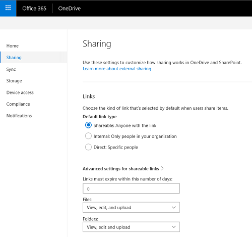
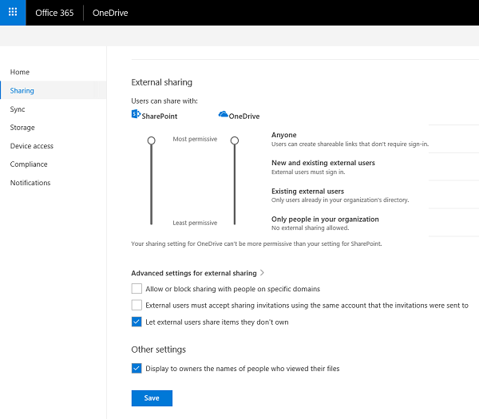

# OneDrive QuickStart guide for small businesses

Small business deployment guide: Part 2 of 2
 
Before you jump in, make you've make sure you've read part 1 for subscription and licensing prerequisites, feature info, and adoption tips: [OneDrive planning basics](what-is-onedrive-small-business.md).

You can upload, download, and interact with your OneDrive files from a web browser, but the ideal OneDrive experience comes from the Windows and Mac sync clients and the iOS and Android mobile apps. With these clients and apps, saving files to OneDrive and interacting with them is much easier than visiting a website each time you need something. Through this experience, you can seamlessly integrate OneDrive into your existing file interaction experiences.

You can install OneDrive on any supported device. For small businesses, manual installations typically make the most sense. For some devices, the installation process may be as simple as installing an app from the app store. For others, you may need to delete older versions of OneDrive first. This section walks you through the installation and configuration of OneDrive on iOS and Android mobile devices, Windows devices, and computers running macOS.You may not need to install OneDrive on all these platforms, depending on the devices used in your organization.

## Install and configure the OneDrive sync client

Most small businesses start by installing the OneDrive sync client on users’ Windows and macOS devices, and then consider the OneDrive mobile apps afterwards. You don’t need to install and configure OneDrive on all your devices before you start using it.

### Install and configure the sync client on a Windows device

If your Windows device has either Office 2016 or Windows 10, it already has the OneDrive sync client.

For devices running older versions of Windows or on which Office 2016 is not installed, you can download the OneDrive sync client for Windows from [https://onedrive.live.com/about/download](https://onedrive.live.com/about/download/).

> [!NOTE]
> If the device has an older version of the sync client, you’ll be asked to uninstall it when you install the new one.

Configuring OneDrive for Windows is simple, but if you want to see a demonstration, see [Sync files with the OneDrive sync client in Windows](https://support.office.com/article/615391c4-2bd3-4aae-a42a-858262e42a49) 

### Install and configure OneDrive on a macOS device

To install the OneDrive sync client on a computer running macOS, just follow the steps in [Sync files with the OneDrive sync client on Mac OS X](https://support.office.com/article/d11b9f29-00bb-4172-be39-997da46f913f). The setup experience is similar to that for Windows. For more information about OneDrive on macOS, see [OneDrive for Mac – FAQ](https://support.office.com/article/3fc4062c-8051-4392-bff1-551e32840cd0). 

## Install and configure OneDrive on a mobile device

Installing the OneDrive app on a mobile device is simple: download the app from the app store on any Android, iOS, or Windows mobile device. If you want to simplify the manual installation process even further, go to [https://onedrive.live.com/about/download](https://onedrive.live.com/about/download/) and enter the mobile phone number of the device on which you want to install OneDrive. Microsoft will send a text message to the mobile device with a link to the app in the device’s app store. Once installed, start the configuration process by opening the app and responding to the prompts.

To learn how to perform tasks in OneDrive on an iOS device, see [Use OneDrive on iOS](https://support.office.com/article/08d5c5b2-ccc6-40eb-a244-fe3597a3c247). 

FTo learn how to perform tasks in OneDrive on an iOS device, see [Use OneDrive for Android](https://support.office.com/article/eee1d31c-792d-41d4-8132-f9621b39eb36). 

## Manage OneDrive

Many small businesses use OneDrive without changing any of the options.

If want to add some basic device and sharing restrictions to OneDrive, you can use the OneDrive admin center. To access the new OneDrive admin center, go to <https://admin.onedrive.com>. There, you can restrict the people with whom your users can share files, choose the devices your employees can use to access OneDrive, and more.

Settings in the OneDrive admin center are grouped into six categories:

-   **Sharing.** On the **Sharing** tab, you can configure the default sharing link users send out to colleagues to share a file. For example, when users share a file, you can specify that the default sharing type is **Internal**.

    

    You can also change the external sharing settings to prevent users from sharing files with people outside your organization. This is useful if you have a lot of confidential information.

    

<!-- -->

-   **Sync.** On the **Sync** tab, you can configure sync restrictions based on file type, require that synced devices be joined to your domain, or restrict synchronization from computers running macOS.

-   **Storage.** On the **Storage** tab, you specify the default OneDrive storage limit for users within your Office 365 organization. You can also configure how long to keep data for users whose accounts have been deleted (the maximum value is 10 years).

-   **Device Access.** On the **Device Access** tab, you can restrict device access to OneDrive based on network location and apps that don’t use modern authentication, among other application management options.

-   **Compliance.** The **Compliance** tab provides a centralized list of links to auditing, data loss prevention (DLP), retention, ediscovery, and alerting capabilities within Office 365 that are applicable to OneDrive. (Most small businesses won’t use these options.)

    Selecting an item’s link redirects you to the Office 365 Security & Compliance Center, where you can configure that item. You can create DLP policies from templates that protect certain types of data, such as Social Security numbers, banking information, and other financial and medical content. For a walkthrough of how to create DLP policies in Office 365 and apply them to OneDrive, see [Create a DLP policy from a template](https://support.office.com/article/59414438-99f5-488b-975c-5023f2254369).

-   **Notifications.** On the **Notifications** tab, you define when OneDrive owners should receive notifications about sharing or accessing their data. These settings are helpful for small businesses that likely don’t have IT staff who can audit this information. For information about enabling these options, see [Turn on external sharing notifications for OneDrive](turn-on-external-sharing-notifications.md).

For detailed examples of how to perform management tasks in the OneDrive admin center, see [OneDrive admin center](https://support.office.com/article/onedrive-admin-center-b5665060-530f-40a3-b34a-9e935169b2e0).

## Get help with OneDrive

If you need help with OneDrive, you have many ways to find solutions to common issues or request help:

-   **Tech community.** Find helpful information from other customers in the community by reviewing the discussions and blogs in the [OneDrive for Business Tech Community](https://techcommunity.microsoft.com/t5/OneDrive-for-Business/ct-p/OneDriveforBusiness).

-   **Support documentation.** For a list of recent issues in OneDrive and how to resolve or work around them, see [Fixes or workarounds for recent issues in OneDrive](https://support.office.com/article/36110213-f3f6-490d-8cb7-3833539def0b).

-   **Microsoft Support.** If you need help from Microsoft to troubleshoot an issue or configure or deploy OneDrive, see [Contact Microsoft](https://support.microsoft.com/gp/contactus81?Audience=Commercial).

-   **OneDrive UserVoice.** You can review and submit feature requests and provide feature feedback at [OneDrive UserVoice](https://onedrive.uservoice.com/).
