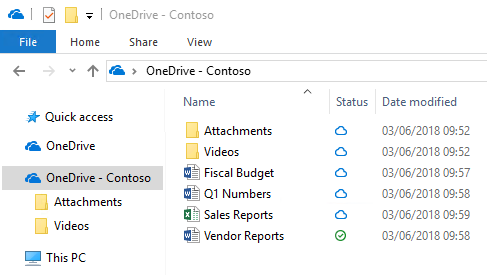
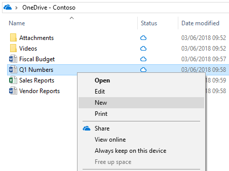
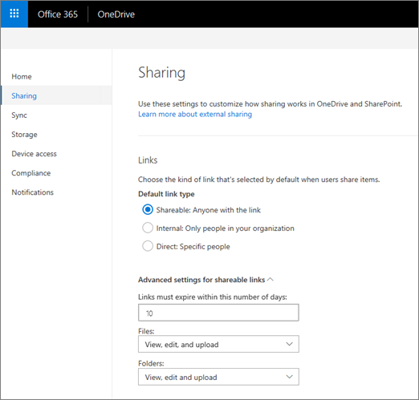
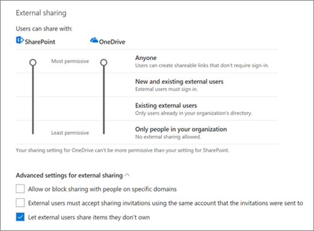

# OneDrive QuickStart guide for small businesses

Microsoft OneDrive is a robust but simple-to-use cloud storage platform for small businesses, enterprises, and everything in between. Unlike other cloud storage providers, most of the advanced enterprise-focused features in OneDrive are available for every subscription type, enabling organizations to use OneDrive in whatever way benefits them the most. This user guide focuses on the deployment and configuration options that make the most sense for small businesses looking to use OneDrive. From there, these organizations can select whatever additional management capabilities they require. For the full deployment guide, which contains other methods of deploying, configuring, and managing OneDrive cloud storage, see [OneDrive guide for enterprises](plan-onedrive-enterprise.md).

## Getting started with OneDrive

OneDrive is effective in even the largest enterprises, but it still has a small, easy-to-implement footprint that small businesses can take advantage of. After all, small businesses are often at highest risk for losing files on failed devices because few are concerned with centralized storage and backups. By using OneDrive cloud storage, however, your small business can keep files safe, and your users can easily access them from all their devices.

To get started with OneDrive, follow these steps:

1.  **Review basic OneDrive information.** Start by reviewing the introductory OneDrive information available at the [OneDrive help center](https://support.office.com/onedrive). You'll get answers to many of your questions, including the OneDrive experience and how it works.

2.  **Set up a Microsoft Office 365 subscription.** You must set up a subscription to use OneDrive, but you aren't required to purchase all the applications in the Microsoft 365 suite. To get started, follow the steps in [Set up Microsoft 365 Apps for business](/office365/admin/setup/setup).

3.  **Add OneDrive licenses.** Review your plan options in [Compare OneDrive plans](https://products.office.com/onedrive-for-business/compare-onedrive-for-business-plans), and then add the licenses you need.

When you've completed these tasks, you're ready to plan for, deploy, and configure the OneDrive sync app and applications. To do that, complete these three simple steps:

1.  **Plan for adoption.** For small businesses, planning for user adoption can be as simple as individually showing your users how to use OneDrive. Often, small business customers don't consider this step for new applications, and that can negatively affect the application's success. The section [Adopt OneDrive](#adopt-onedrive) provides helpful resources for OneDrive adoption.

2.  **Install and configure.** Sync app are available for the Windows and macOS operating systems that provide a seamless experience for users interacting with their files. Most small businesses start by installing the sync app on their users' devices, and then consider the OneDrive mobile apps later. In fact, you may already have the OneDrive client on your devices. Devices running the Windows 10 operating system and devices running Windows or macOS with Microsoft Office 2016 or later will have the OneDrive sync app already. For information about how to install and configure the OneDrive sync app and mobile apps, see the section [Install and configure OneDrive](#install-and-set-up-onedrive-apps).

3.  **Manage OneDrive.** For many small businesses, managing OneDrive is optional. You could simply install and configure OneDrive and leave it at that. If you want to use advanced features of OneDrive or add device sharing or access restrictions, however, you can easily manage those and other settings in the OneDrive admin center. For more information about managing OneDrive, see the section [Manage OneDrive](#manage-onedrive).

## Key OneDrive cloud storage features for small businesses

Unlike most other cloud storage providers, OneDrive not only provides robust features to small businesses out of the box, but it also makes most of its advanced features available to them. This gives small businesses the flexibility to use advanced features based on the needs of their organization. 

The features listed in this section address common customer concerns or specific compliance requirements, or provide unique functionality available only in OneDrive. For a full list of features available across OneDrive plans, see [Microsoft OneDrive](https://onedrive.live.com/about).

> [!NOTE]
> The information in this section is for awareness purposes only and is not required to install and use OneDrive.

### OneDrive Files On-Demand

OneDrive Files On-Demand enables users to view, search for, and interact with files stored in OneDrive from within File Explorer, without downloading all the files to their device. The feature provides a seamless look and feel for both OneDrive and local files without taking up space on the local hard drive. As shown in the following screenshot, files that have not been downloaded have a cloud icon for their status. For those files that have been downloaded, the status shows a green checkmark.

By default, files are downloaded only when you need to access them. However, if you plan to access a file while disconnected from the internet, simply make the file available offline by right-clicking it, and then selecting **Always keep on this device**. Alternatively, if you want to free space on your device and remove the downloaded copy of a file, right-click the file, and then select **Free up space**. The following screenshot shows the right-click menu for OneDrive files on a device running Windows.

For more information about OneDrive Files On-Demand, see [Learn about OneDrive Files On-Demand](https://support.office.com/article/0e6860d3-d9f3-4971-b321-7092438fb38e).

### Modern attachments

OneDrive cloud storage integrates with Microsoft Outlook to enable easy sharing of OneDrive files that appear just like email attachments. This feature provides a familiar sharing experience but centralizes storage of attachments in OneDrive. This allows your users to all collaborate on the same file instead of sending different versions back and forth in email. In addition, you can configure sharing permissions on the files directly from within the Outlook client.

To reduce the potential for confusion when users choose to add a copy versus a link to attached OneDrive files, you can set the default behavior of the Outlook client, as demonstrated in [How to control default attachment state when you attach a cloud file in Outlook 2016](https://support.microsoft.com/help/4011261/how-to-set-attachment-preference-for-attaching-a-cloud-file-in-outlook).

### Files Restore

The OneDrive Files Restore feature lets users restore files to any point over the past 30 days. To select the desired recovery time, OneDrive presents you with a histogram that shows file activity so that you can determine which recovered time meets your needs. From there, simply select the file history entry to which you want to restore, and all changes after that point will be rolled back.

In addition, because the histogram shows individual activity on a file, you can use this feature to quickly view your files' modification history. For more information about this feature, see [Restore your OneDrive](https://support.office.com/article/fa231298-759d-41cf-bcd0-25ac53eb8a15).

### Recycle bin

OneDrive has a recycle bin similar to the one available on the Windows desktop. Deleted files are moved to the recycle bin and kept for a designated time before being permanently deleted. For work or school accounts, deleted files are purged after 93 days unless configured otherwise. For a demonstration of how the recycle bin works, see [Restore deleted files or folders in OneDrive](https://support.office.com/article/949ada80-0026-4db3-a953-c99083e6a84f).

### Known Folder Move

Known Folder Move enables users to select Windows known folders, such as their desktop, Documents, or Pictures, to automatically synchronize to OneDrive. You can add this feature during the initial setup of OneDrive or after it has been configured. This capability provides a simple migration option for users looking to add known folders to their existing list of synchronized folders. For more information about Known Folder Move, see [Protect your files by saving them to OneDrive](https://support.office.com/article/d61a7930-a6fb-4b95-b28a-6552e77c3057).

## Adopt OneDrive

User adoption is important to the overall success of any new application. Ideally, to feel that you have maximized your investment in Office 365 and OneDrive, you need to maximize user engagement with them. For small businesses, driving user adoption can be as simple as introducing users to OneDrive when you're installing it or showing them any of the videos available at the [Office 365 Training Center](https://support.office.com/office-training-center).

Personally showing your users how to save and share documents in OneDrive tends to be the most effective option for driving adoption, given that you'll likely be performing manual installations. The primary value proposition for small businesses is file availability and redundancy. A document saved on local storage can be lost with a device; a document saved to OneDrive cannot. Simply having this discussion with your users beforehand, coupled with demonstrating the application's ease of use, can drive positive outcomes for this effort.

For information about a more formal Microsoft 365 user adoption strategy, see the [Microsoft 365 End User Adoption Guide](https://fto365dev.blob.core.windows.net/media/Default/DocResources/en-us/Microsoft%20365%20User%20Adoption%20Guide.pdf). For more information about driving user engagement through a similar, more formal process, see [Success Factors for Office 365 End User Engagement](https://fto365dev.blob.core.windows.net/media/Default/DocResources/en-us/Resources/Office365_AdoptionBrochure_v2.0_Screen.pdf). You can also contribute to or comment on adoption-related ideas in the [Driving Adoption Tech Community](https://techcommunity.microsoft.com/t5/Driving-Adoption/ct-p/DrivingAdoption).

## Install and set up OneDrive apps

You can upload, download, and interact with your OneDrive files from a web browser, but the ideal OneDrive experience comes from the Windows and Mac sync apps and the iOS and Android mobile apps. With these clients and apps, saving files to OneDrive and interacting with them is much easier than visiting a website each time you need something. Through this experience, you can seamlessly integrate OneDrive into your existing file interaction experiences.

You can install OneDrive on any supported device. For small businesses, manual installations typically make the most sense. For some devices, the installation process may be as simple as installing an app from the app store. For others, you may need to delete older versions of OneDrive first. This section walks you through the installation and configuration of OneDrive on iOS and Android mobile devices, Windows devices, and computers running macOS. You may not need to install OneDrive on all these platforms, depending on the devices used in your organization.

Most small businesses start by installing the OneDrive sync app on users' Windows and macOS devices, and then consider the OneDrive mobile apps afterwards. You don't need to install and configure OneDrive on all your devices before you start using it.

> [!VIDEO https://www.microsoft.com/videoplayer/embed/RE2CvJE]

### Install and configure the sync app on a Windows device

If your Windows device has either Office 2016 or Windows 10, it already has the OneDrive sync app.

For devices running older versions of Windows or on which Office 2016 is not installed, you can download the OneDrive sync app for Windows from [https://onedrive.live.com/about/download](https://onedrive.live.com/about/download/).

> [!NOTE]
> If the device has an older version of the sync app, you'll be asked to uninstall it when you install the new one.

Configuring OneDrive for Windows is simple, but if you want to see a demonstration, see [Sync files with the OneDrive sync app in Windows](https://support.office.com/article/615391c4-2bd3-4aae-a42a-858262e42a49) 

### Install and configure OneDrive on a macOS device

To install the OneDrive sync app on a computer running macOS, just follow the steps in [Sync files with the OneDrive sync app on Mac OS X](https://support.office.com/article/d11b9f29-00bb-4172-be39-997da46f913f). The setup experience is similar to that for Windows. For more information about OneDrive on macOS, see [OneDrive for Mac – FAQ](https://support.office.com/article/3fc4062c-8051-4392-bff1-551e32840cd0). 

## Install and configure OneDrive on a mobile device

Installing the OneDrive app on a mobile device is simple: download the app from the app store on any Android, iOS, or Windows mobile device. If you want to simplify the manual installation process even further, go to [https://onedrive.live.com/about/download](https://onedrive.live.com/about/download/) and enter the mobile phone number of the device on which you want to install OneDrive. Microsoft will send a text message to the mobile device with a link to the app in the device's app store. Once installed, start the configuration process by opening the app and responding to the prompts.

To learn how to perform tasks in OneDrive on an iOS device, see [Use OneDrive on iOS](https://support.office.com/article/08d5c5b2-ccc6-40eb-a244-fe3597a3c247). 

To learn how to perform tasks in OneDrive on an Android device, see [Use OneDrive on Android](https://support.office.com/article/eee1d31c-792d-41d4-8132-f9621b39eb36). 

## Manage OneDrive

Many small businesses use OneDrive cloud storage without changing any of the options.

If you want to add some basic device and sharing restrictions to OneDrive, you can use the OneDrive admin center. To access the new OneDrive admin center, go to https://admin.onedrive.com. There, you can restrict the people with whom your users can share files, choose the devices your employees can use to access OneDrive, and more.

> [!VIDEO https://www.microsoft.com/videoplayer/embed/RE2CnSt]

Settings in the OneDrive admin center are grouped into six categories:

-   **Sharing.** On the **Sharing** page, you can configure the default sharing link users send out to colleagues to share a file. For example, when users share a file, you can specify that the default sharing type is **Internal**.

    

    You can also change the external sharing settings to prevent users from sharing files with people outside your organization. This is useful if you have a lot of confidential information.

    

<!-- -->

-   **Sync.** On the **Sync** page, you can configure sync restrictions based on file type, require that synced devices be joined to your domain, or restrict synchronization from computers running macOS.

-   **Storage.** On the **Storage** page, you specify the default OneDrive storage limit for users within your Office 365 organization. You can also configure how long to keep data for users whose accounts have been deleted (the maximum value is 10 years).

-   **Device Access.** On the **Device Access** page, you can restrict device access to OneDrive based on network location and apps that don't use modern authentication, among other application management options.

-   **Compliance.** The **Compliance** page provides a centralized list of links to auditing, data loss prevention (DLP), retention, ediscovery, and alerting capabilities within Office 365 that are applicable to OneDrive. (Most small businesses won't use these options.)

    Selecting an item's link redirects you to the Office 365 Security & Compliance Center, where you can configure that item. You can create DLP policies from templates that protect certain types of data, such as Social Security numbers, banking information, and other financial and medical content. For a walkthrough of how to create DLP policies in Office 365 and apply them to OneDrive, see [Create a DLP policy from a template](/office365/securitycompliance/create-a-dlp-policy-from-a-template).

-   **Notifications.** On the **Notifications** page, you define when OneDrive owners should receive notifications about sharing or accessing their data. These settings are helpful for small businesses that likely don't have IT staff who can audit this information. For information about enabling these options, see [Turn on external sharing notifications for OneDrive](turn-on-external-sharing-notifications.md).

## Get help with OneDrive

If you need help with OneDrive, you have many ways to find solutions to common issues or request help:

-   **Tech community.** Find helpful information from other customers in the community by reviewing the discussions in the [OneDrive Tech Community](https://techcommunity.microsoft.com/t5/OneDrive-for-Business/ct-p/OneDriveforBusiness) and the [Microsoft OneDrive Blog](https://techcommunity.microsoft.com/t5/OneDrive-Blog/bg-p/OneDriveBlog).

-   **Support documentation.** For a list of recent issues in OneDrive and how to resolve or work around them, see [Fixes or workarounds for recent issues in OneDrive](https://support.office.com/article/36110213-f3f6-490d-8cb7-3833539def0b). For getting started info, see [Get started with OneDrive](https://support.office.com/article/c7f31921-e2e5-4b00-959a-cc9ad6297de7), [Employee file storage (video training)](https://support.office.com/article/12dbe3e4-dbef-48f8-a90e-87f1bc607073) and [Why use OneDrive to store your docs](https://support.office.com/article/e55c4fa8-1e03-4d75-956b-924620bdfa2d).

-   **Microsoft Support.** If you need help from Microsoft to troubleshoot an issue or configure or deploy OneDrive, see [Contact Microsoft](https://support.microsoft.com/gp/contactus81?Audience=Commercial).

-   **OneDrive UserVoice.** You can review and submit feature requests and provide feature feedback at [OneDrive UserVoice](https://onedrive.uservoice.com/).
 

