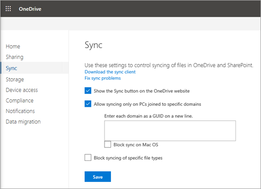

# Allow syncing only on computers joined to specific domains

To make sure that users sync OneDrive files only on managed computers, you can configure OneDrive to sync only on PCs that are joined to specific domains.
  
 **To allow syncing only on PCs joined to specific domains**
 
> [!NOTE]
> These settings apply to SharePoint sites as well as OneDrive.

1. Sign in to the [OneDrive admin center](https://admin.onedrive.com) as a global or SharePoint admin, and select **Sync** in the left pane.
    
    
  
2. Select the **Allow syncing only on PCs joined to specific domains** check box.
    
3. Click **Add domains**.
    
4. Add the [GUID of each domain](/powershell/module/activedirectory/get-addomain) for the member computers that you want to be able to sync.
 
> [!NOTE]
> Make sure to add the domain GUID of the computer domain membership. If users are in a separate domain, only the domain GUID that the computer account is joined to is required.

> [!IMPORTANT]
> This setting is only applicable to Active Directory domains. It does not apply to Azure AD domains. If you have devices which are only Azure AD joined, consider using a [Conditional Access Policy](/azure/active-directory/conditional-access/overview) instead.
   
5. If you want to prevent Mac OS users from syncing entirely, select the **Block sync on Mac OS** check box.
    
6. Click **Save** on the Sync page.
    
For info about setting this sync app restriction by using PowerShell, see [Set-SPOTenantSyncClientRestriction](/powershell/module/sharepoint-online/set-spotenantsyncclientrestriction)
