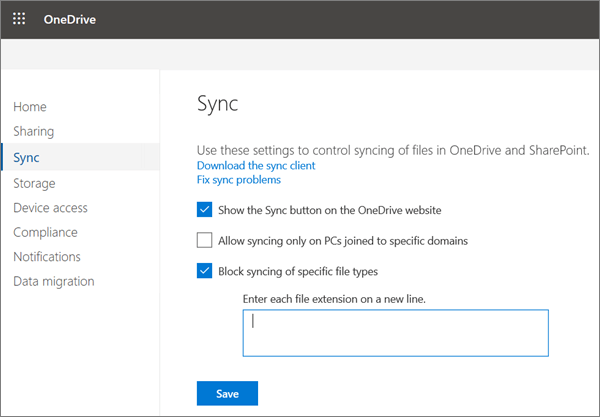

# Block syncing of specific file types

You can prevent users from uploading specific file types when they sync their OneDrive files.

You must sign in as a global or SharePoint admin in your organization.

- If you're signed in to your browser with a work or school account that isn't an admin, you'll see the Sync page, but the contents won't appear.
- If you're signed in to your browser with a Microsoft account, your personal OneDrive will appear.

   > [!NOTE]
   > This setting prevents file types from being uploaded but not downloaded. If users already have blocked file types in their OneDrive, the files will sync to their computer, but any changes they make on their computer won't be uploaded.
  
 **To block uploading of specific file types**
  
1. Open the [OneDrive admin center](https://admin.onedrive.com), and click **Sync** in the left pane.

    
  
2. Select the **Block syncing of specific file types** check box.

3. Type the file name extensions you want to block, for example: **exe** or **mp3**.

    > [!IMPORTANT]
    > Do not include the periods with the extensions, or any other punctuation, spaces, or special characters.
  
4. Click **Save** on the Sync page.

For info about setting this sync app restriction by using PowerShell, see [Set-SPOTenantSyncClientRestriction](/powershell/module/sharepoint-online/set-spotenantsyncclientrestriction)
