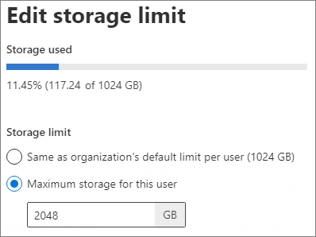

# Change a specific user's OneDrive storage space

As a global or SharePoint admin in Microsoft 365, you can set the OneDrive storage space for a specific user.
  
> [!NOTE]
> For info about setting the default storage space, see [Set the default storage space for OneDrive users](set-default-storage-space.md). For info about the storage available for your Microsoft 365 subscription, see the [OneDrive service description](https://go.microsoft.com/fwlink/?linkid=826071).

> [!NOTE]
> The ability to change an individual's storage from the user interface is still not available for Multi-Geo enabled tenants. Please continue to use the PowerShell method outlined below until this functionality becomes available. 

  
## Change the storage space for a specific user's OneDrive

1. Sign in to https://admin.microsoft.com as a global or SharePoint admin. (If you see a message that you don't have permission to access the page, you don't have Microsoft 365 admin permissions in your organization.)
    
    > [!NOTE]
    > If you have Office 365 Germany, sign in at https://portal.office.de. If you have Office 365 operated by 21Vianet (China), sign in at https://login.partner.microsoftonline.cn/. Then select the Admin tile to open the admin center.
    
2. In the left pane, select **Users** \> **Active users**.

3. Select the user.

4. Select the **OneDrive** tab.

5. Under **Storage used** click **Edit**.

6. Select the **Maximum storage for this user** option, and type the storage limit that you want to use.

7. Click **Save**.
    
    

> [!NOTE]
> If you want to change the storage space for multiple users, you can use PowerShell to [Display a list of OneDrive accounts by using PowerShell](list-onedrive-urls.md) and use [Set-SPOSite](https://docs.microsoft.com/powershell/module/sharepoint-online/set-sposite) to make the change. To disable OneDrive creation for specific users, see [Manage user profiles in the SharePoint admin center](/sharepoint/manage-user-profiles).

When you need cloud storage for individual users beyond the initial 5 TB, additional cloud storage will be granted as follows:

When a user has filled their 5 TB of OneDrive storage to at least 90% capacity, Microsoft will increase your default storage space in OneDrive to up to 25 TB per user (admins may set a lower per-user limit if they want to).

For any user that reaches at least 90% capacity of their 25 TB of OneDrive storage, additional cloud storage will be provided as 25 TB SharePoint team sites to individual users. Contact Microsoft technical support for information and assistance.

Admins can [open a case with Microsoft technical support](https://go.microsoft.com/fwlink/?linkid=869559) to request storage beyond 5 TB.
    
    
## Change the storage space for a specific user’s OneDrive using PowerShell

1. [Download the latest SharePoint Online Management Shell](https://go.microsoft.com/fwlink/p/?LinkId=255251).

    > [!NOTE]
    > If you installed a previous version of the SharePoint Online Management Shell, go to Add or remove programs and uninstall "SharePoint Online Management Shell." <br>On the Download Center page, select your language and then click the Download button. You'll be asked to choose between downloading a x64 and x86 .msi file. Download the x64 file if you're running the 64-bit version of Windows or the x86 file if you're running the 32-bit version. If you don't know, see [Which version of Windows operating system am I running?](https://support.microsoft.com/help/13443/windows-which-operating-system). After the file downloads, run it and follow the steps in the Setup Wizard.

2. Save the following text to a PowerShell file. For example, you could save it to a file named UpdateOneDriveStorage.ps1.
    
```PowerShell
$TenantUrl = Read-Host "Enter the SharePoint admin center URL" 
Connect-SPOService -Url $TenantUrl 
 
$OneDriveSite = Read-Host "Enter the OneDrive Site URL" 
$OneDriveStorageQuota = Read-Host "Enter the OneDrive Storage Quota in MB" 
$OneDriveStorageQuotaWarningLevel = Read-Host "Enter the OneDrive Storage Quota Warning Level in MB" 
Set-SPOSite -Identity $OneDriveSite -StorageQuota $OneDriveStorageQuota -StorageQuotaWarningLevel $OneDriveStorageQuotaWarningLevel 
Write-Host "Done" 
```

3. Open the SharePoint Online Management Shell. Navigate to the directory where the script has been saved and run:

```PowerShell
PS C:\>.\ UpdateOneDriveStorage.ps1
```

> [!NOTE]
    > If you get an error message about being unable to run scripts, you might need to change your execution policies. For more info about PowerShell execution policies, see [About Execution Policies](https://go.microsoft.com/fwlink/?linkid=869255).
    

4. The script will prompt you for the SharePoint admin center URL. For example, "https://contoso-admin.sharepoint.com" is the Contoso SharePoint admin center URL.

5. You will then be prompted to sign in. Use a SharePoint admin or global admin account.

6. You will then be prompted for the OneDrive site URL: For example, https://contoso-my.sharepoint.com/personal/user_contoso_onmicrosoft_com. 

7.	You will then be prompted for OneDrive Storage Quota which should be entered in Megabytes.

8.	You will then be prompted for OneDrive Storage Quota Warning Level which should be entered in Megabytes.
MB | TB
------------ | -------------
1024000 | 1
2048000 | 2
3072000 | 3
4096000 | 4
5120000 | 5
6144000 | 6
7168000 | 7
8192000 | 8
9216000 | 9
1024000 | 10

> [!NOTE]
> If you want to change the storage space for multiple users, you can use PowerShell to [Display a list of OneDrive accounts by using PowerShell](https://docs.microsoft.com/en-us/onedrive/list-onedrive-urls) and use [Set-SPOSite](https://docs.microsoft.com/en-us/powershell/module/sharepoint-online/set-sposite?view=sharepoint-ps) to make the change. To disable OneDrive creation for specific users, see [Manage user profiles in the SharePoint admin center](https://docs.microsoft.com/en-us/sharepoint/manage-user-profiles).