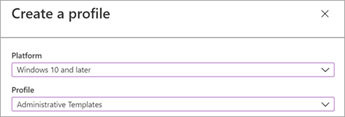
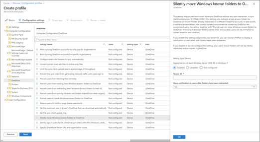

# Use administrative templates in Intune

Profiles in Microsoft Intune let you configure settings and push them to devices in your organization. The administrative templates built in to Microsoft Intune make configuring the Microsoft OneDrive sync app easier than ever.

1. Go to [The Configuration profiles page of the Microsoft Endpoint Manager admin center](https://endpoint.microsoft.com/?ref=AdminCenter#blade/Microsoft_Intune_DeviceSettings/DevicesMenu/configurationProfiles).
2. Select **Create profile**.
3. Under **Platform**, select **Windows 10 and later**.
4. Under **Profile**, select **Administrative Templates**.

    

5. Select **Create**.
6. Enter a name for the profile, and optionally a description, and then select **Next**.
7. Under **Computer Configuration** or **User Configuration**, select **OneDrive**, and select the setting you want to configure. For info about these settings, see [Use Group Policy](use-group-policy.md). For info about the recommended settings, see [Recommended sync app configuration](ideal-state-configuration.md).

    

8. Configure the setting the way you want, and then select **OK**. Some settings require entering your tenant ID. [Learn how to find it](find-your-office-365-tenant-id.md). When you're done, select **Next**.
9. Select scope tags, and then select **Next**. For info about scope tags, see [Use RBAC and scope tags for distributed IT](/mem/intune/fundamentals/scope-tags).
10. In **Assignments**, include or exclude the profile from selected groups. For info about assigning profiles, see [Assign user and device profiles](/mem/intune/configuration/device-profile-assign).

    If the profile is assigned to user groups, then configured ADMX settings apply to any device that the user enrolls, and signs in to. If the profile is assigned to device groups, then configured ADMX settings apply to any user that signs into that device. This assignment happens if the ADMX setting is a computer configuration (`HKEY_LOCAL_MACHINE`), or a user configuration (`HKEY_CURRENT_USER`). With some settings, a computer setting assigned to a user may also impact the experience of other users on that device.     For more info, see [User groups vs. device groups](/mem/intune/configuration/device-profile-assign#user-groups-vs-device-groups).

    Select **Next**.

11. Review the profile, and then select **Create**.

## See also

- [Use Windows 10 templates to configure group policy settings in Microsoft Intune](/mem/intune/configuration/administrative-templates-windows)
- [Understanding ADMX-backed policies](/windows/client-management/mdm/understanding-admx-backed-policies)
- [Monitor device profiles in Microsoft Intune](/mem/intune/configuration/device-profile-monitor)