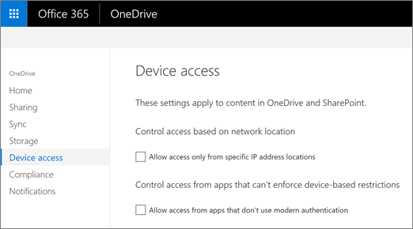

# Control access based on network location or app

To prevent users from accessing OneDrive and SharePoint content on devices outside of specific domains, and to prevent them from accessing files in apps that don't check for device status, use the Device access page of the [OneDrive admin center](https://admin.onedrive.com). Note that the first two settings on this page are also on the "Access control" page in the new SharePoint admin center.
  

  
## Control access based on network location

You can choose a specific IP addresses or IP address ranges from which you want to allow users to access their OneDrive files. For example, you might want your users to only access OneDrive files using network addresses that your organization owns.
  
 **To allow access only from defined network locations**
  
1. Under **Control access based on network location**, select the **Allow access only from specific IP address locations** check box.
    
2. Click **Edit**.
    
3. Enter the IP address ranges that you want to allow using CIDR notation. For example: 172.16.0.0, 192.168.1.0/27, 2001:4898:80e8::0/48. Enter one IP address range per line, and make sure there are no overlapping IP addresses.

    > [!IMPORTANT]
    > Make sure you include your own IP address so you don't lock yourself out. This setting not only restricts access to OneDrive and SharePoint sites, but also to the OneDrive and SharePoint admin centers, and to running PowerShell cmdlets. If you lock yourself out and can't connect from an IP address within a range you specified, you will need to contact Support for help.
    
4. Click **Save** on the Device access page.
    
## Control access from apps that don't use modern authentication

Some third-party apps and versions of Office prior to Office 2013 don't use modern authentication and can't enforce device-based restrictions. This means they allow users to bypass conditional access policies that you configure in Azure.
  
 **To block access from apps that don't use modern authentication**
  
1. Under **Control access from apps that can't enforce device-based restrictions**, clear the **Allow access from apps that don't use modern authentication** check box.
    
2. Click **Save**.
    
## See also

[Manage OneDrive for Business mobile access](control-access-to-mobile-app-features.md)
