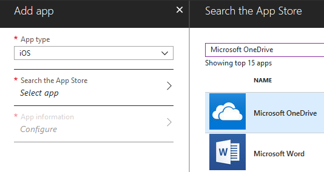
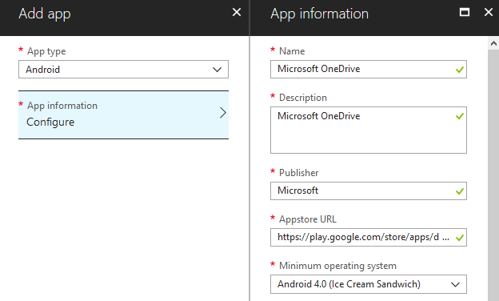
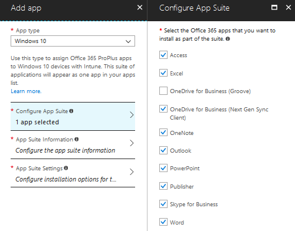

# Deploy OneDrive apps by using Intune

Use Intune to deploy the mobile apps for iOS and Android and to deploy the new OneDrive sync app (OneDrive.exe). Before you begin deploying, make sure you have reviewed the planning information and deployment options in the [OneDrive guide for enterprises](plan-onedrive-enterprise.md).

> [!VIDEO https://www.microsoft.com/videoplayer/embed/RE2CnSk]

### Deploy OneDrive to iOS devices by using Intune

1. In the Azure AD admin center, create a group of devices or users to target the deployment.
2. In Intune, select **Client apps**, then select **Apps**, and then select **Add**.
3. Under **App type**, select **iOS**.
4. Under **Search the App Store**, select **Select app**.
5. In the search box, to find the OneDrive app, enter **Microsoft OneDrive**, as follows.

    

6. Select it, select **Select**, and then select **Add**.
7. Select **Assignments** and select the group you created. For info about this, see [How to assign apps to groups with Microsoft Intune](/intune/apps-deploy/).

For more info about using Intune to deploy apps to iOS devices, see [How to add iOS store apps to Microsoft Intune](https://github.com/MicrosoftDocs/IntuneDocs/blob/master/intune/store-apps-ios.md). 

For more info about deploying Microsoft 365 apps to MacOS devices using Intune, see [How to assign Microsoft 365 to MacOS devices with Microsoft Intune](https://docs.microsoft.com/intune/apps-add-office365-macos).

### Deploy OneDrive to Android devices by using Intune

1. To target the deployment in the Azure AD admin center, create a group of devices or users.
2. In Intune, select **Client apps**, then select **Apps**, and then select **Add**.
3. Under **App type**, select **Android**.
4. To configure the app information, enter the required info, including **https://play.google.com/store/apps/details?id=com.microsoft.skydrive** for the Appstore URL and **Android 4.0 (Ice Cream Sandwich)** for the minimum operating system. 

    

5. Select **OK**, and then select **Add**.
6. Select **Assignments**, and select the group you created. For info about this, see [How to assign apps to groups with Microsoft Intune](/intune/apps-deploy/).

For more info about using Intune to deploy OneDrive to Android devices, see [How to add Android store apps to Microsoft Intune](/intune/store-apps-android).

### Deploy OneDrive to Windows devices by using Intune

To use Intune to deploy OneDrive to Windows devices, follow these steps:

1. In the Azure AD admin center, create a group of devices or users to target the deployment.
2. In Intune, select **Client apps**, then select **Apps**, and then select **Add**.
3. In the **App type** list, under **Office 365 Suite**, select **Windows 10**. 
4. Select **Configure App Suite**.
5. Select **OneDrive Desktop**, and then select **OK**.

    

    > [!NOTE]
    > You aren't required to deploy the entire Microsoft 365 suite at once. If you need the OneDrive sync app only, you can select that one item.

6. Click to configure the required App Suite information, and then select**OK**.
7. Click to configure the required App Suite Settings, and then select **OK**.
8. Select **Add**. 
9. Select **Assignments**, and choose the group you created.
10. If you want to use silent account configuration, add a PowerShell script to do this, and assign it to the group. For info about this, see [Silently configure user accounts](use-silent-account-configuration.md).

For more info about deploying Microsoft 365 apps to Windows 10 devices using Intune, see [How to assign Office 365 apps to Windows 10 devices with Microsoft Intune](/intune/apps-add-office365/). 
