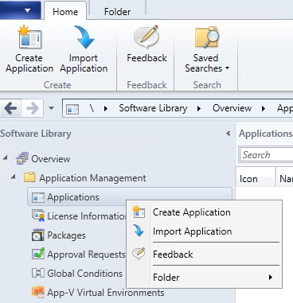

# Deploy OneDrive apps by using System Center Configuration Manager

You can use System Center Configuration Manager (SCCM) to deploy the new OneDrive sync app (OneDrive.exe), as well as the mobile apps for iOS and Android. Before you begin deploying, make sure you have reviewed the planning information and deployment options in the [OneDrive guide for enterprises](plan-onedrive-enterprise.md).

> [!VIDEO https://www.microsoft.com/videoplayer/embed/RE2CnSr]
  
## Deploy the OneDrive sync app for Windows

 The OneDrive sync app (OneDrive.exe) can be installed on Windows 7 and later. It can also be installed on macOS. For info about deploying the OneDrive sync app on macOS, see [Configure the new OneDrive sync app on macOS](deploy-and-configure-on-macos.md)
    
The new OneDrive sync app can be used with SharePoint Server 2019, but not earlier versions of SharePoint Server. For more information about the restrictions and limitations of the OneDrive sync app, see [Invalid file names and file types in OneDrive, OneDrive for Business, and SharePoint](https://support.office.com/article/64883a5d-228e-48f5-b3d2-eb39e07630fa).
  
> [!IMPORTANT]
> If your users are currently using the OneDrive for Business sync app (Groove.exe), and you want to move them to the OneDrive sync app, see [Transition from the previous OneDrive for Business sync app](transition-from-previous-sync-client.md) before proceeding.  

### Make sure that WNS is set up correctly

The OneDrive sync app uses Windows Push Notification Services (WNS) for optimum performance and battery life. Make sure you allow access from your network to the [endpoints that OneDrive uses](/office365/enterprise/urls-and-ip-address-ranges#sharepoint-online-and-onedrive-for-business).
 
### Check if users already have the OneDrive sync app

If the computers in your organization are running Windows 10, they already have the new sync app installed. If the computers have Office 2016 or Office 2013 (Home &amp; Student, Home &amp; Business, Professional, Personal, Home, or University) installed, they might also have the new sync app. 

> [!NOTE]
> Office is installed per machine, whereas OneDrive is installed per user by default. [Learn about installing OneDrive per machine](per-machine-installation.md)
  
### Deploy any administrative settings

To set registry keys on computers in your domain, install OneDrive and copy the OneDrive.admx and OneDrive.adml files from %localappdata%\Microsoft\OneDrive\BuildNumber\adm\ to your Group Policy central store. For more info, see [Use Group Policy to control OneDrive sync app settings](use-group-policy.md).
  
### Use System Center Configuration Manager to deploy the OneDrive sync app

1. In System Center Configuration Manager, select **Create Device Collection** and follow the steps in the Create Device Collection Wizard. 

2. Save the OneDriveSetup.exe installer for Windows to your local computer or a network share. [Download the Production ring OneDriveSetup.exe installer for Windows](https://go.microsoft.com/fwlink/?linkid=844652) or [download the Enterprise ring OneDriveSetup.exe installer for Windows](https://go.microsoft.com/fwlink/p/?linkid=860987). 
  
3. Download the [sample SCCM package](https://go.microsoft.com/fwlink/p/?LinkId=824069). It's a .zip file that contains the script installer deployment type. For more information about packages and programs in System Center Configuration Manager, see [Packages and programs in Configuration Manager](https://docs.microsoft.com/configmgr/apps/deploy-use/packages-and-programs).


> [!NOTE]
> The script installer deployment type already has a detection method script and will correctly assess the installation. Also, there is an uninstall switch, which means that you can easily remove the OneDrive sync app, if necessary.

  
4. Copy the installer to a folder in the SCCM source content share. 

5. In SCCM, select the **Software Library** workspace. Under **Application Management**, right-click **Applications**, and then select **Import Application**. 



6. Select the sample package.

7. Select the **Deployment Types** tab on the bottom of SCCM, right-click the deployment, and edit the properties to update the **Content location**.

8. Right-click the package, select **Deploy**, and follow the steps in the Deploy Software Wizard.


If you don't use the sample package, run the following command using System Center Configuration Manager:
  
```
Execute <pathToExecutable>\OneDriveSetup.exe /silent
```

(where pathToExecutable is a location on the local computer or an accessible network share).
  
> [!NOTE]
> This command must be run at user logon and using Administrator permissions. It must be run for each user on a machine. For an example of how to deploy an .exe on every user account, see [How to deploy the OneDrive sync app with SCCM](https://go.microsoft.com/fwlink/?linkid=839723).</br>If you run the command with no command line parameter, users will see the installation status. After installation, OneDriveSetup.exe will automatically execute OneDrive.exe and display OneDrive Setup to users. If you run the command with the /silent parameter, OneDrive.exe will be installed transparently and OneDrive Setup won't appear. You'll need to run OneDrive.exe with an additional command. If you want to control the launch of OneDrive across your organization, we recommend using the /silent parameter. 
  
[Learn more about application management in Configuration Manager](https://go.microsoft.com/fwlink/p/?LinkId=535034).
The installer will install the OneDrive executable file under **%localappdata%\Microsoft\OneDrive**. 
  
### Deploy the RMS client to enable syncing IRM-protected files

The new OneDrive sync app for Windows now supports syncing IRM-protected SharePoint document libraries and OneDrive locations. To create a seamless IRM sync experience for your users, deploy to your users' computers the latest [Rights Management Service (RMS) client](https://aka.ms/odirm) from the Microsoft Download Center. Even if these computers have the Azure Information Protection client installed, which includes the RMS client, the OneDrive sync app still needs a separate installation of the RMS client from the Microsoft Download Center.
  
To silently install the RMS client on computers, use the /qn switch as part of the command-line options of the Microsoft Windows Installer Tool (Msiexec.exe). For example, the following command shows the silent mode installation (assuming the RMS Client installer package is already downloaded to C:\Downloads)
  
```
msiexec /qn c:\downloads\setup.msi
```

You can have the setup file on a network share and use managed software deployment to run the msiexec command.
  
> [!NOTE]
> The sync app does not support IRM policies that expire document access rights. 
  
## Help users sign in
<a name="step3"> </a>

To help users sign in, you can use [silent account configuration](use-silent-account-configuration.md) or one of these methods:
  
- Use the following URL to start OneDrive Setup on users' computers. When users click to begin Setup, a sign-in window will appear for users can enter email address.
    
  ```
  odopen://launch
  ```

- Use the following URL with each user's email address to start Setup and prepopulate user email addresses in the sign-in window.
    
  ```
  odopen://sync?useremail=youruseremail@organization.com
  ```

If you want to auto-configure a SharePoint site to be synced, you can use the URL below as a guide to build the path to the SharePoint site you want to sync automatically. Replace HERE with the correct values for each component of the URL.
  
> [!NOTE]
> Replace special characters like the period (.), hyphen (-), and at sign (@) with the corresponding encoded values. For example, if the URL includes a hyphen, replace the hyphen with its encoded value, **%2D**. Additionally, you will need Client Side Object Model (CSOM) knowledge to query the team site to determine the appropriate SiteID, WebID and ListID to build the appropriate URL. 
  
```
odopen://sync/?siteId=SiteID_HERE&amp;webId=WebID_HERE&amp;listId=ListID_HERE&amp;userEmail=UserEmail_HERE&amp;webUrl=WebURL_HERE"
```

- Run the following command using System Center Configuration Manager (SCCM) script: 
    
  ```
  %localappdata%\Microsoft\OneDrive\OneDrive.exe 
  ```

    It starts the OneDrive process. If users haven't set up any accounts, it displays OneDrive Setup. To display OneDrive Setup specifically to users who haven't set up an account for your organization, use the command line parameter: 
    
  ```
   /configure_business:<tenantId>
  ```

> [!NOTE]
> When you use System Center Configuration Manager, make sure you run OneDrive.exe with User permissions (not as an Administrator). </br> For help finding your tenant ID, see [Find your Office 365 tenant ID](find-your-office-365-tenant-id.md). 
  
## Deploy the OneDrive app on mobile devices running iOS or Android

You can use System Center Configuration Manager to deploy apps to mobile devices. Before you do, however, you need to complete a few prerequisite steps because integration with Intune is required to manage mobile devices in System Center Configuration Manager. For information about managing mobile devices with System Center Configuration Manager and Intune, see [Manage Mobile Devices with Configuration Manager and Microsoft Intune](/previous-versions/system-center/system-center-2012-R2/jj884158(v=technet.10)).

### Deploy the OneDrive app for iOS

1. In SCCM, on the Home ribbon, select **Create Application**.

2. In the **Type** box, select **App Package for iOS from App Store**.

3. In the **Location** box, enter the app store URL, https://itunes.apple.com/us/app/onedrive/id823766827?mt=12.
 


4. Target the app to users. 

For more info, see [Create iOS applications with System Center Configuration Manager](/sccm/mdm/deploy-use/creating-ios-applications/), and use  as the app location, as shown below.

### Deploy the OneDrive app for Android

1. In SCCM, on the Home ribbon, select **Create Application**.

2. In the **Type** box, select **App Package for Android on Google Play**.

3. In the **Location** box, enter the app store URL, https://play.google.com/store/apps/details?id=com.microsoft.skydrive&hl=en


4. Target the app to users.

For more info, see [Create Android applications with System Center Configuration Manager](/sccm/mdm/deploy-use/creating-android-applications/). 


## See also
<a name="cad"> </a>

[Invalid file names and file types in OneDrive, OneDrive for Business, and SharePoint](https://support.office.com/article/64883a5d-228e-48f5-b3d2-eb39e07630fa)

 

