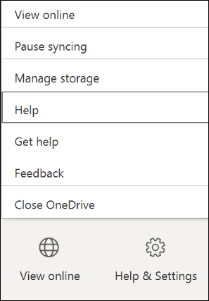

# Prevent users from contacting Microsoft directly

The OneDrive sync app (OneDrive.exe) allows users to contact Microsoft directly from within the app. Users can:

- Create a support ticket by selecting **Get help** and then selecting the **Contact support** link in the help pane.
- Send positive or negative feedback directly to Microsoft by selecting **Send feedback**.


As a global or SharePoint admin in Microsoft 365, you might want to disable these support features to prevent people in your organization from contacting Microsoft directly.

If you disable these features, users can still select Get help to view help articles, but the Contact support link will no longer appear. The Send feedback command will be replaced with a Feedback command that opens the [OneDrive UserVoice page](https://onedrive.uservoice.com/) in a web browser so users can view and provide feature suggestions.

The following screenshots show the changes after you disable the support features.




> [!NOTE]
> If you disable "Contact support" and "Send feedback" but allow users to sync personal accounts, they can still contact support and send feedback directly to Microsoft from the OneDrive sync app when they're signed in with their personal account. 

## Disable "Contact support" and "Send feedback" in Windows 

To disable these features in Windows, you can:

- Use the [Set-SPOTenantSyncClientRestriction](/powershell/module/sharepoint-online/set-spotenantsyncclientrestriction) in Microsoft PowerShell
- Edit the registry

### Use PowerShell

1. [Download the latest SharePoint Online Management Shell](https://go.microsoft.com/fwlink/p/?LinkId=255251).

    > [!NOTE]
    > If you installed a previous version of the SharePoint Online Management Shell, go to Add or remove programs and uninstall "SharePoint Online Management Shell." <br>On the Download Center page, select your language and then click the Download button. You'll be asked to choose between downloading a x64 and x86 .msi file. Download the x64 file if you're running the 64-bit version of Windows or the x86 file if you're running the 32-bit version. If you don't know, see [Which version of Windows operating system am I running?](https://support.microsoft.com/help/13443/windows-which-operating-system). After the file downloads, run it and follow the steps in the Setup Wizard.

2. Connect to SharePoint as a [global admin or SharePoint admin](/sharepoint/sharepoint-admin-role) in Microsoft 365. To learn how, see [Getting started with SharePoint Online Management Shell](/powershell/sharepoint/sharepoint-online/connect-sharepoint-online).
    
3. Run the following command:
    
      ```PowerShell
      Set-SPOTenantSyncClientRestriction -DisableReportProblemDialog $true
      ```

### Edit the registry

Follow these steps to disable the features on a PC by editing the registry.

> [!IMPORTANT]
> Follow the steps in this section carefully. Serious problems might occur if you modify the registry incorrectly. Before you modify it, [back up the registry for restoration](https://support.microsoft.com/help/322756/how-to-back-up-and-restore-the-registry-in-windows) in case problems occur.

1. In Registry Editor, locate the following subkey: **HKEY_CURRENT_USER\Software\Microsoft\OneDrive**

2. Right-click **OneDrive**, select **New**, and then select **DWORD (32-bit) Value**.

3. Enter **DisableReportProblemDialog** for the name.

4. Right-click the new registry key, enter **1** for **Value data**, and then select **OK**.

## Disable "Contact support" and "Send feedback" on Mac 

To disable the features in the OneDrive sync app for Mac, add a preference to defaults.

For the standalone Mac sync app:
**defaults write com.microsoft.OneDrive DisableReportProblemDialog 1**

For the Mac sync app installed through the Mac App Store:

**defaults write com.microsoft.OneDrive-mac DisableReportProblemDialog 1**
