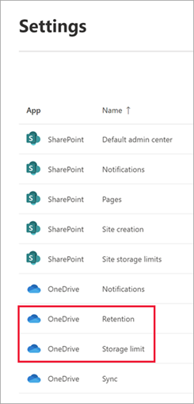
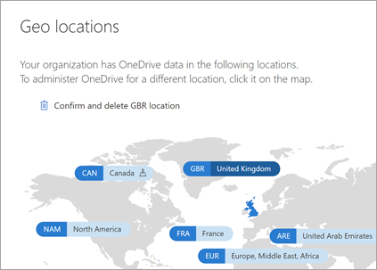

# Find OneDrive admin settings

This article covers all the features in the OneDrive admin center and where you can find them in other places.

## Sharing page

Go to the [Sharing page in the new SharePoint admin center](https://admin.microsoft.com/sharepoint?page=sharing&modern=true)

| OneDrive admin center | SharePoint admin center |
|:-----|:-----|
|| |

## Sync page

Go to the [Settings page in the new SharePoint admin center](https://admin.microsoft.com/sharepoint?page=settings&modern=true), and select **Sync**.

| OneDrive admin center | SharePoint admin center |
|:-----|:-----|
|| |

## Storage page

Go to the [Settings page in the new SharePoint admin center](https://admin.microsoft.com/sharepoint?page=settings&modern=true). To change the default storage setting, select **Storage limit**. To change the retention setting for deleted users, select **Retention**. 

| OneDrive admin center | SharePoint admin center |
|:-----|:-----|
|| |

## Device access page

Go to the [Access control page in the new SharePoint admin center](https://admin.microsoft.com/sharepoint?page=accessControl&modern=true). To control access based on network location, select **Network location**. To control access from apps that can't enforce device-based restrictions, select **Apps that don't use modern authentication**.

| OneDrive admin center | SharePoint admin center |
|:-----|:-----|
|| |

The policy settings under "Mobile application management" are no longer being updated. We recommend [creating app protection policies](https://endpoint.microsoft.com/?ref=AdminCenter#blade/Microsoft_Intune_DeviceSettings/AppsMenu/appProtection) in the Microsoft Endpoint Manager admin center. [Learn how](/mem/intune/apps/app-protection-policies). Refer to the following table to identify the Intune settings that correspond with the settings in the OneDrive admin center. 

| OneDrive | Intune |
|:-----|:-----|
|Block downloading files in the apps |Save copies of org data    |
|Block taking screenshots in the Android apps   |Screen capture and Google Assistant    |
|Block copying files and content within files   |Restrict cut, copy, and paste between other apps    |
|Block printing files in the apps   |Printing org data    |
|Block backing up app data   |Prevent backups    |
|Require an app passcode  Number of attempts before app is reset  Passcode length  Require complex passcode  Allow fingerprint instead of passcode (iOS only)   |PIN for access    MAX PIN attempts Select minimum PIN length Simple PIN Allow fingerprint instead of PIN |
|Block opening OneDrive and SharePoint files in other apps   |Send org data to other apps    |
|Encrypt app data when the device is locked   |Encrypt org data    |
|Require Office 365 sign-in every 7 days   |Recheck the access requirements after (minutes of inactivity)    |
|When a device is offline: Minutes to verify user access after   |Offline grace period (for "Block access")    |
|When a device is offline: Days to wipe app data after   |Offline grace period (for "Wipe data")    |

## Compliance

This page contains links to Office 365 Security & Compliance. [View the compliance and risk management solutions available in Microsoft 365](https://compliance.microsoft.com/solutioncatalog)

- [Search the audit log](https://compliance.microsoft.com/auditlogsearch?viewid=Search)
- [Create a DLP policy](https://compliance.microsoft.com/datalossprevention?viewid=policiesn)
- [View DLP policy match reports](https://compliance.microsoft.com/reports/dlppolicymatchesreport)
- [Create a retention policy](https://compliance.microsoft.com/informationgovernance?viewid=retention)
- [Create an eDiscovery case](https://compliance.microsoft.com/classicediscovery)
- [Create an alert](https://compliance.microsoft.com/compliancealerts)

## Notifications

For the "Display device notifications to users when OneDrive files are shared with them" setting, Go to the [Settings page in the new SharePoint admin center](https://admin.microsoft.com/sharepoint?page=settings&modern=true), and select the OneDrive **Notifications** setting.

| Classic | New |
|:-----|:-----|
|| |

For info about the "E-mail OneDrive owners when" settings, refer to the following table.

| Classic | New |
|:-----|:-----|
|Other users invite additional external users to shared files   |This setting is available in PowerShell (`Set-SPOTenant -NotifyOwnersWhenItemsReshared`).    |
|External users accept invitations to access files   |This setting no longer works for the new sharing experience that appears in most places.    |
|An anonymous access link is created or changed   |This setting is available in PowerShell (`Set-SPOTenant -OwnerAnonymousNotification`).    |

## Data migration

This page redirects to the [Migration page in the new SharePoint admin center](https://admin.microsoft.com/sharepoint?page=migration&modern=true).

## Geo locations

Go to the [Geo locations page in the new SharePoint admin center](https://admin.microsoft.com/sharepoint?page=geoLocationsg&modern=true).

| OneDrive admin center | SharePoint admin center |
|:-----|:-----|
|||

