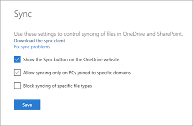
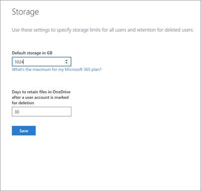

# Find OneDrive admin settings

This article covers all the features in the OneDrive admin center and where you can find them in other places.

## Sharing page

Go to the [**Sharing page** in the new SharePoint admin center](https://admin.microsoft.com/sharepoint?page=sharing&modern=true)

| OneDrive admin center | SharePoint admin center |
|:-----|:-----|
|| |

## Sync page

Go to the [Settings page of the new SharePoint admin center](https://admin.microsoft.com/sharepoint?page=settings&modern=true), and select **Sync**.

| OneDrive admin center | SharePoint admin center |
|:-----|:-----|
|| |

## Storage page

For the default storage setting, go to the [Settings page of the new SharePoint admin center](https://admin.microsoft.com/sharepoint?page=settings&modern=true), and select **Storage limit**.

| OneDrive admin center | SharePoint admin center |
|:-----|:-----|
|| |

For the default storage setting, go to the [Settings page of the new SharePoint admin center](https://admin.microsoft.com/sharepoint?page=settings&modern=true), and select **Storage limit**.

| OneDrive admin center | SharePoint admin center |
|:-----|:-----|
|| |

## Device access page

| Classic | New |
|:-----|:-----|
|| |

 

| Classic | New |
|:-----|:-----|
|Allow access only from specific IP address locations   |Yes    |
|Allow access from apps that don't use modern authentication   |Yes    |
|Mobile application management   |Map with Intune    |

## Compliance

This page contained links to other admin centers in Microsoft 365. Those places still exist. 

## Notifications

| Classic | New |
|:-----|:-----|
|| |

 

| Classic | New |
|:-----|:-----|
|Display device notifications to users when OneDrive files are shared with them   |Yes    |
|Other users invite additional external users to shared files   |Set-SPOTenant -NotifyOwnersWhenItemsReshared    |
|External users accept invitations to access files   |Deprecated    |
|An anonymous access link is created or changed   |Set-SPOTenant -OwnerAnonymousNotification    |

## Data migration

This page redirects to Migration Manager in the SharePoint admin center.

## Geo locations

| Classic | New |
|:-----|:-----|
|| |

 

| Classic | New |
|:-----|:-----|
|Switch location   |Yes    |
|Add location    |Yes    |
|Delete satellite locations   |Yes    |
