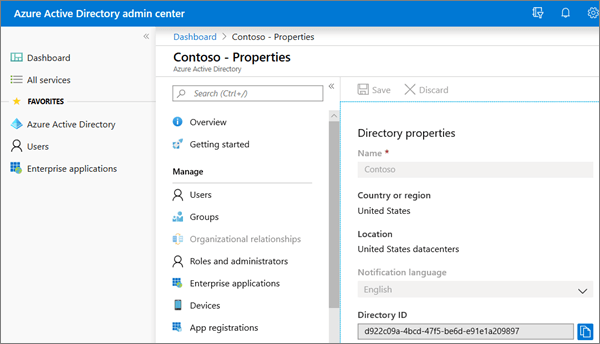

# Find your Microsoft 365 tenant ID

Your Microsoft 365 tenant ID is a globally unique identifier (GUID) that is different than your organization name or domain. You may need this identifier when you configure Group Policy objects for OneDrive.
  
**To find your Microsoft 365 tenant ID in the Azure AD admin center**

Your tenant ID can be found in the **Directory ID** box on the [Properties page](https://aad.portal.azure.com/#blade/Microsoft_AAD_IAM/ActiveDirectoryMenuBlade/Properties).

  
> [!NOTE]
> For info about finding your tenant ID by using PowerShell instead, first read [Azure Active Directory PowerShell for Graph](/powershell/azure/active-directory/install-adv2?view=azureadps-2.0) and then use [Get-AzureADTenantDetail](/powershell/module/azuread/Get-AzureADTenantDetail).
