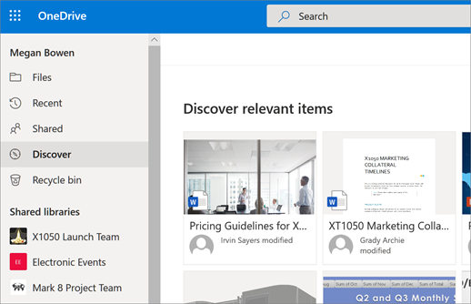

# About Discover view

The Discover view in OneDrive (available with some subscription plans) showed users the most relevant content based on who they were working with and what they were working on. This view was removed from OneDrive in September 2020. We recommend that users find files across your organization by using Search. 

