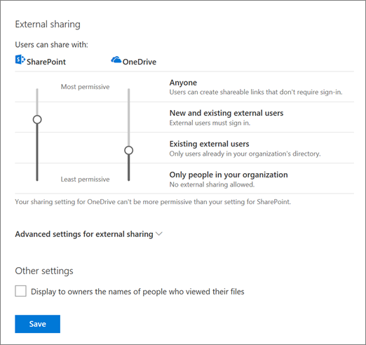

# Manage sharing in OneDrive and SharePoint

As a global admin or SharePoint admin in Office 365, you can use the OneDrive admin center to control how sharing works at the organization level in OneDrive and SharePoint Online. Because each OneDrive is a site (previously called "site collection") within SharePoint, your organization's SharePoint settings and OneDrive settings are related.
  
To learn how to change the external sharing setting of an individual user's OneDrive, see [Change the external sharing setting for a user's OneDrive](user-external-sharing-settings.md). For info about how to share a file or folder in OneDrive, see [Share OneDrive files and folders](https://support.office.com/article/9fcc2f7d-de0c-4cec-93b0-a82024800c07#BKMK_BusinessTab).
  
> [!NOTE]
> Some sharing settings exist in multiple admin centers. When you change them in one place, the other admin centers will reflect the change. If you have multiple admins in your organization, make sure you communicate the changes you're making. In the Microsoft 365 admin center, under **Settings** \> **Services &amp; add-ins** \> **Sites**, the External sharing setting is the same as the SharePoint external sharing setting in the OneDrive admin center. The Sharing page in the OneDrive admin center and the in the classic SharePoint admin center control the same settings. 
  
## Change your sharing link settings

If you haven't yet specified the external sharing settings you allow, do that first: [Control external sharing for OneDrive and SharePoint](manage-sharing.md#externalsharing). Then follow these steps to guide your users into creating the kind of sharing link you prefer.
  
1. Open the [OneDrive admin center](https://admin.onedrive.com/?v=SharingSettings), and select **Sharing** in the left pane. 
    
2. Under **Default link type**, choose the kind of link that's selected by default when users share items:
    
    > [!IMPORTANT]
    > The following setting applies to both SharePoint and OneDrive. It syncs with the setting in the SharePoint admin center. For more info about this setting in the SharePoint admin center, see [Change the default link type when users get links for sharing](/sharepoint/change-default-sharing-link). 
  
  - **Shareable links** (accessible by anyone with the link). This option is only available if your external sharing setting for SharePoint is set to **Anyone**. If the external sharing setting for OneDrive or a specific site isn't set to "Anyone," the default link type for OneDrive or the site will be "Internal."
    
  - **Internal links** (accessible only by users within your organization, can be shared internally). If you allow external sharing, users will have to switch the link type every time they share externally. 
    
  - **Direct links** (accessible only by the people specified when the user creates the link). Select this type if most of the time users will share with guests (who will need to authenticate) or with a small group of individuals in your organization.  
    
3. Click **Save**.
    
    
  
 **Advanced settings for shareable links**
 
  - **Links must expire within this number of days** This value sets the expiration time for links.  Entering a value of 0 will set it so that links do not expire.
  
  - **Files and Folders**
  
    - **View** Using this setting will make it so that the shared files or folders can only be viewed or accessed.  Think of this as a "read only" option.
    
    - **View, edit, and upload** Using this setting will make it so that the shared files or folders can be edited by anyone who has the link.
  
## Control external sharing for OneDrive and SharePoint

By default, users are allowed to share files in OneDrive and SharePoint with anyone using links that don't require sign-in. If you want to change this, it's best to do it first before you customize your link settings. Keep the following in mind as you configure sharing for OneDrive.
  
- The external sharing setting for SharePoint can be **more** permissive than what you allow in OneDrive, but not **less** permissive. If you turn off external sharing for SharePoint in your organization, you can't turn it on for OneDrive. 
    
- If you want to allow external file sharing on any sites, you need to turn it on globally (at the organization level). You can then turn it off for all other sites. To learn how to turn external sharing on or off for a site, see [Change external sharing for a site](/sharepoint/change-external-sharing-site).
    
- If you turn off external sharing, any links shared externally will stop working. If you later turn it back on, the links will resume working.
    
 **To configure external sharing for OneDrive**
  
1. Open the [OneDrive admin center](https://admin.onedrive.com/?v=SharingSettings), and select **Sharing** in the left pane. 
    
2. Under **External sharing**, move the sliders to the settings you want for SharePoint and OneDrive, as described in the table below.
    
    
  
    |**If you want to:**|**Select this option:**|**For this result:**|
    |:-----|:-----|:-----|
    |Let users create links that don't require sign-in (previously referred to as "anonymous access links")    |**Anyone**   |Users can create links that can be freely shared. They can also select to require sign-in when they share items.    |
    |Require external users to prove who they are by entering a verification code or by signing in with a Microsoft account or a work or school account before they can access shared files.    |**New and existing external users**   |Users can send invitations to anyone (unless you choose to restrict domains). Invitations to access files can be redeemed only once. After they've been redeemed, they can't be used by others to gain access. New external users will be added to Azure Active Directory when they sign in to view the shared item.    |
    |Allow sharing only for external users who are already in Azure Active Directory.    |**Existing external users**   |Users can send sharing invitations to any external user who has been added to Azure Active Directory. Invitations to access files can be redeemed only once. After they've been redeemed, they can't be used by others to gain access.    |
    |Turn off external sharing.    |**Only people in your organization**   |External sharing is not allowed.    |

    > [!NOTE]
    > If you turn off external sharing for SharePoint, you can still change the advanced settings for external sharing in the next step. Your changes won't take effect until you turn on external sharing.
    
3. Specify any advanced settings for external sharing.
    
    > [!IMPORTANT]
    > These settings apply to both SharePoint and OneDrive. The settings you change in the OneDrive admin center sync with your settings in the SharePoint admin center. 
  
  - **Allow or block sharing with people on specific domains**. You specify a list of allowed or blocked domains. Note that if you allow shareable links (which don't require sign-in), users who share items with these links can share with anyone, including people who have accounts on restricted domains. This setting is the same as the setting on the sharing page in the SharePoint admin center. For more info, see [Restricted domains sharing in SharePoint Online and OneDrive for Business](/sharepoint/restricted-domains-sharing)
    
  - **External users must accept sharing invitations using the same account that the invitations were sent to**. This lets you control the accounts external users use to access shared items.
    
  - **Let external users share items they don't own**. This setting is selected by default.
    
4. Click **Save**.
    
## Other settings

1. Open the [OneDrive admin center](https://admin.onedrive.com/?v=SharingSettings), and select **Sharing** in the left pane. 
    
2. Under **Other settings**, select or clear **Display to owners the names of people who viewed their files**.
    
    
  
    This setting lets you control whether the owner of a shared file can see the people who only view (and don't edit) the file in OneDrive file access statistics. File access statistics appear on a card when users hover over a file name or thumbnail in OneDrive. The statistics include the number of views on the file, the number of people who viewed it, and the list of people who viewed it.
    
    > [!NOTE]
    > This setting is selected by default. If you clear it, file viewer info is still recorded and available to you to audit as an admin. OneDrive owners will also still be able to see people viewing their shared Office files by using Office Online or the Office desktop apps. 
  
3. Click **Save**.
    

  

