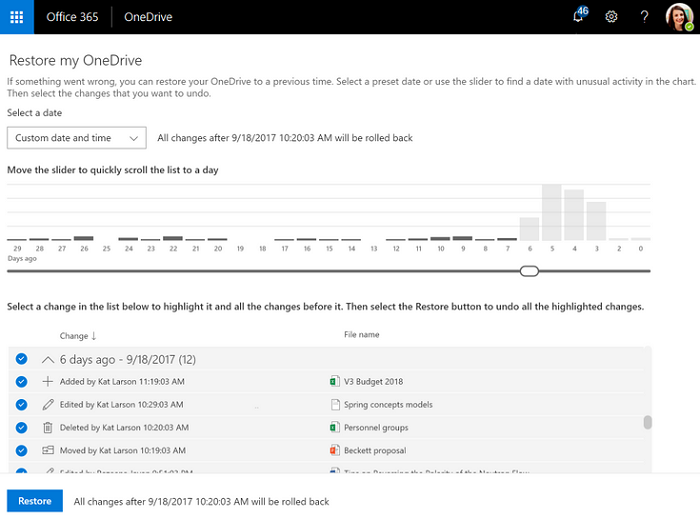
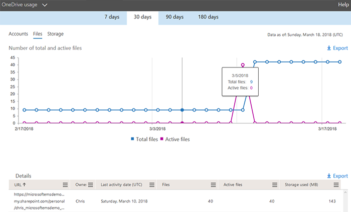

# OneDrive guide for enterprises

With Microsoft OneDrive, you can easily and securely store and access your files from all your devices. You can work with others regardless of whether they're inside or outside your organization and terminate that sharing whenever you want. OneDrive helps protect your work through advanced encryption while the data is in transit and at rest in data centers. OneDrive also helps ensure that users adhere to your most rigorous compliance standards by enabling them to choose where their data lives and providing detailed reporting of how that data has changed and been accessed. OneDrive connects you to your personal and shared files in Microsoft Microsoft 365, enhancing collaboration capabilities within Microsoft 365 apps. With OneDrive on the web, desktop, or mobile, you can access all your personal files plus the files shared with you from other people or teams, including files from Microsoft Teams and SharePoint.

## Why deploy OneDrive?

OneDrive provides a robust but simple-to-use cloud storage platform for small businesses, enterprises, and everything in between. Unlike other cloud storage providers, most of the advanced enterprise-focused features in OneDrive are available for every subscription type, enabling companies to use OneDrive in whatever way benefits their business the most – whether that's simply a cloud-based file share for a small business or a highly utilized storage system that provides the basis for all collaboration within an enterprise. At its core, however, OneDrive enables you to securely share and work together on all your files. With OneDrive, you can:

-   **Access files from all your devices.** Access all your personal files and those files others share with you on all your devices, including mobile, Mac, and PC as well as in a web browser.

-   **Share inside or outside your organization.** Securely share files with people inside or outside your organization by using their email address, even if they don't have a Microsoft Services Account. This common sharing experience is available in the web, mobile, and desktop versions of OneDrive.

-   **Collaborate with deep Microsoft Office integration.** Document coauthoring is available in the Office web apps, Office mobile apps, and Office desktop apps, helping you maintain a single working version of any file. Only OneDrive provides coauthoring capabilities in Office apps across all your devices.

-   **Quickly find files that matter most.** Finding content in your OneDrive is simplified through the intelligence of the Microsoft Graph application programming interface. This technology simplifies finding what's important by providing file recommendations based on your relationship to other people, how you received various files, and when you last accessed them.

-   **Protect your files with enterprise-grade security.** OneDrive has many security and compliance features, enabling you to meet some of the strictest compliance requirements out there.

The Microsoft 365 family of products, which includes Office, Microsoft Outlook, SharePoint, Teams, OneDrive, and Yammer, provides a complete, intelligent, and secure solution to empower employees. Together, the Microsoft 365 applications unlock creativity and encourage teamwork through product integration and a simple user experience, all while providing intelligent security to help keep your data safe. In addition, Microsoft Graph enables you to interact with and report on the data within many of the Microsoft 365 applications.

## Key OneDrive features

Unlike most other cloud storage providers, OneDrive makes most of its advanced features available to all subscription types. This gives smaller organizations the flexibility to use standard features out of the box, and configure advanced features based on the needs of their organization.

The features listed in this section address common customer concerns or specific compliance requirements, or provide unique functionality available only in OneDrive:

-   Known Folder Move
  
-   OneDrive Files On-Demand

-   Modern attachments

-   Real-time team collaboration: Coauthoring in full versions of Microsoft Word, Excel, and PowerPoint

-   Seamlessly connecting files to conversations

-   Intelligent discover with OneDrive Discover view

-   OneDrive Files Restore

-   Recycle bin

-   Data loss prevention (DLP)

-   eDiscovery

-   Auditing and reporting

-   Encryption of data in transit and at rest

-   Customer-controlled encryption keys

-   Microsoft 365 Customer Lockbox

-   Hybrid integration with SharePoint Server

-   OneDrive Multi-Geo storage locations""""

-   Government cloud


For a full list of feature availability across OneDrive plans, see [Microsoft OneDrive](https://products.office.com/onedrive-for-business/online-cloud-storage). More in-depth descriptions for some of these features follow.

### Known Folder Move

Known Folder Move makes it easier to move files in your users' Desktop, Documents, and Pictures folders to OneDrive. This lets users continue working in the folders they're familiar with and access their files from any device. It also helps you make sure your users' files are backed up in the cloud if anything happens to their device. For more info, see [Redirect and move Windows known folders to OneDrive](redirect-known-folders.md).

### OneDrive Files On-Demand

OneDrive Files On-Demand enables users to view, search for, and interact with files stored in OneDrive from within File Explorer without downloading them all to their device. The feature provides a seamless look and feel for both OneDrive and local files without taking up space on the local hard drive. Files that have not been downloaded have a cloud icon for their status, as shown below. For those files that have been downloaded, the status shows a green checkmark.


Natively, files will be downloaded only when you need to access them. However, if you plan to access a file while disconnected from the internet, you can simply make the file available offline by right-clicking it, and then selecting **Always keep on this device**. Alternatively, if you want to free space on your device and remove the downloaded copy of a file, right-click the file, and then select **Free up space**. The following image shows the right-click menu for OneDrive files on a computer running the Windows operating system.


For more info about OneDrive Files On-Demand, see [Learn about OneDrive Files On-Demand](https://support.office.com/article/0e6860d3-d9f3-4971-b321-7092438fb38e).

### Modern attachments

OneDrive integrates with Outlook to allow seamless sharing of OneDrive files that appear just like email attachments. This feature provides a familiar sharing experience but centralizes storage of attachments in OneDrive, providing collaborative benefits such as version control typically lost when users email documents back and forth. In addition, you can configure sharing permissions on the files directly from within the Outlook client. For an example of a document in OneDrive being attached as a link to an email, as well as the experience of changing the sharing permissions on the link, see the following image.


To reduce the potential for confusion when OneDrive users choose to add a copy versus a link to attached OneDrive files, you can set the default behavior of the Outlook client, as demonstrated in [How to control default attachment state when you attach a cloud file in Outlook](https://support.microsoft.com/help/4011261/how-to-set-attachment-preference-for-attaching-a-cloud-file-in-outlook).

### Files Restore

The OneDrive Files Restore feature enables users to restore files to any point over the past 30 days. To select the desired recovery time, OneDrive presents users with a histogram that shows file activity so that they can determine which recovered time meets their needs. From there, users can simply select the file history entry to which they want to restore, and all changes after that point will be rolled back. The following image shows the Files Restore experience for a user.



In addition, because the histogram shows individual activity on a file, users can employ this feature to quickly view their files' modification history. For more info about this feature, see [Restore your OneDrive](https://support.office.com/article/fa231298-759d-41cf-bcd0-25ac53eb8a15).

### Recycle bin

OneDrive has a recycle bin similar to the one available on the Windows desktop. Deleted files are moved to the recycle bin and kept for a designated time before being permanently deleted. For work or school accounts, deleted files are purged after 93 days unless configured otherwise. For a demonstration about how the recycle bin works, see [Restore deleted files or folders in OneDrive](https://support.office.com/article/949ada80-0026-4db3-a953-c99083e6a84f).

### Auditing and reporting

OneDrive has detailed reporting and auditing capabilities for files it stores as well as for those files stored through other services that use OneDrive for storage, such as Microsoft SharePoint. In addition, you can audit individual file actions, including downloads, renames, and views.

The Office 365 admin center handles reporting for cloud services, including OneDrive. You can view historical information like storage usage by user and for the organization, total file and active file counts, and account activity. The following image shows an example of a OneDrive report for file usage over the past 30 days in the Office 365 admin center.

> [!NOTE]
> To export this info to a .csv file, select **Export**.



You can also consume this info in Power BI by using the Microsoft 365 usage analytics content pack. Using this content pack, you can visualize and analyze Office 365 usage data by using prebuilt graphs and charts or by creating custom reports to gain insights into how specific regions or departments within your organization are using Office 365. For more info about this content pack, see [Microsoft 365 usage analytics](/office365/admin/usage-analytics/usage-analytics).

### Encryption of data in transit and at rest

OneDrive uses advanced data-encryption methods between your client and the data center, between servers in the data center, and at rest. At rest, OneDrive uses disk encryption through BitLocker Drive Encryption and file encryption to secure your data. Each file is encrypted with its own encryption key; anything larger than 64 KB is split into individual chunks, each of which has its own encryption key locked in a key store.

Each file chunk is then randomly distributed among Microsoft Azure Storage containers, and a construction map for the complete file is stored in a separate secure content database. For attackers to access the file, they would need all the file chunks, the keys, and the map—a highly improbable task. For more info about this process, see [Data Encryption in OneDrive and SharePoint](/office365/securitycompliance/data-encryption-in-odb-and-spo/).

### Customer-controlled encryption keys

By using an Office 365 feature called *service encryption with Customer Key,* you can upload your own encryption keys to Azure Key Vault for use encrypting your data at rest in Azure data centers. Even though this encryption is done natively through BitLocker, customers can require the use of their own key to meet their security compliance requirements. Should users lose their key, they can retrieve a deleted key from the Recycle Bin for up to 90 days (based on your configuration). Before you can use this feature, however, you must create an Azure subscription and complete a few prerequisite steps. For detailed info about service encryption with Customer Key, and how to configure it in your environment, see [Controlling your data in Office 365 using Customer Key](/office365/securitycompliance/controlling-your-data-using-customer-key/).

### Office 365 Customer Lockbox

If a Microsoft support engineer needs to access your data to resolve an issue, that engineer is required to obtain approval from a Microsoft manager first. The Office 365 Customer Lockbox feature adds a requirement to that process: you must approve or reject that access before the support engineer can access your data. With Customer Lockbox, you can also set boundaries on how long the engineer can access your data, and all activity during that time is logged for auditing purposes. For more info about how to configure and use the Customer Lockbox feature, see [Office 365 Customer Lockbox Requests](/office365/admin/manage/customer-lockbox-requests).

### Microsoft Trust Center

Microsoft Trust Center provides info about Microsoft's trust policy, how Microsoft products help you protect your data and maintain your customers' and users' trust, and why you should trust Microsoft products with your data. The following two categories provide details about Office 365 and OneDrive data privacy, compliance, and security:

-   **Office 365 Trust Center.** Privacy, compliance, and cybersecurity are as important to Microsoft as they are to you. For info about how Office 365 can help you increase employee productivity while helping you safeguard your data, see [Microsoft Office 365](https://www.microsoft.com/trustcenter/cloudservices/office365) in the Microsoft Trust Center. For info about why you should trust Microsoft, Office 365, and OneDrive with your data, see [Office 365 Trust Center](https://www.microsoft.com/trust-center).

-   **General Data Protection Regulation (GDPR).** This new European Union regulation changes how companies are required to handle data and the transparency with which they collect it. Windows 10 and Office 365 with OneDrive give you GDPR-compliant tools; you simply need to incorporate those tools into your overall data integrity story. For answers to some common questions about GDPR compliance with OneDrive and SharePoint, see [GDPR Compliancy with OneDrive and SharePoint](https://techcommunity.microsoft.com/t5/Microsoft-OneDrive-Blog/GDPR-Compliancy-with-OneDrive-and-SharePoint/ba-p/191126). For a complete list of helpful resources about GDPR, see [Resources for GDPR compliance](https://www.microsoft.com/trustcenter/privacy/gdpr/resources). For additional helpful info about OneDrive, see the [Microsoft OneDrive Blog](https://techcommunity.microsoft.com/t5/OneDrive-Blog/bg-p/OneDriveBlog).

### OneDrive Multi-Geo storage locations

Multi-Geo is an Office 365 feature that allows organizations so span their storage over multiple Office 365 geo locations and specify in which of those to store users' data. You can designate storage geographies on a per-user basis.

For multinational customers with data residency requirements, you can use this feature to ensure that each user's data is stored in the geo location necessary for compliance. For more info about this feature, see [Multi-Geo Capabilities in OneDrive and SharePoint in Office 365](/office365/enterprise/multi-geo-capabilities-in-onedrive-and-sharepoint-online-in-office-365/).

### Government cloud

OneDrive is available in Office 365 U.S. Government plans. For info about these plans, see [Office 365 U.S. Government](https://products.office.com/government/office-365-web-services-for-government).


## Deployment and management options

You can deploy and manage OneDrive in many ways, but certain options make more sense in larger organizations than in smaller businesses and vice versa. For example, it likely wouldn't make sense to have an enterprise management solution like Microsoft Endpoint Configuration Manager for a business that has just 10 employees. Table 1 outlines the deployment and management tools typically used for small businesses, medium-sized businesses, and enterprises.

> [!NOTE]
> Keep in mind that an organization in one size category would probably incorporate additional options from other size categories. This table is not intended to exclusively identify a technology with a specific business size.

|**Size of organization**|**Deployment tools used**|**Management**|
|:-----|:-----|:-----|
|Small business|Local installation|OneDrive admin center|
|Medium-sized business|Scripted installation or Microsoft Intune mobile device management (MDM)|Office 365 with MDM, OneDrive admin center, Intune mobile application management (MAM) or MDM|
|Enterprise|Microsoft Endpoint Configuration Manager with Intune or Windows Autopilot|Microsoft Endpoint Configuration Manger, Group Policy objects (GPOs), and so on. |

Depending on where your organization fits in this table and the technologies available to you, you can choose which portion of this guide to use. For example, if you run a small business, you may want to keep your OneDrive deployment simple by installing the sync app manually on your employees' computers and using the OneDrive admin center to manage a few settings for your users. Alternatively, if you're running an enterprise, you may choose to deploy and manage OneDrive by using advanced tools like Microsoft Endpoint Configuration Manager and Group Policy, and you could use the sections that correspond to those tools, instead. To accommodate various situations, the deployment and management portions of this guide are in a modular format so that you can consume the document in the way that best aligns with your deployment needs and capabilities. This format also provides visibility into alternate technologies to improve your current processes.

## Prerequisites

- **Client and app requirements.** Even though you can upload, download, and interact with your OneDrive files from a web browser, the ideal OneDrive experience comes from the Windows and Mac sync apps and the iOS and Android mobile apps. With that in mind, OneDrive is available for most operating systems and browsers and requires minimal hardware. For a full list of client and app requirements for using OneDrive, see [OneDrive system requirements](https://support.office.com/article/cc0cb2b8-f446-445c-9b52-d3c2627d681e).

- **License requirements.** There are multiple methods by which you can acquire a license for OneDrive. However, a few OneDrive features are available only within certain licensing models. For info about the licensing requirements for OneDrive, its advanced features, and any special licensing required for them, see [Office 365 plans](https://products.office.com/business/compare-more-office-365-for-business-plans).

## Deployment process

When deploying any new technology, there's always an ideal process to follow to ensure that you deploy it correctly. This section covers the high-level planning and deployment steps to help ensure that your OneDrive deployment is successful.

> [!NOTE]
> OneDrive deployment can be as simple as a local installation and may not require all the steps in this section. For example, the "Determine devices" and "Align technologies" sections may not be applicable to small business interested in performing a simple installation of OneDrive.

### Determine devices

Your organization doesn't have to manage all connected devices for them to use OneDrive, but securing and managing the interaction with the data do require a layer of management capabilities. Start by determining which types of devices—iOS, Android, Windows 10—require access to OneDrive and who owns them (the business or the employee). Put this info in a spreadsheet to help you determine which capabilities you need from your technology solutions. Some management options are more suitable for devices that the company owns and manages. Regardless of the platform running OneDrive and who owns it, the following management options are available to you:

- OneDrive admin center

- Microsoft 365 MDM

- Intune MDM or MAM

For Windows 10 client devices that are joined to a domain, you have the additional option of using GPOs for management. Also, for those devices that are company owned and managed, you can use Microsoft Endpoint Configuration Manager to deploy OneDrive.

### Align technologies

When you've identified the devices that require access to OneDrive, you then identify the technology options available to you or that align with your organization's size. If you're considering implementing a new deployment and management solution, the table in [How organizations deploy and manage OneDrive](#deployment-and-management-options) lists the technologies that make the most sense based on organization size. Using this info, you can align the technologies you need or already have with the deployment and management capabilities that fit the devices you need to manage.

### Deploy, secure, and manage OneDrive

You deploy, manage, and secure OneDrive based on the tools you chose in the previous steps. Each technology has different deployment, update, and management options, so when deploying OneDrive, you must first consider whether you need to upgrade existing devices. Also, securing OneDrive may include both client-side and cloud service–side configuration. Lastly, be sure to consider data compliance requirements, such as dedicated storage regions.

## OneDrive limitations

Because OneDrive provides access to files on many kinds of devices, it restricts the use of certain characters, file names, and folder names. In addition, certain features are available only in the Windows operating system. For a full list of these and other limitations of OneDrive, see [Invalid file names and file types in OneDrive and SharePoint](https://support.office.com/article/64883a5d-228e-48f5-b3d2-eb39e07630fa).

## Feature releases and requests

If you want to see the functionality currently under development for OneDrive and Office 365, check out the [Microsoft 365 Roadmap](https://www.microsoft.com/microsoft-365/roadmap) or the [Microsoft OneDrive Blog](https://techcommunity.microsoft.com/onedrive). Lastly, if you want to request new functionality or vote on great community ideas for OneDrive, visit [OneDrive UserVoice](https://onedrive.uservoice.com).

## Keys to successful user adoption

User adoption is important to the overall success of any new application. Ideally, to feel that you have maximized your investment in Office 365 and OneDrive, you need to maximize user engagement with them. To do that, start by focusing on three critical success factors:

-   **Stakeholders.** Securing the participation and buy-in of key people within your organization is critical to successful user adoption. This support can come from business-focused leaders, IT leadership, or anyone else who has a vested interest in seeing OneDrive and Office 365 succeed in the organization. It is important to have both executive or business leader support and product champions to help carry the knowledge to their peers. Whether you're formally delegating the product champion role or allowing it to grow organically, champions are mission critical to user adoption. In fact, a SharePoint user study in 2013 showed that people prefer to learn from a coworker than from an IT employee. For more info about how to identify key stakeholders for your OneDrive and Office 365 implementation, see the [Identify key stakeholders guide](https://aka.ms/execsponsor). For more info about building a sustainable champion community, see [Build a champion program](https://aka.ms/office365champions).

-   **Scenarios.** When planning to implement OneDrive and Office 365, identify and define your business scenarios and how those scenarios align with the benefits of implementing OneDrive and Office 365. Work with your key stakeholders to identify the goals of the business scenarios, and then match those goals against usage scenarios. For example, a business goal may be to maximize user productivity; a key usage scenario enabling that goal would be using OneDrive to access files from mobile devices, PCs, and Macs. For help with this process, see the [Office 365 Productivity Library](https://support.office.com/article/d8ab82a5-5f02-4439-816b-4a5d35133e48).

-   **Awareness and training.** Creating awareness through awareness campaigns such as announcements, launch events, newsletters, town hall meetings, contests, and giveaways is a critical path to maximizing adoption. In addition, providing users with knowledge through classroom-style sessions and self-help guides helps them feel empowered to use OneDrive and Office 365. For more info about user communication and training on Office 365, see the [Plan your Office 365 Launch: Communication and Training Guide](https://aka.ms/commandtraining).

Many resources are available from Microsoft to help you drive user adoption within your environment. For more info about a recommended Microsoft 365 user adoption strategy, see the [Microsoft 365 End User Adoption Guide](https://fto365dev.blob.core.windows.net/media/Default/DocResources/en-us/Microsoft%20365%20User%20Adoption%20Guide.pdf). For more info about driving user engagement, see [Success Factors for Office 365 End User Engagement](https://fto365dev.blob.core.windows.net/media/Default/DocResources/en-us/Resources/Office365_AdoptionBrochure_v2.0_Screen.pdf). You can also contribute to or comment on adoption-related ideas in the [Driving Adoption Tech Community](https://techcommunity.microsoft.com/t5/Driving-Adoption/ct-p/DrivingAdoption).

## Preparing your environment

Before you deploy OneDrive, prepare your environment.

### Network utilization

A variety of factors can impact the amount of network bandwidth used by OneDrive. For the best experience, we recommend that you assess this impact before doing a full OneDrive deployment across your organization. The article [Network utilization planning for the OneDrive sync app](network-utilization-planning.md) includes the recommended process for determining your network bandwidth needs for OneDrive. Be sure to include this as part of your deployment plan.

### Multi-Geo

If you have data residency requirements, consider OneDrive Multi-Geo. With OneDrive Multi-Geo, you can specify a preferred data location (PDL), from available locations around the world, for each user's OneDrive. For detailed info about OneDrive Multi-Geo, see [Multi-Geo Capabilities in OneDrive and SharePoint in Microsoft 365](/office365/enterprise/multi-geo-capabilities-in-onedrive-and-sharepoint-online-in-office-365/).

If you plan to deploy OneDrive Multi-Geo, there are two user scenarios:

-   Users who start using OneDrive before you configure OneDrive Multi-Geo – their OneDrive will be located in the central location once you configure OneDrive Multi-Geo. If you need to move a user's OneDrive to a different geo location, follow the steps in [Move a OneDrive site to a different geo-location](/office365/enterprise/move-onedrive-between-geo-locations/).

-   Users who start using OneDrive after you configure OneDrive Multi-Geo – you can configure their preferred data location as part of your general user onboarding process and their OneDrive will be created in the appropriate geo location.

Features such as file sync and mobile device management work normally in a multi-geo environment. There's no special configuration or management needed. The multi-geo experience for your users has minimal difference from a single-geo configuration. For details, see [User experience in a multi-geo environment](/office365/enterprise/multi-geo-user-experience/).

If you plan to configure OneDrive Multi-Geo prior to deploying OneDrive for your users, see [Plan for OneDrive Multi-Geo](/office365/enterprise/plan-for-multi-geo/), and follow the steps in [OneDrive Multi-Geo tenant configuration](/office365/enterprise/multi-geo-tenant-configuration/).

Key decisions:

-   Do you plan to use OneDrive Multi-Geo?

-   Will you have OneDrive Multi-Geo fully configured before your users start using OneDrive?

### Hybrid

If you currently use OneDrive or MySites in SharePoint Server on-premises, we highly recommend deploying hybrid OneDrive. With hybrid OneDrive, users are redirected from their on-premises OneDrive to OneDrive in Microsoft 365. Hybrid OneDrive allows for seamless navigation to OneDrive in the cloud from both SharePoint on-premises and Microsoft 365.

When you deploy hybrid OneDrive, the OneDrive links in the SharePoint Server ribbon and app launcher will point to OneDrive in Microsoft 365. If your users have files in on-premises OneDrive, they may have trouble accessing them unless they've bookmarked the old URL. It's important to have a migration plan for these files before you deploy hybrid OneDrive. For migration options, see [Migrating data](#migrating-data) later in this article.

If you don't use OneDrive in SharePoint Server, but you do have an on-premises SharePoint environment, you may still want to consider deploying hybrid OneDrive. Doing so will update the OneDrive navigation links in SharePoint Server to point to OneDrive in Microsoft 365 – again, giving your users seamless navigation to OneDrive in the cloud from either location.

For more info about how to configure OneDrive in a hybrid scenario and how it works, see [Plan hybrid OneDrive](/sharepoint/hybrid/plan-hybrid-onedrive-for-business/).

SharePoint hybrid has a variety of features to create a seamless experience when using both SharePoint Server and SharePoint. If you're planning to configure hybrid OneDrive, consider including other SharePoint hybrid features for a better overall user experience. For more info, see [Explore SharePoint Server hybrid](/sharepoint/hybrid/explore-sharepoint-server-hybrid/) .

After you've migrated your users' files from on-premises OneDrive and configured hybrid OneDrive, to save disk space, you can reduce the quota for your on-premises OneDrive top-level site collection to a minimal value.

Key decisions:

-   Do you want to deploy hybrid OneDrive?

-   Do your users have OneDrive on-premises data that needs to be migrated to OneDrive in Microsoft 365?

## Information protection

OneDrive shares can contain sensitive info that could damage your organization if it were shared with the wrong people. This section provides OneDrive best practices and other info to help prevent accidental data leakage and protect your data by controlling who can access it.

### Information rights management–protected file synchronization

If you're using information rights management (IRM), OneDrive can synchronize those file libraries and provide a seamless experience for users. For detailed information about how OneDrive handles IRM, see [How Office applications and services support Azure Rights Management](/azure/information-protection/office-apps-services-support). For OneDrive to synchronize these IRM-protected libraries, however, additional configuration is required, including deploying the latest [Rights Management Services (RMS) client](https://www.microsoft.com/download/details.aspx?id=38396) to your users' computers. For details about the additional configuration required for OneDrive to support IRM libraries, see [SharePoint and OneDrive: IRM Configuration](/azure/information-protection/configure-office365#sharepoint-online-and-onedrive-for-business-irm-configuration).

### Windows Information Protection

You can use Windows Information Protection (WIP) to help prevent data leakage by deploying application or device policies that restrict how your employees can store, access, and use your organization's data. For example, you can restrict users to synchronizing files that contain company data only to OneDrive and not to personal cloud storage providers like Dropbox. For info about how to use WIP, see [Protect your enterprise data using Windows Information Protection (WIP)](/windows/security/information-protection/windows-information-protection/protect-enterprise-data-using-wip/).

If you've decided to use Windows Information Protection with OneDrive, see the following resources to set up your Windows Information Protection policies:

-   [Create a Windows Information Protection (WIP) policy using Microsoft Intune](/windows/security/information-protection/windows-information-protection/overview-create-wip-policy/)

-   [Create a Windows Information Protection (WIP) policy using Configuration Manager](/windows/security/information-protection/windows-information-protection/overview-create-wip-policy-sccm/)


### Azure Information Protection

Azure Information Protection is a cloud-based solution that helps organizations classify, label, and protect their documents and emails. This classification can occur automatically when administrators define rules and conditions; manually by users; or both, where users receive recommendations. Users can synchronize Azure Information Protection–protected files to OneDrive after you have configured their accounts to do so.

For more info about Azure Information Protection, see [What is Azure Information Protection](/azure/information-protection/what-is-information-protection/)? You can add Azure Information Protection to your Office 365 subscription on the Subscriptions page of the [Microsoft 365 admin center](https://admin.microsoft.com/AdminPortal/Home#/subscriptions).

If you have decided to use Azure Information Protection, to configure the necessary settings for it to work with OneDrive, see [Office 365: Configuration for clients and online services to use the Azure Rights Management service](/azure/information-protection/configure-office365#sharepoint-online-and-onedrive-for-business-irm-configuration/).


### OneDrive integration with other Microsoft 365 features

OneDrive integrates with many other applications, such as SharePoint, Teams, and Yammer. With that integration comes the necessity to protect the data stored in OneDrive. When considering security, for example, think about potential leakage scenarios through each integrated application and apply WIP, IRM, Azure Information Protection, or another protection option to help prevent unauthorized access. For info about how these products integrate with each other to provide a better collaboration solution and how they can introduce additional vectors for data leakage, see [How SharePoint and OneDrive interact with Microsoft Teams](/microsoftteams/sharepoint-onedrive-interact/).

## Sharing options

Using the OneDrive admin center, you can specify sharing options such as the default sharing type for users, with whom they can share, and how long sharing links remain active.

These are the key decisions around sharing for OneDrive:

-   **Do you want to allow external sharing?** If you enable external sharing for OneDrive, your users will be able to share files and folders with people outside your organization.

-   **If you allow external sharing, do you want to allow unauthenticated users?** If you enable sharing with **Anyone**, users can create sharable links that don't require sign-in.

-   **What do you want the default sharing link to be?** Users can choose which type of link to send (Anyone, Internal, or Direct), but you can choose the default option that is presented to users.

-   **Do you want to restrict external sharing by domain?** You can restrict external sharing to specific domains or prevent sharing with specific domains.

Note that the OneDrive sharing settings are a subset of the SharePoint sharing settings. If you want to allow external sharing in OneDrive, it must be enabled for SharePoint.


## Data retention

When a user leaves your organization and you've deleted that user's account, what happens to his or her data? When considering data retention compliance, determine what needs to happen with the deleted user's data. For some organizations, retaining deleted user data could be important continuity and preventing critical data loss. The default retention policy for deleted OneDrive users is 30 days. You can configure the setting to a range between 0 days and 3,650 days (ten years).

For more info about OneDrive retention, see [OneDrive retention and deletion](retention-and-deletion.md) and [Overview of document deletion policies](/office365/securitycompliance/document-deletion-policies/).

Key decision:

-   What data retention time do you need for your organization?

## Migrating data

A key task in deploying OneDrive for your organization is a plan to migrate your users existing files to OneDrive. Depending on where these files are kept, there are several options, discussed below. You can choose one or more of these options depending on the number and location of files that you need to migrate.

Another planning consideration is who will be migrating the data. Normally, a user's OneDrive is created the first time they access OneDrive. If you will be migrating your users' files on their behalf before they begin using OneDrive, you may need to pre-provision OneDrive for each of them. (This can be done with a PowerShell script.)

Keep in mind that any of the migration options listed below may result in a surge of network activity as large numbers of files are migrated to OneDrive.

Key decisions:

-   Which of the following migration methods do you want to use?

-   Are you configuring hybrid OneDrive? (See the hybrid section of this article for the considerations around this option.)

-   Do you need to pre-provision OneDrive for your users? (Are you migrating files before users have started using OneDrive?)

> [!VIDEO https://www.microsoft.com/videoplayer/embed/RE2CyhW]


### Files in on-premises OneDrive or MySites libraries

If users' existing files are in on-premises SharePoint, OneDrive, or MySites, you can use the SharePoint Migration Tool to migrate the files to Microsoft 365.

For detailed info about the SharePoint Migration Tool, see [How the SharePoint Migration Tool works](/sharepointmigration/how-the-sharepoint-migration-tool-works/).

The SharePoint Migration Tool can be used by your IT department to migrate files on their behalf. This is the recommended method of migration for files in an on-premises SharePoint farm.


### Files on users' local disk in known folders

If user files are located in Windows known folders such as their desktop, Documents, or Pictures, you can use Known Folder Move. Known Folder Move enables users to select known folders to automatically synchronize to OneDrive. You can add this feature during the initial setup of OneDrive or after it has been configured. This capability provides a simple migration option for users looking to add known folders to their existing list of synchronized folders.

Known Folder Move can be configured by administrators to automatically redirect known folders for all users on the domain. It's an easy way to migrate files kept in these locations.

### Files in other local disk folders

If users have their additional work files in various locations on their computers, it's often easiest for them to manually move the files to OneDrive. After you deploy the OneDrive sync app to your users' computers, you can instruct them to move their work files to the OneDrive folder on their computer.

### Migrating with FastTrack

FastTrack is a Microsoft benefit that is included in your subscription. FastTrack provides you with a set of best practices, tools, resources, and experts committed to making your experience with the Microsoft Cloud a great one! Guidance around OneDrive onboarding, migration, and adoption are included in the benefit offering. This guidance includes: help to discover what's possible, creating a plan for success, and onboarding new users, providing guidance on migrating content from file share, Box, or Google Drive source environments, and introducing capabilities at a flexible pace, your pace! FastTrack guidance provides enablement of both OneDrive and getting the source environment ready for your transition. In addition, the FastTrack data migration benefit will also perform specific data migration activities on behalf of you, the customer, for those with 500 or more licenses. For more details, see [FastTrack Center Benefit Overview](/fasttrack/data-migration/). Interested in getting started? Visit [FastTrack.Microsoft.Com](https://www.microsoft.com/fasttrack/), review resources, and submit a Request for Assistance.

## Sync

Even though you can upload, download, and interact with your OneDrive files from a web browser, the ideal OneDrive experience comes from the Windows and Mac sync apps and the iOS and Android mobile apps. OneDrive is available for most operating systems and browsers and requires minimal hardware. For a full list of app requirements for using OneDrive, see [OneDrive system requirements](https://support.office.com/article/cc0cb2b8-f446-445c-9b52-d3c2627d681e).

If you already have the OneDrive client installed on Windows devices, start by determining the version or versions of OneDrive in your environment. Depending on your findings, you may need to change your deployment process to accommodate the current version (for example, run takeover commands in PowerShell to ensure that data sync responsibilities transition to the new client). To determine which version of OneDrive you're currently using, see [Which version of OneDrive am I using?](https://support.office.com/article/19246eae-8a51-490a-8d97-a645c151f2ba)


### Upgrade from the Groove sync app to the OneDrive sync app

If you currently have the old OneDrive sync app (Groove.exe), then you'll need to follow a slightly different process to upgrade to the new sync app. If you had more than 250 licensed users before June 2016, you may need to run a takeover command to continue syncing existing libraries using the new client. For detailed info about this process (and caveats), see [Transition from the previous OneDrive for Business sync app](transition-from-previous-sync-client.md).

### Sync app update process

You can update the OneDrive sync app in two waves:

-   **Production ring** – In this ring, you get new features and improvements sooner – as soon as they've been validated within Microsoft.

-   **Deferred ring** – In this ring, changes are rolled out after they've been validated in the Production ring, reducing the risk of issues.

This setting is configured by using a OneDrive Group Policy object.

For details about the update process for the OneDrive sync app, see [The OneDrive sync app update process](sync-client-update-process.md).

To find out about new features available in current OneDrive updates as well as the current and historical version numbers, see [New OneDrive sync app release notes](https://support.office.com/article/845dcf18-f921-435e-bf28-4e24b95e5fc0).

Key decision:

-   Which ring do you want to use for updates to the OneDrive sync app?

## Configure settings

After you have planned your rollout, configure any settings you need before you begin deploying apps to your users:

- Specify settings for sharing links and control external sharing: [Manage sharing](manage-sharing.md)

- To manage the sync app deployment centrally, prevent users from installing the sync app when they go to their OneDrive in a web browser: [Prevent installation](prevent-installation.md)

- To make sure that users sync OneDrive files only on managed computers, configure OneDrive to sync only on PCs that are joined to specific domains: [Allow syncing only on specific domains](allow-syncing-only-on-specific-domains.md)

- To prevent users from uploading specific file types, such as exe or mp3 files: [Block file types](block-file-types.md)

- Set the default storage space for your users: [Set the default storage space](set-default-storage-space.md)

- Specify how long you want to retain a user's OneDrive files when the user is deleted: [Set OneDrive retention for deleted users](set-retention.md)

- To prevent users from accessing OneDrive and SharePoint content on devices outside of specific domains, or from apps that don't use modern authentication: [Control access based on network authentication or app](control-access-based-on-network-location-or-app.md)

- To control user access to features in the OneDrive and SharePoint mobile apps: [Control access to mobile app features](control-access-to-mobile-app-features.md)


## Deployment options

You have several different options for deploying OneDrive: manually, using scripting, using Windows AutoPilot (for the sync app on Windows), using an MDM such as Intune, or using Microsoft Endpoint Configuration Manager.

The OneDrive sync app is included as part of Windows 10 and Office 2016. You do not need to deploy the sync app to devices running these, though you may need to update the sync app to the latest version.

## Install OneDrive apps and sync apps manually

Although not particularly scalable, you always have the option of installing OneDrive manually on a device. For some devices, this process may be as simple as installing an app. For others, you may need to delete older versions of OneDrive first. This section walks you through the manual installation and configuration of OneDrive on iOS and Android mobile devices, Windows devices, and computers running macOS.

> [!VIDEO https://www.microsoft.com/videoplayer/embed/RE2CvJE]


### Manually install and configure OneDrive on a mobile device

Installing the OneDrive app on a mobile device is simple: users can download the app from the app store on any Android, iOS, or Windows mobile device. To simplify the manual installation process even further, users can go to [https://onedrive.live.com/about/download](https://onedrive.live.com/about/download/) and enter the mobile phone number of their device. Microsoft will send a text message to the mobile device with a link to the app in the device's app store. Once installed, users can start the configuration process by opening the app and responding to the prompts.

Send your users the following links to set up OneDrive on their mobile devices:

-   [Use OneDrive on iOS](https://support.office.com/article/08d5c5b2-ccc6-40eb-a244-fe3597a3c247)

-   [Use OneDrive for Android](https://support.office.com/article/eee1d31c-792d-41d4-8132-f9621b39eb36)

### Manually install and configure OneDrive on a Windows device

Manually installing OneDrive on a Windows device may or may not be necessary: many devices may already have it, either because the user installed Microsoft Office 2016 or simply because the device runs Windows 10, both of which include the OneDrive client by default. For devices running older versions of Windows or on which Office 2016 is not installed, you can download the new OneDrive sync app for Windows from [https://onedrive.live.com/about/download](https://onedrive.live.com/about/download/).

> [!NOTE]
> You may be required to uninstall an old version of the OneDrive sync app before you can install the new one. If so, you will receive a notification stating that you must uninstall the previous version before you can proceed.

To manually configure OneDrive on a Windows device, see [Sync files with the OneDrive sync app in Windows](https://support.office.com/article/615391c4-2bd3-4aae-a42a-858262e42a49).

### Manually install and configure OneDrive on a macOS device

For info about installing the OneDrive app on a computer running macOS or adding a work account to an existing installation, see [Sync files with the OneDrive sync app on Mac OS X](https://support.office.com/article/d11b9f29-00bb-4172-be39-997da46f913f).

## Install OneDrive on Windows devices by using scripting methods

To silently install the OneDrive sync app on an individual computer, run the following command:

```PowerShell
<pathToExecutable>\OneDriveSetup.exe /silent
```

To silently update the OneDrive sync app, run the following command:

```PowerShell
<pathToExecutable>\OneDriveSetup.exe /update
```

For info about enabling silent account configuration, see [Silently configure user accounts](use-silent-account-configuration.md).

## Deploy and configure OneDrive through Windows AutoPilot

Windows AutoPilot provides a simple way to deliver PCs to users. It is an alternative to the traditional system imaging you typically perform when provisioning a new computer or repurposing an existing computer for a user. Rather than using deployment tools such as Microsoft Endpoint Configuration Manager, you can register your hardware info in Azure, and use a deployment profile to control the out-of-box experience and register the device in Azure Active Directory (Azure AD).

From there, Intune can deploy apps such as OneDrive to the device automatically. To deliver OneDrive during this process, complete the configuration steps in [Deploy OneDrive by using Intune](deploy-intune.md).

For an overview of Windows AutoPilot, see [Overview of Windows AutoPilot](/windows/deployment/windows-autopilot/windows-10-autopilot/).

## Deploy OneDrive by using Intune

To deploy the OneDrive sync app to Windows 10 or the mobile apps to Android or iOS, follow the steps in [Deploy OneDrive apps by using Intune](deploy-intune.md), or take a look at the following video.

> [!VIDEO https://www.microsoft.com/videoplayer/embed/RE2CnSk]


## Deploy OneDrive using Microsoft Endpoint Configuration Manager

To deploy the OneDrive sync app to Windows using Microsoft Endpoint Configuration Manager, see [Deploy OneDrive apps by using Microsoft Endpoint Configuration Manager](deploy-on-windows.md).

> [!VIDEO https://www.microsoft.com/videoplayer/embed/RE2CnSr]

Before you can deploy applications to computers running macOS, you need to complete some prerequisite tasks on the Microsoft Endpoint Configuration Manager site. For detailed info about these prerequisites and how to prepare a Configuration Manager environment for Mac management, see [Prepare to deploy client software to Macs](/configmgr/core/clients/deploy/prepare-to-deploy-mac-clients/). When you've completed the prerequisites, you can deploy applications to Macs by completing the steps described in [Create Mac computer applications with Configuration Manager](https://docs.microsoft.com/configmgr/apps/get-started/creating-mac-computer-applications). For info about configuring the OneDrive sync app for macOS, see [Deploy and configure the new OneDrive sync app for Mac](deploy-and-configure-on-macos.md).

## Manage OneDrive

The tools and technologies you use to manage OneDrive are based on the individual management task you want to perform. The following table shows the three primary categories to consider when managing OneDrive and the technologies and methods available for that category.


|**Category**|**Tasks**|**Technology or method**|
|:-----|:-----|:-----|
|OneDrive organization-wide settings|Manage settings such as storage limits and sharing capabilities.|OneDrive admin center<br>Microsoft PowerShell|
|App updates|Update the OneDrive sync app or mobile apps|MDM (for example, Intune)<br>Microsoft Endpoint Configuration Manager<br>Group Policy<br>OneDrive admin center<br>Manually|
|Sync app settings|Configure the sync app update ring, DLP policies, and other device or app restrictions.|MDM (for example, Intune)<br>Microsoft Endpoint Configuration Manager<br>Group Policy<br>Manually|

## Manage OneDrive by using the OneDrive admin center

The OneDrive admin center [https://admin.onedrive.com](https://admin.onedrive.com) in Office 365 enables you to manage OneDrive settings and device access from one central location. Some settings in the OneDrive admin center you'll use regardless of any other technologies you use to manage OneDrive (for example, to configure storage space settings). Others may overlap management apps in use (for example, the MDM section). Most organizations will use the OneDrive admin center for some of their settings, but only those organizations without an MDM application would likely use the device access functionality in the OneDrive admin center.

> [!VIDEO https://www.microsoft.com/videoplayer/embed/RE2CnSt]

Settings in the OneDrive admin center are grouped into six categories:

-   **Sharing** - On the **Sharing** page, you can configure the default sharing link users send out to colleagues to share a file as well as external sharing settings. These settings are organization-wide and applicable to all organizations, regardless of the device management tool in use. Use this page to configure the sharing option based on the sharing decisions you made in Part 2, [Plan for OneDrive for enterprises](plan-onedrive-enterprise.md).

-   **Sync** - On the **Sync** page, you can configure sync restrictions based on file types, require that synced devices be domain joined, or restrict synchronization from computers running macOS. Depending on your device management tool, the PC device restrictions in this section may overlap other management settings.

-   **Storage** - On the **Storage** page, you specify the default OneDrive storage limit for users within your Office 365 organization. You can also configure data retention settings for users whose accounts have been deleted (the maximum value is 10 years). These organization-wide configuration settings are applicable to all organizations, regardless of the device management tool they use. Use this page to configure the data retention value based on the decisions you made in Part 2, [Plan for OneDrive for enterprises](plan-onedrive-enterprise.md).

-   **Device Access** - On the **Device Access** page, you can restrict device access to OneDrive based on network location and apps that don't use modern authentication among other application management options. Depending on your device management tool, the restrictions configurable on this page may overlap with other management settings. If a conflict occurs with an Intune policy, for example, the Intune policy will take precedence for the users that policy targets.

-   **Compliance** - The **Compliance** page provides a centralized list of links to auditing, DLP, retention, eDiscovery, and alerting capabilities within Office 365 that are applicable to OneDrive. Selecting an item's link redirects you to the Office 365 Security & Compliance Center, where you can configure that item. You can create DLP policies from templates that protect certain types of data, such as Social Security numbers, banking information, and other financial and medical content. Some capabilities won't be available if you're using Intune (for example, device management). For a walkthrough of how to create DLP policies in Office 365 and apply them to OneDrive, see [Create a DLP policy from a template](/office365/securitycompliance/create-a-dlp-policy-from-a-template/).

-   **Notifications** - On the **Notifications** page, you define when OneDrive owners should receive notifications about sharing or accessing their data. For info about enabling these options, see [Turn on external sharing notifications for OneDrive](turn-on-external-sharing-notifications.md).


## Manage OneDrive settings by using Intune

Unlike Windows, OneDrive doesn't have a configuration service provider. Therefore, to use Intune to configure OneDrive settings, you must deploy the setting's corresponding registry key and value by using a PowerShell cmdlet. Read [Use Group Policy to control OneDrive sync app settings](use-group-policy.md) for a list of settings and their corresponding registry values; then, construct a PowerShell script using the following cmdlet syntax:

```PowerShell
New-ItemProperty -Path $Path -Name $Name -Value $Value -PropertyType DWORD -Force | Out-Null
```

where \$Path is the full path to the subkey to which you want to add a value to (for example, **Registry::HKEY_LOCAL_MACHINE\\SOFTWARE\\Policies\\Microsoft\\OneDrive**), \$Name is the name of the value you're adding (for example, **AutomaticUploadBandwidthPercentage**), \$Value is the data within the new value (for example, **32**), and the value following the PropertyType switch is the type of value you're adding.

Save the PowerShell script as a .ps1 file. Then, see [Manage PowerShell scripts in Intune for Windows 10 devices](/intune/intune-management-extension/) for instructions on how to deploy the PowerShell script in your environment.

### Manage OneDrive updates by using Intune

OneDrive is updated through Windows Update in two waves. Out of the box, OneDrive sync apps are in the first wave, which means that they receive updates as soon as they're published. The second wave receives those same updates several weeks later. To configure Windows devices to be in the second wave, you must configure the **EnableEnterpriseUpdate** entry by using the following command:

```PowerShell
New-ItemProperty -Path 'HKCU:\SOFTWARE\Microsoft\OneDrive' -Name 'EnableEnterpriseUpdate' -Value '1' -PropertyType DWORD -Force | Out-Null
```

Save the script as a .ps1 file. Then, see [Manage PowerShell scripts in Intune for Windows 10 devices](/intune/intune-management-extension/) for instructions on how to deploy the PowerShell script in your environment.

### Manage OneDrive by using third-party MDM tools

Intune isn't the only MDM option you can use to manage OneDrive apps and settings. For info about managing OneDrive for Windows 10 by using VMware AirWatch, see [Modern Management for Windows 10](https://www.air-watch.com/solutions/windows-10-management/). For info about managing OneDrive for Windows 10 by using MobileIron, see [Windows 10 in the Enterprise](https://www.mobileiron.com/solutions/multi-os-management/windows-10).

## Manage OneDrive by using Group Policy

You can use OneDrive Group Policy objects to manage OneDrive settings for domain-joined computers in your environment. For info, see [Use Group Policy to control OneDrive sync app settings](use-group-policy.md). Using Group Policy, you can [redirect and move Windows known folders to OneDrive](redirect-known-folders.md), and [enable silent account configuration](use-silent-account-configuration.md).

> [!VIDEO https://www.microsoft.com/videoplayer/embed/RE2CnSx]


## Manage OneDrive using Microsoft Endpoint Configuration Manager

Because Windows devices that you use Microsoft Endpoint Configuration Manager to manage are either domain joined (and therefore managed in Active Directory) or administered through Intune, the role of Configuration Manager in managing OneDrive settings is limited. When using Configuration Manager to manage OneDrive, Microsoft recommends using either Group Policy or Intune, depending on whether the device is domain joined.

Configuration Manager can manage OneDrive updates and configuration alongside other updates in your environment, such as for Windows and Office applications.

### Manage OneDrive updates using Microsoft Endpoint Configuration Manager

Depending on where the OneDrive client originated—as part of an Office package, Windows 10, or as a stand-alone installation—there are two primary methods for using Configuration Manager to manage OneDrive updates:


-   **Traditional updates managed through Windows Service Update Services (WSUS).** OneDrive product updates are downloaded to WSUS, and you can manage them alongside your Windows and Office updates. For info about how to configure Configuration Manager with WSUS, see [Install and configure a software update point](/configmgr/sum/get-started/install-a-software-update-point/).

-   **Single-instance updates.** If you want to perform an ad hoc update of the OneDrive sync app on a Windows device, start by downloading the updated OneDrive sync app from [OneDrive for Windows](https://onedrive.live.com/about/download). This method is typically applicable only for older installations of Office running on devices with a Windows version earlier than Windows 10 that are not updating OneDrive as part of their other updates.

    Once downloaded, you can create a script in Configuration Manager by following the process in [Create and run PowerShell scripts from the Configuration Manager Console](/configmgr/apps/deploy-use/create-deploy-scripts/) or by using a traditional script-based application such as that in [Create applications in Configuration Manager](/configmgr/apps/deploy-use/create-applications/). When using either option, the command to update the OneDrive client using the installer is:

    ```PowerShell
    <pathToExecutable>\OneDriveSetup.exe /update /restart
    ```
