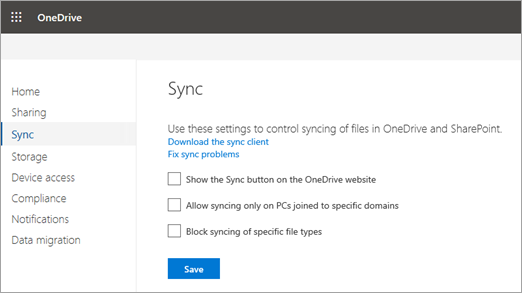

# Prevent users from installing the OneDrive sync client

The Sync button helps users install and set up the new OneDrive sync client. If you want to manage the rollout of the sync client to your organization, you can hide the Sync button on the OneDrive website to prevent your users from downloading the sync client themselves.
  
 **To prevent users from downloading the OneDrive sync client**
  
1. Open the [OneDrive admin center](https://admin.onedrive.com/?v=SyncSettings), and click **Sync** in the left pane. 
    
    
  
2. Clear the **Show the Sync button on the OneDrive website** check box. 
    
3. Click **Save**.
    
## See also

[Use Group Policy to control OneDrive sync client settings](use-group-policy.md)
  

