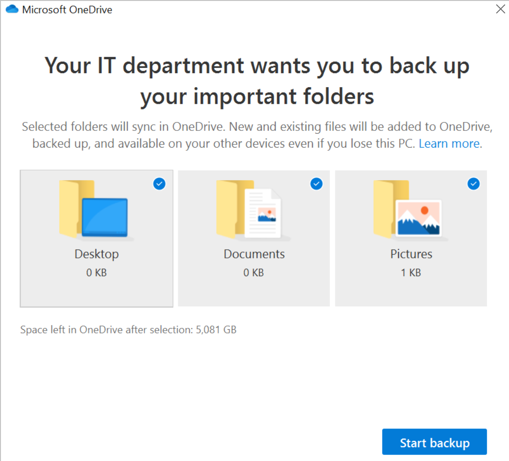

# Redirect and move known folders to OneDrive

This article is for IT admins managing the OneDrive sync app.
  
There are two primary advantages of moving or redirecting Windows known folders (Desktop, Documents, Pictures, Screenshots, and Camera Roll) or macOS known folders (Desktop, Documents) to Microsoft OneDrive for the users in your domain:
  
- Your users can continue using the folders they're familiar with. They don't have to change their daily work habits to save files to OneDrive.

- Saving files to OneDrive backs up your users' data in the cloud and gives them access to their files from any device.

For these reasons, we recommend moving or redirecting known folders to OneDrive if you're an enterprise or large organization. [See all our recommendations for configuring the sync app](ideal-state-configuration.md). Small or medium businesses may also find this useful, but keep in mind you'll need some experience configuring policies. For info about the end-user experience, see [Protect your files by saving them to OneDrive](https://support.office.com/article/d61a7930-a6fb-4b95-b28a-6552e77c3057). 

## Prepare to move known folders on existing devices

We recommend that you upgrade to the latest available build before you deploy to decrease deployment issues. Known Folder Move (KFM) doesn't work for users syncing OneDrive files in SharePoint Server. 

> [!IMPORTANT]
> If your organization is large and your users have a lot of files in their known folders, make sure you roll out the configuration slowly to minimize the network impact of uploading files. For users who have a lot of files in their known folders, consider using the policy [Limit the sync app upload rate to a percentage of throughput](use-group-policy.md#limit-the-sync-app-upload-rate-to-a-percentage-of-throughput) temporarily to minimize the network impact and then disable the policy once uploads are complete. 
  
## About the Known Folder Move policies

OneDrive policies can be set using Group Policy, [Intune Windows 10 Administrative Templates](configure-sync-intune.md), or by configuring registry settings. For a full reference of available policies and their registry settings, see [Use OneDrive policies to control sync settings](use-group-policy.md).  

The following policies control the Known Folder Move feature: 
  
- [Prompt users to move macOS known folders to OneDrive](use-group-policy.md#prompt-users-to-move-macos-known-folders-to-onedrive)

    Use this setting to give the users a call to action to move their Windows or macOS known folders.

    

    If users dismiss the prompt, a reminder notification will appear in the activity center until they move all known folders or an error occurs with the move, in which case the reminder notification will be dismissed.

    

    If a user has already redirected their known folders to a different OneDrive account, they'll be prompted to direct the folders to the account for your organization (leaving existing files behind).
    
    > [!IMPORTANT]
    > We recommend deploying the prompt policy for existing devices only, and limiting the deployment to 5,000 devices a day and not exceeding 20,000 devices a week.
  
- [Silently move macOS known folders to OneDrive](use-group-policy.md#silently-move-macos-known-folders-to-onedrive)
    
    Use this setting to redirect and move known folders to OneDrive without any user interaction. Move all the folders or select the desired individual folders. After a folder is moved, the policy won't affect the folder again, even if the selection for the folder changes. 

    > [!NOTE]
    > You can choose to display a notification to users after their folders have been redirected. 

    Various errors can prevent this setting from taking effect, such as:

    - A file exceeds the maximum path length
    - The known folders aren't in the default locations
    - Folder protection is unavailable
    - Known folders are prohibited from being redirected

    For info about these errors, see [Fix problems with folder protection](https://support.office.com/article/d61a7930-a6fb-4b95-b28a-6552e77c3057#BKMK_FixProblems).

    > [!IMPORTANT]
    > We recommend deploying the silent policy for existing devices and new devices while limiting the deployment of existing devices to 1,000 devices a day and not exceeding 4,000 devices a week. We also recommend using this setting together with "Prompt users to move Windows known folders to OneDrive." If moving the known folders silently does not succeed, users will be prompted to correct the error and continue. 
   
- [Prevent users from redirecting their macOS known folders to their device](use-group-policy.md#prevent-users-from-redirecting-their-macos-known-folders-to-their-device)

    Use this setting to force users to keep their known folders directed to OneDrive.

    > [!NOTE]
    > Windows users can direct their known folders by opening OneDrive sync app settings, clicking the **Backup** tab, and then clicking **Manage backup**.
  
- [Prevent users from moving their Windows known folders to OneDrive](use-group-policy.md#prevent-users-from-moving-their-windows-known-folders-to-onedrive)

For info about using the OneDrive policies, see [Use Group Policy to control OneDrive sync app settings](use-group-policy.md).