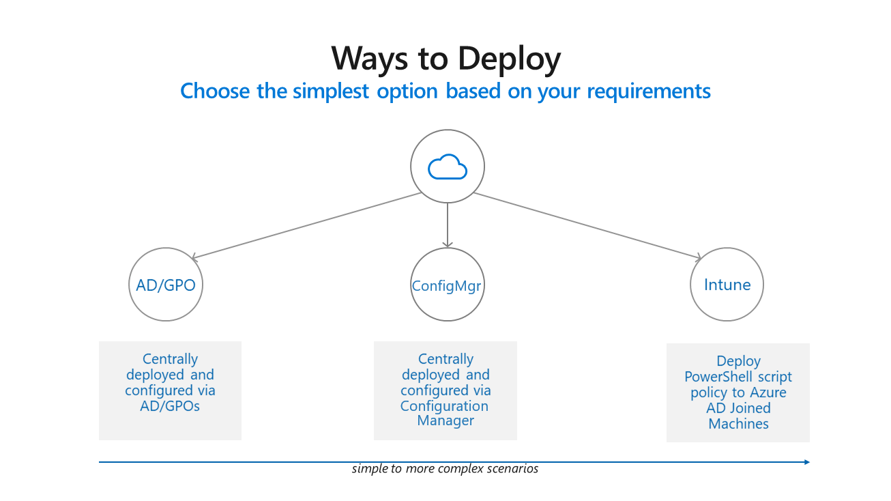
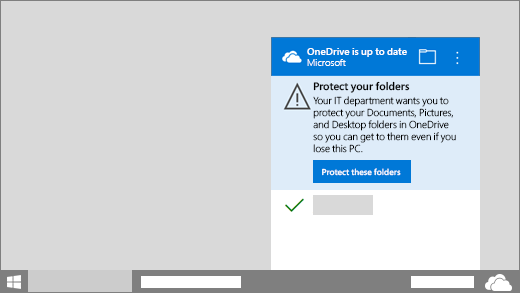

# Redirect and move Windows known folders to OneDrive

This article is for IT admins managing the OneDrive sync app in a Windows Server enterprise environment that uses Active Directory Domain Services.
  
There are two primary advantages of moving or redirecting Windows known folders (Desktop, Documents, Pictures, Screenshots, and Camera Roll) to Microsoft OneDrive for the users in your domain:
  
- Your users can continue using the folders they're familiar with. They don't have to change their daily work habits to save files to OneDrive.

- Saving files to OneDrive backs up your users' data in the cloud and gives them access to their files from any device.

For these reasons, we recommend moving or redirecting known folders to OneDrive if you're an enterprise or large organization. Small or medium businesses may also find this useful, but keep in mind you'll need some experience with Group Policy. For info about the end-user experience, see [Protect your files by saving them to OneDrive](https://support.office.com/article/d61a7930-a6fb-4b95-b28a-6552e77c3057).

## Known Folder Move workshop

This workshop provides guidance on how you can roll out OneDrive Known Folder Move (KFM):

- Plan for common challenges
- Requirements for each deployment option
- Deploy using Active Directory and Group Policy objects, Microsoft Endpoint Configuration Manager, or Intune
- Monitor device eligibility, known folder details, move status, and Group Policy object state

The workshop assumes that you've already set up core infrastructure (Active Directory, DNS, AD Connect, Microsoft Endpoint Configuration Manager) and doesn't cover third-party tools or custom applications integration.

[Download the PDF](https://github.com/MicrosoftDocs/OfficeDocs-SharePoint/blob/live/OneDrive/media/OneDrive-for-Business-KFM.pdf?raw=true)

[Download the PowerPoint presentation](https://github.com/MicrosoftDocs/OfficeDocs-SharePoint/blob/live/OneDrive/media/OneDrive-for-Business-KFM.pptx?raw=true)

  
## About the Known Folder Move Group Policy objects

We recommend upgrading to the latest available build before deploying to decrease deployment issues. Known Folder Move (KFM) does not work for users syncing OneDrive files in SharePoint Server.

To check eligibility, data volume, and item counts as you decide on a rollout plan, and to later monitor progress of the rollout, use the [Known Folder Move PowerShell script](https://github.com/OneDrive/onedrive-admin-scripts/tree/master/Scripts/Sync-KFM-Deployment). 

> [!IMPORTANT]
   > If your organization is large and your users have a lot of files in their known folders, make sure you roll out the Group Policy objects slowly to minimize the network impact of uploading files. For users who have a lot of files in their known folders, consider using the policy "[Limit the sync app upload rate to a percentage of throughput](use-group-policy.md#limit-the-sync-app-upload-rate-to-a-percentage-of-throughput)" temporarily if you would like to minimize the network impact and then disable the policy once uploads are complete.
  
- [Prompt users to move Windows known folders to OneDrive](use-group-policy.md#prompt-users-to-move-windows-known-folders-to-onedrive)

    Use this setting to give the users a call to action to move their Windows known folders.

    

    If users dismiss the prompt, a reminder notification will appear in the activity center until they move all known folders or an error occurs with the move, in which case the reminder notification will be dismissed.

    

    If a user has already redirected their known folders to a different OneDrive account, they'll be prompted to direct the folders to the account for your organization (leaving existing files behind).
    
    We recommend deploying the prompt policy for existing devices only, and limiting the deployment to 5,000 devices a day and not exceeding 20,000 devices a week.
  
- [Silently move Windows known folders to OneDrive](use-group-policy.md#silently-move-windows-known-folders-to-onedrive)
    
    Use this setting to redirect and move known folders to OneDrive without any user interaction. 

    > [!NOTE]
    > You can choose to display a notification to users after their folders have been redirected. 

    A number of errors can prevent this setting from taking effect, such as:
    - A file exceeds the maximum path length
    - The known folders aren't in the default locations
    - A folder isn't selected for syncing
    - Folder protection is unavailable
    - Known folders are prohibited from being redirected

    For info about these errors, see [Fix problems with folder protection](https://support.office.com/article/d61a7930-a6fb-4b95-b28a-6552e77c3057#BKMK_FixProblems).

    We recommend deploying the silent policy for existing devices and new devices while limiting the deployment of existing devices to 1,000 devices a day and not exceeding 4,000 devices a week.  We also recommend using this setting together with "Prompt users to move Windows known folders to OneDrive." If moving the known folders silently does not succeed, users will be prompted to correct the error and continue.  
   
- [Prevent users from redirecting their Windows known folders to their PC](use-group-policy.md#prevent-users-from-redirecting-their-windows-known-folders-to-their-pc)

    Use this setting to force users to keep their known folders directed to OneDrive.

    > [!NOTE]
    > Users can direct their known folders by opening OneDrive sync app settings, clicking the **Backup** tab, and then clicking **Manage backup**.
  
- [Prevent users from moving their Windows known folders to OneDrive](use-group-policy.md#prevent-users-from-moving-their-windows-known-folders-to-onedrive)

For info about using the OneDrive Group Policy objects, see [Use Group Policy to control OneDrive sync app settings](use-group-policy.md).

## Transition from the Windows Folder Redirection Group Policy objects
The OneDrive Known Folder Move (KFM) Group Policy objects won't work if you previously used [Windows Folder Redirection Group Policy objects](/windows-server/storage/folder-redirection/deploy-folder-redirection) to redirect the Documents, Pictures, or Desktop folders to a location other than OneDrive. The OneDrive Group Policy objects won't affect the Music and Videos folders, so you can keep them redirected with the Windows Group Policy objects. Follow these steps to switch to using the KFM Group Policy objects.

- If folders have been redirected to OneDrive using Windows Folder Redirection Group Policy:

  1. Disable the Window Folder Redirection Group Policy and make sure to leave the folder and contents on OneDrive.
  2. Enable KFM Group Policy. Known folders remain in OneDrive.
  
- If folders have been redirected to a location on a local PC:

  1. Disable the Window Folder Redirection Group Policy and make sure to leave the folder and contents at the redirected location.
  2. Enable KFM Group Policy. Known folders move to OneDrive.
  
- If folders have been redirected to a network file share: 

  > [!NOTE]
  > We recommend using Windows 10 Fall Creators Update (version 1709 or later) or Windows Server 2019 and the current version of OneDrive to get the benefits from Files On-Demand.
  
  1. Use a migration tool such as [Mover](https://docs.microsoft.com/sharepointmigration/mover-fileshare-to-o365) or the [SharePoint Migration Tool](https://docs.microsoft.com/sharepointmigration/introducing-the-sharepoint-migration-tool) to copy contents in the network file share location to a user's OneDrive, making sure that all contents go into the existing Documents, Pictures, or Desktop folders.
  2. Disable the Window Folder Redirection Group Policy and make sure to leave the folder and contents on the network file share. 
  3. Enable KFM Group Policy. Known folders move to OneDrive and will merge with the existing Desktop, Documents, and Pictures folders which contain all the file share content that you moved in the first step.

