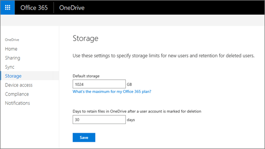

# Set the default storage space for OneDrive users

For most subscription plans, the default storage space for each user's OneDrive is 1 TB. Depending on your plan and the number of licensed users (see the [OneDrive for Business service description](/office365/servicedescriptions/onedrive-for-business-service-description) for info), you can increase the storage up to 5 TB.
  
> [!NOTE]
> For help finding out which subscription you have, see [What Office 365 for business subscription do I have?](/office365/admin/admin-overview/what-subscription-do-i-have)<br> If your organization has a qualifying Office 365 plan and 5 or more users, you can change the storage space to more than 5 TB. Contact Microsoft support to discuss your needs. You must assign at least one license to a user before you can increase the default OneDrive storage space. <br>The new storage limit is applied the next time a user accesses their OneDrive.
  
## Set the default OneDrive storage space in the OneDrive admin center

This storage space setting applies to all new and existing users who are licensed for a qualifying plan and for whom you haven't set specific storage limits. (To check if a user has a specific storage limit, see the next section.) To change the storage space for specific users, you need to use Microsoft PowerShell. For info on how to do this, see [Change your users' OneDrive storage space using PowerShell](change-user-storage.md).

> [!WARNING]
> If you decrease the storage limit and a user is over the new limit, their OneDrive will become read-only.

1. Sign in to the [OneDrive admin center](https://admin.onedrive.com) as a global or SharePoint admin, and select **Storage** in the left pane.
    
    
  
2. Enter the default storage amount (in GB) in the **Default storage** box, and then click **Save**.

> [!NOTE]
> The minimum storage is 1 GB.
    

  
## Check if a user has the default storage limit or a specific limit

1. Sign in to https://admin.microsoft.com as a global or SharePoint admin. (If you see a message that you don't have permission to access the page, you don't have Office 365 administrator permissions in your organization.)
    
    > [!NOTE]
    > If you have Office 365 Germany, sign in at https://portal.office.de. If you have Office 365 operated by 21Vianet (China), sign in at https://login.partner.microsoftonline.cn/. Then select the Admin tile to open the admin center.
    
2. In the left pane, select **Users** \> **Active users**.

3. Select the user.

4. Select the **OneDrive** tab.

5. Next to "Storage used," look at the max value. (For example, 3 GB **of 1024 GB**)
    
    
## Set the default OneDrive storage space using PowerShell

1. [Download the latest SharePoint Online Management Shell](https://go.microsoft.com/fwlink/p/?LinkId=255251).
    
2. Connect to SharePoint Online as a global admin or SharePoint admin in Office 365. To learn how, see [Getting started with SharePoint Online Management Shell](/powershell/sharepoint/sharepoint-online/connect-sharepoint-online).
    
3. Run the following command:
    
      ```PowerShell
      Set-SPOTenant -OneDriveStorageQuota <quota>
      ```

     Where  _\<quota\>_ is the value in megabytes for the storage space. For example, 1048576 for 1 TB or 5242880 for 5 TB. You can specify any value that you want, however, if you specify a value greater than that allowed by a given user's license, that user's storage space will be rounded down to the maximum value allowed by their license. 
    
    To reset an existing user's OneDrive to the new default storage space, run the following command:
    
      ```PowerShell
      Set-SPOSite -Identity <user's OneDrive URL> -StorageQuotaReset
      ```
   
    > [!NOTE]
    > When you set site storage limits in PowerShell, you enter them in MB. The values are converted and rounded down to the nearest integer to appear in the admin centers in GB, so a value of 5000 MB becomes 4 GB. If you set a value of less than 1024 MB using PowerShell, it will be rounded up to 1 GB.

## See also

[More info about using Set-SPOTenant](/powershell/module/sharepoint-online/set-spotenant)
