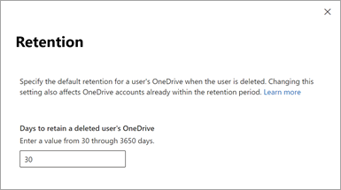

# Set the OneDrive retention for deleted users

If a user's Microsoft 365 account is deleted, their OneDrive files are preserved for a period of time. You can set this time period.
  
 **To set the retention time for OneDrive accounts**
  
1. Go to the [Settings page of the new SharePoint admin center](https://admin.microsoft.com/sharepoint?page=settings&modern=true), and sign in with an account that has [admin permissions](/sharepoint/sharepoint-admin-role) for your organization.
 
   > [!NOTE]
   > If you have Office 365 Germany, [sign in to the Microsoft 365 admin center](https://go.microsoft.com/fwlink/p/?linkid=848041), then browse to the SharePoint admin center and open the Sharing page. 
   > 
   > If you have Office 365 operated by 21Vianet (China), [sign in to the Microsoft 365 admin center](https://go.microsoft.com/fwlink/p/?linkid=850627), then browse to the SharePoint admin center and open the Sharing page.

2. Select the **Retention** setting.

    
  
3. Enter a value from 30 through 3650 in the **Days to retain files a deleted user's OneDrive** box.

    The setting is activated for the next user that is deleted as well as any users that are in the process of being deleted. The count begins as soon as the user account was deleted in the Microsoft 365 admin center, even though the deletion process takes time. 

4. Select **Save**.

## Related articles

[Delete a user from your organization](/office365/admin/add-users/delete-a-user)
  
[Set up OneDrive to alert managers and delegate access automatically when users leave your organization](retention-and-deletion.md)
  
[Overview of retention policies](/office365/securitycompliance/retention-policies)
