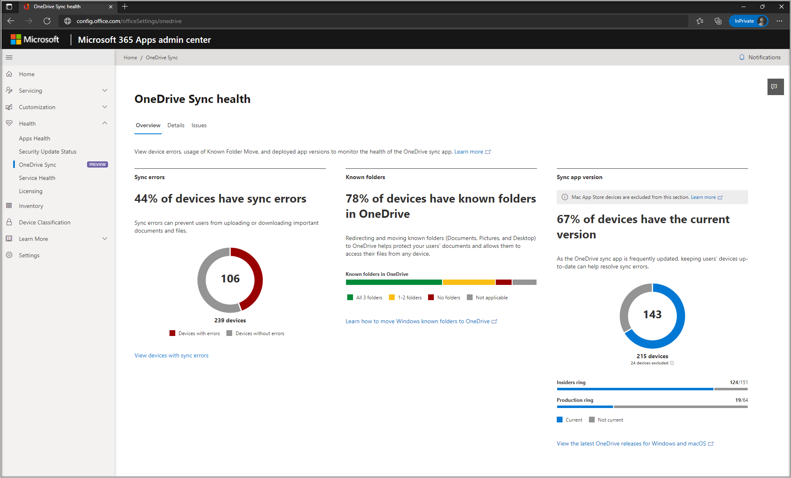

# OneDrive sync reports in the Apps Admin Center

The new OneDrive sync health dashboard in the Microsoft 365 [Apps Admin Center](https://config.office.com/) provides IT admins with actionable insights about the OneDrive sync app. For small businesses to large enterprises, the dashboard is the single place to get information and take action on sync app adoption and health.

>[!IMPORTANT]
> This feature is in preview and isn't available to everyone. It will gradually roll out to customers on the Insiders and Production rings in May 2021.

From the Sync health dashboard, admins can check the sync status and sync app version of individual devices, monitor Known Folder Move roll out, and track sync errors. The insights range from a high-level executive summary to a drill-down of sync status per device, to be used in a variety of administrative scenarios.

## Requirements  

- OneDrive sync apps on the Insiders or Production ring. Devices on the Deferred ring aren't eligible for the preview. [Set the sync app update ring](use-group-policy.md#set-the-sync-app-update-ring).

- OneDrive Sync app version 21.078 or later for Windows. Support for Mac isn't available yet.

- [Global Administrator role](/microsoft-365/admin/add-users/about-admin-roles) or [Office apps admin role](/microsoft-365/admin/add-users/about-admin-roles) to set up the dashboard. After setup, only [Global reader role](/microsoft-365/admin/add-users/about-admin-roles) is required to view the dashboard.

- Devices can reach the endpoint [https://clients.config.office.net](https://clients.config.office.net).

## Set up the OneDrive sync health dashboard

1. Make sure you have the required role and app versions listed in the previous section. 
2. Go to https://config.office.com and sign in as a global admin or Office apps admin.
3. In the left pane, under **Health**, select **OneDrive Sync**. This tab has a "PREVIEW" tag on it.
4. Select **Enable preview features** to accept the license terms. 

    

    The OneDrive sync health dashboard appears.

   

5. In the left pane, select **Settings**.
6. Copy the **Tenant Association Key**. If the key field is empty, select **Generate new key**.

   

    > [!NOTE] 
    > When you generate a new key for the first time, it can take up to 30 seconds for it to appear.

7. Enable the OneDrive SyncAdminReports Group Policy Object (GPO) using the Tenant Association Key.

    > [!IMPORTANT]
    > -  You must enable this setting on the devices from which you want to get reports. The setting has no impact on users.
    > - When a new Tenant Association Key is generated, update the registry setting as well.
    > - We recommend a gradual rollout starting with a few test devices per day, then up to 100 devices per day, then gradually up to 10,000 devices per day until you finish.

    You can enable this setting in multiple ways:

    - Edit the registry
        
        a. Navigate to HKLM\SOFTWARE\Policies\Microsoft\OneDrive

        b. Right-click > **New** > **String Value**.

        c. Name: SyncAdminReports
            
        d. Type: REG_SZ

        e. Data: Paste your Tenant Association Key.

        

    - Run Command Prompt as an administrator and run the following command:
        
        `reg.exe add HKLM\Software\Policies\Microsoft\OneDrive /v SyncAdminReports /t REG_SZ /d <your Tenant Association Key> /f`

    - Use [Group Policy](use-group-policy.md#manage-onedrive-using-group-policy) or [administrative templates in Intune](configure-sync-intune.md). To apply the setting on a single PC, follow these steps:

        a. Open Group Policy Editor (gpedit.exe).

        b. Navigate to Computer Configuration\Administrative Templates\OneDrive.

        c. Double-click **Sync Admin Reports**.

        d. Select **Enabled**, paste your Tenant Association Key in the box in the Options pane, and then select **OK**.

    > [!IMPORTANT]
    > After you enable the SyncAdminReports setting on devices, it takes up to three days for reports to be available.

## OneDrive Sync health dashboard 

> [!NOTE]
> After you set up the dashboard as described in the previous section, the Global Reader admin role is sufficient to access and view reports.

The Overview tab provides aggregated insights on devices that have sync errors, [Known Folder Move](redirect-known-folders.md) rollout status, and adoption of sync app versions and update ring.

   

The Details tab provides detailed info for each user and device to help you understand and troubleshoot sync errors.

The tab reports on the following diagnostic data:

- User: The name of the user
- User email: The email address of the user
- Computer name: The name of the device
- Errors: Details including the counts, and error messages users are seeing
- Known folders: Details including enabled status for each folder (Desktop, Documents, Pictures)
- OneDrive app version: The currently installed OneDrive sync app version 
- Operating system version: The current version of the OS running on the device
- Last synced timestamp (UTC): The last time sync app was fully up to date with the cloud
- Last status reported timestamp (UTC): The last time the sync app reported its diagnostic data to the dashboard. 

### Data for the OneDrive sync health dashboard

The sync reports use the required service data and diagnostic data that your OneDrive sync apps send to Microsoft. You are in control of which data and which devices send this data. Use the SyncAdminReports setting to control which devices send data.

Diagnostic data is always under your control. To learn more about diagnostic data and the controls available to you, see [Overview of privacy controls for Microsoft 365 Apps](/deployoffice/privacy/overview-privacy-controls). To learn more about required service data, see [Required diagnostic data for Office](/deployoffice/privacy/required-diagnostic-data).

## Troubleshooting

This section will help you troubleshoot if the OneDrive sync reports don't appear after three days.

> [!IMPORTANT]
> The sync app must be (1) running build 21.078.0412.0001 or later and (2) in the Insiders or Production ring (not Deferred). Enabling the setting on ineligible devices will not have any effect – the app will not upload reports.

1. Confirm that the sync app is on the Insiders or Production ring. Run Command Prompt as an administrator and run the following command.  

    `reg.exe query HKLM\Software\Policies\Microsoft\OneDrive /v GPOSetUpdateRing`

    If the output from the script is **not** dword:00000000, your device is on the Insiders or Production ring.

2. Confirm that the SyncAdminReports setting has been applied to the device. Run Command Prompt as an administrator and run the following command. 

    `reg.exe query HKLM\Software\Policies\Microsoft\OneDrive /v SyncAdminReports`

- Confirm the sync app has SyncAdminReports setting enabled. The output should look like this.

    

If the SyncAdminReports setting was not applied, go back and follow the steps under [Set up the OneDrive sync health dashboard](#set-up-the-onedrive-sync-health-dashboard).

If the device is on the Insiders or Production ring and the setting was applied correctly, wait for 24 hours with the device on and signed in to OneDrive. If the device still doesn't appear on the dashboard, open a support ticket with Microsoft. For more information, see the section [Report issues](#report-issues) later in this article.

## Report a problem

If you encounter a problem with viewing the report dashboard, first verify that you've completed the troubleshooting steps above.

If problems persist after troubleshooting, please [open a support ticket with Microsoft](/microsoft-365/admin/contact-support-for-business-products). Ensure that the device is not powered off during this period so that the sync app can still run and upload a health report.

For quick investigations, be sure to have the date and time when the SyncAdminReports setting was enabled and either the user’s email or the OneDriveDeviceId available in your issue report.

To get the OneDrive Device ID, select the OneDrive sync app in the notification area > **Help & Settings** > **Settings** > **About**.

## Send feedback

To make a feature suggestion, use the Feedback button in the lower-right corner of the dashboard page.

