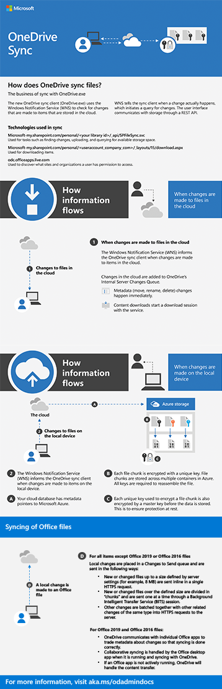

# How sync works

This article gives you an overview of how sync works in OneDrive. It helps you understand the logic behind how information flows between applications, how the technologies work together, and how data is secured.

[Download the PDF](https://go.microsoft.com/fwlink/p/?LinkId=829044)

  
## How information flows

The OneDrive sync app uses [Windows Push Notification Services](/windows/uwp/design/shell/tiles-and-notifications/windows-push-notification-services--wns--overview) (WNS) to sync files in real time. WNS informs the sync app whenever a change actually happens, eliminating redundant polling and saving on unnecessary computing power.

Here's how it works:

- A change occurs in Microsoft 365.

- WNS alerts the sync app of the change.

- OneDrive adds it to the Internal Server Changes Queue.
    - Any metadata changes happen immediately, like renaming or deleting files.
    - Downloading content also starts a specific session with the client.

- Microsoft 365 has metadata pointers directing it through Microsoft Azure.

- The changes are processed in the order they are received.

The previous OneDrive sync app (Groove.exe) used a polling service to check for changes on a predetermined schedule. Polling can lead to system lag and slowness because it requires a lot of computing power. Using WNS is a significant enhancement.
  

## Authentication protocols

The authentication protocols depend on which version of SharePoint you are using.

 - SharePoint Server 2019 uses NTLM.
 - SharePoint uses FedAuth.

## Syncing different file types

OneDrive handles sync differently depending on the type of file.

For Office 2016 and Office 2019 files, OneDrive collaborates directly with the specific apps to ensure data are transferred correctly. If the Office desktop app is running, it will handle the syncing. If it is not running, OneDrive will.

For other types of files and folders, items smaller than 8 MB are sent inline in a single HTTPS request. Anything 8 MB or larger is divided into file chunks and sent separately one at a time through a [Background Intelligent Transfer Service](/windows/desktop/Bits/background-intelligent-transfer-service-portal) (BITS) session. Other changes are batched together into HTTPS requests to the server.
  
## The underlying technologies

The OneDrive sync app uses the following to sync files:

- To find new changes and upload information: Microsoft-my.sharepoint.com/personal/<your library id>/_api/SPFileSync.svc

- To download items: Microsoft-my.sharepoint.com/personal/<useraccount_company_com>/_layouts/15/download.aspx

- To discover the sites and organizations a user can access: odc.officeapps.live.com
  
## Security and encryption

File chunks are stored in multiple containers in Azure, each of which is given a unique key. Each key is required to reassemble the complete file. There's also a separate master key encrypting each file chunk key, ensuring the data remain secure even when not moving.

## Related topic

- [SharePoint Authentication](https://docs.microsoft.com/sharepoint/authentication)

