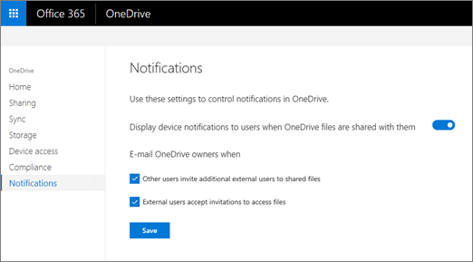

# Turn on external sharing notifications for OneDrive

To help your OneDrive users monitor and control which external users have access to their files, make sure external sharing notifications are turned on. File and folder owners will be emailed when:
  
- Another user invites external users to shared files
    
- An external user accepts an invitation to access their files
    
If external sharing is enabled in your organization, these notifications are enabled by default.
  
> [!NOTE]
> Office 365 admins can use [Search the audit log in the Office 365 Security &amp; Compliance Center](/office365/securitycompliance/search-the-audit-log-in-security-and-compliance) to monitor content that is shared externally. 
  
## Turn on external sharing notifications

1. Sign in to the [OneDrive admin center](https://admin.onedrive.com) as a global or SharePoint admin, and select **Notifications** in the left pane. 
    
    
  
2. Under **Email OneDrive owners when**, make sure the following check boxes are selected: 
    
  - **Other users invite additional users to shared files**
    
  - **External users accept invitations to access files**
    
    > [!NOTE]
    > This setting no longer works for the new sharing experience that appears in most places. This setting will be removed. 
  

