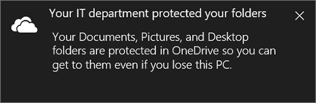
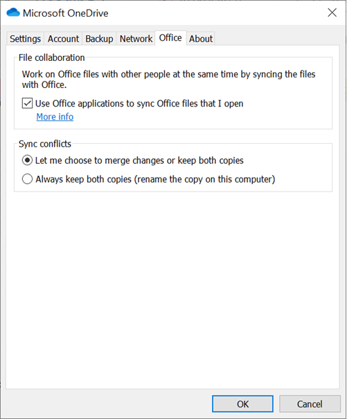
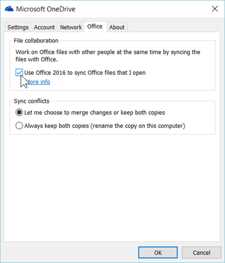
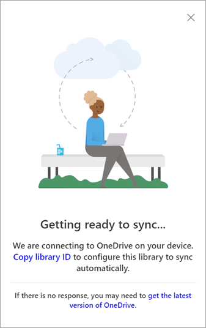

# Use Group Policy to control OneDrive sync settings

This article is for IT admins who manage the new OneDrive sync app in a Windows Server enterprise environment that uses Active Directory Domain Services (AD DS).
  
> [!NOTE]
> If you're not an IT admin, see [Sync files with the new OneDrive sync app in Windows](https://support.office.com/article/615391c4-2bd3-4aae-a42a-858262e42a49) for info about OneDrive sync settings.


> [!VIDEO https://www.microsoft.com/videoplayer/embed/RE2CnSx]
 
## Manage OneDrive using Group Policy

1. Install the OneDrive sync app for Windows. (To see which builds are releasing and download builds, go to the [release notes](https://support.office.com/article/845dcf18-f921-435e-bf28-4e24b95e5fc0?).) Installing the sync app downloads the .adml and .admx files.

2. Browse to %localappdata%\Microsoft\OneDrive\BuildNumber\adm\, to the subfolder for your language, as necessary.

    (where *BuildNumber* is the number displayed in sync app settings on the **About** tab.) 

    
  
3. Copy the .adml and .admx files.

4. Paste the .admx file in your domain's Central Store, \\\\*domain*\sysvol\domain\Policies\PolicyDefinitions (where *domain* is your domain name, such as corp.contoso.com), and the .adml in the appropriate language subfolder, such as en-us. If the PolicyDefinitions folder does not exist, see [How to create and manage the Central Store for Group Policy Administrative Templates in Windows](https://support.microsoft.com/help/3087759), or use your local policy store under %windir%\policydefinitions.

5. Configure settings from the domain controller or on a Windows computer by running the [Remote Server Administration Tools](https://go.microsoft.com/fwlink/?linkid=871794).

6. Link the Group Policy objects to an Active Directory container (site, domain, or organizational unit). For info, see [Link Group Policy objects to Active Directory containers](https://go.microsoft.com/fwlink/?linkid=871796).

7. Use security filtering to narrow the scope of a setting. By default, a setting is applied to all user and computer objects within the container to which it's linked, but you can use security filtering to narrow the scope of the policy's application to a subset of users or computers. For info, see [Filtering the scope of a GPO](https://go.microsoft.com/fwlink/?linkid=2004146).

The OneDrive Group Policy objects work by setting registry keys on the computers in your domain.
  
- When you enable or disable a setting, the corresponding registry key is updated on computers in your domain. If you later change the setting back to **Not configured**, the corresponding registry key is not modified, and the change does not take effect. After you configure a setting, set it to **Enabled** or **Disabled** going forward.

- The location where registry keys are written has been updated. When you use the latest files, you might delete registry keys that you set previously.

> [!NOTE]
> For info about storage, see [OneDrive Files On-Demand and Storage Sense for Windows 10](https://support.office.com/article/de5faa9a-6108-4be1-87a6-d90688d08a48) and [Policy CSP - Storage](/windows/client-management/mdm/policy-csp-storage).

## List of policies

- [Allow OneDrive to disable Windows permission inheritance in folders synced read-only](use-group-policy.md#allow-onedrive-to-disable-windows-permission-inheritance-in-folders-synced-read-only)

- [Allow syncing OneDrive accounts for only specific organizations](use-group-policy.md#allow-syncing-onedrive-accounts-for-only-specific-organizations)

- [Allow users to choose how to handle Office file sync conflicts](use-group-policy.md#allow-users-to-choose-how-to-handle-office-file-sync-conflicts)

- [Block file downloads when users are low on disk space](use-group-policy.md#block-file-downloads-when-users-are-low-on-disk-space)

- [Block syncing OneDrive accounts for specific organizations](use-group-policy.md#block-syncing-onedrive-accounts-for-specific-organizations)

- [Coauthor and share in Office desktop apps](use-group-policy.md#coauthor-and-share-in-office-desktop-apps)

- [Configure team site libraries to sync automatically](use-group-policy.md#configure-team-site-libraries-to-sync-automatically)

- [Continue syncing on metered networks](use-group-policy.md#continue-syncing-on-metered-networks)

- [Continue syncing when devices have battery saver mode turned on](use-group-policy.md#continue-syncing-when-devices-have-battery-saver-mode-turned-on)

- [Convert synced team site files to online-only files](use-group-policy.md#convert-synced-team-site-files-to-online-only-files)

- [Disable the tutorial that appears at the end of OneDrive Setup](use-group-policy.md#disable-the-tutorial-that-appears-at-the-end-of-onedrive-setup)

- [Enable automatic upload bandwidth management for OneDrive](use-group-policy.md#enable-automatic-upload-bandwidth-management-for-onedrive)
 
- [Limit the sync app download speed to a fixed rate](use-group-policy.md#limit-the-sync-app-download-speed-to-a-fixed-rate)

- [Limit the sync app upload rate to a percentage of throughput](use-group-policy.md#limit-the-sync-app-upload-rate-to-a-percentage-of-throughput)

- [Limit the sync app upload speed to a fixed rate](use-group-policy.md#limit-the-sync-app-upload-speed-to-a-fixed-rate)

- [Prevent the sync app from generating network traffic until users sign in](use-group-policy.md#prevent-the-sync-app-from-generating-network-traffic-until-users-sign-in)

- [Prevent users from changing the location of their OneDrive folder](use-group-policy.md#prevent-users-from-changing-the-location-of-their-onedrive-folder)

- [Prevent users from fetching files remotely](use-group-policy.md#prevent-users-from-fetching-files-remotely)

- [Prevent users from moving their Windows known folders to OneDrive](use-group-policy.md#prevent-users-from-moving-their-windows-known-folders-to-onedrive)

- [Prevent users from redirecting their Windows known folders to their PC](use-group-policy.md#prevent-users-from-redirecting-their-windows-known-folders-to-their-pc)

- [Prevent users from syncing libraries and folders shared from other organizations](use-group-policy.md#prevent-users-from-syncing-libraries-and-folders-shared-from-other-organizations)

- [Prevent users from syncing personal OneDrive accounts](use-group-policy.md#prevent-users-from-syncing-personal-onedrive-accounts)

- [Prompt users to move Windows known folders to OneDrive](use-group-policy.md#prompt-users-to-move-windows-known-folders-to-onedrive)

- [Prompt users when they delete multiple OneDrive files on their local computer](use-group-policy.md#prompt-users-when-they-delete-multiple-onedrive-files-on-their-local-computer)

- [Receive OneDrive sync app updates on the Deferred ring](use-group-policy.md#EnableEnterpriseUpdate)

- [Require users to confirm large delete operations](use-group-policy.md#require-users-to-confirm-large-delete-operations)

- [Set the default location for the OneDrive folder](use-group-policy.md#set-the-default-location-for-the-onedrive-folder)

- [Set the maximum size of a user's OneDrive that can download automatically](use-group-policy.md#set-the-maximum-size-of-a-users-onedrive-that-can-download-automatically)

- [Set the sync app update ring](use-group-policy.md#set-the-sync-app-update-ring)

- [Silently move Windows known folders to OneDrive](use-group-policy.md#silently-move-windows-known-folders-to-onedrive)

- [Silently sign in users to the OneDrive sync app with their Windows credentials](use-group-policy.md#silently-sign-in-users-to-the-onedrive-sync-app-with-their-windows-credentials)

- [Use OneDrive Files On-Demand](use-group-policy.md#use-onedrive-files-on-demand)

- [Warn users who are low on disk space](use-group-policy.md#warn-users-who-are-low-on-disk-space)


> [!NOTE]
> "Specify SharePoint Server URL and organization name" and "Specify the OneDrive location in a hybrid environment" are for customers who have SharePoint Server 2019. For more info about using the new OneDrive sync app with SharePoint Server 2019, see [Configure syncing with the new OneDrive sync app](/SharePoint/install/new-onedrive-sync-client/).

    
## Computer Configuration policies
<a name="PerTen"> </a>

Enable or disable OneDrive Group Policy Object (GPO) settings to configure the OneDrive sync app.

Under Computer Configuration\Policies\Administrative Templates\OneDrive, navigate to **Computer Configuration > Policies**.
  


### Allow OneDrive to disable Windows permission inheritance in folders synced read-only

This setting lets the OneDrive sync app remove all inherited permissions within read-only folders syncing on a user's PC. This improves the performance of the sync app when syncing folders that the user has read-only permission to.

Enabling this setting for a user does not change their permissions to view or edit content in SharePoint.

We do not recommend setting this policy for users not syncing read-only content.

Enabling this policy sets the following registry key value to 1:

[HKLM\SOFTWARE\Policies\Microsoft\OneDrive]"PermitDisablePermissionInheritance"="dword:00000001"
  

### Allow syncing OneDrive accounts for only specific organizations
<a name="AllowTenantList"> </a>

This setting lets you prevent users from easily uploading files to other organizations by specifying a list of allowed tenant IDs.

If you enable this setting, users get an error if they attempt to add an account from an organization that is not allowed. If a user has already added the account, the files stop syncing.

To enter a tenant ID, in the **Options** box, select **Show**.
  
This policy sets the following registry key.
  
[HKLM\SOFTWARE\Policies\Microsoft\OneDrive\AllowTenantList] "1111-2222-3333-4444"
  
(where "1111-2222-3333-4444" is the [tenant ID](find-your-office-365-tenant-id.md))
  
This setting takes priority over [Block syncing OneDrive accounts for specific organizations](use-group-policy.md#block-syncing-onedrive-accounts-for-specific-organizations). Do not enable both settings at the same time.


### Block file downloads when users are low on disk space
<a name="MinDiskSpaceLimitInMB"> </a>

This setting lets you specify a minimum amount of available disk space and block the OneDrive sync app (OneDrive.exe) from downloading files when users have less than this amount. 
 
Users are prompted with options to help free up space.
  
Enabling this policy sets the following registry key value to a number from 0 through 10240000.
[HKLM\SOFTWARE\Policies\Microsoft\OneDrive]" MinDiskSpaceLimitInMB


### Block syncing OneDrive accounts for specific organizations
<a name="BlockTenantList"> </a>

This setting lets you prevent users from uploading files to another organization by specifying a list of blocked tenant IDs.

If you enable this setting, users get an error if they attempt to add an account from an organization that is blocked. If a user has already added the account, the files stop syncing.
  
To enter the tenant ID, in the **Options** box, select **Show**.
  
This policy sets the following registry key.
  
[HKLM\SOFTWARE\Policies\Microsoft\OneDrive\BlockTenantList] "1111-2222-3333-4444"
  
(where "1111-2222-3333-4444" is the [tenant ID](find-your-office-365-tenant-id.md))
  
This setting does NOT work if you have [Allow syncing OneDrive accounts for only specific organizations](use-group-policy.md#allow-syncing-onedrive-accounts-for-only-specific-organizations) enabled. Do not enable both settings at the same time.
  
### Convert synced team site files to online-only files
<a name="DehydrateSyncedTeamSites"> </a>

This setting lets you convert synced SharePoint files to online-only files when you enable OneDrive Files On-Demand. If you have many PCs syncing the same team site, enabling this setting helps you minimize network traffic and local storage usage.
  
If you enable this setting, files in currently syncing team sites are changed to online-only files, by default. Files later added or updated in the team site are also downloaded as online-only files. To use this setting, the computer must be running Windows 10 Fall Creators Update (version 1709) or later, and you must enable OneDrive Files On-Demand.
This feature is not enabled for on-premises SharePoint sites.

Enabling this policy sets the following registry key value to 1.
  
[HKLM\SOFTWARE\Policies\Microsoft\OneDrive]"DehydrateSyncedTeamSites"="dword:00000001"

For info about querying and setting file and folder states, see [Query and set Files On-Demand states](files-on-demand-mac.md).
  
### Enable automatic upload bandwidth management for OneDrive
<a name="ENABLE_AUTOMATIC_UPLOAD_BW_MGMT"> </a>

This setting lets the OneDrive sync app (OneDrive.exe) upload data in the background only when unused bandwidth is available. It prevents the sync app from interfering with other apps that are using the network. This setting is powered by the Windows LEDBAT (Low Extra Delay Background Transport) protocol. When LEDBAT detects increased latency that indicates other TCP connections are consuming bandwidth, the sync app will reduce its own consumption to prevent interference. When network latency decreases again and bandwidth is freed up, the sync app will increase the upload rate and consume the unused bandwidth.

If you enable this setting, the sync app upload rate will be set to "Adjust automatically" based on bandwidth availability and users won't be able to change it. 

If you disable or do not configure this setting, users can choose to limit the upload rate to a fixed value (in KB/second), or set it to "Adjust automatically." 

> [!IMPORTANT]
> If you enable or disable this setting, and then change it back to Not Configured, the last configuration will remain in effect. We recommend enabling this setting instead of "Limit the sync app upload speed to a fixed rate." You should not enable both settings at the same time. This setting will override "Limit the sync app upload rate to a percentage of throughput" if both are enabled on the same device.

Enabling this policy sets the following registry key value to 1.
[HKEY_LOCAL_MACHINE\Software\Policies\Microsoft\OneDrive]"ENABLE_AUTOMATIC_UPLOAD_BW_MGMT"="dword:00000001"
  
### Limit the sync app upload rate to a percentage of throughput
<a name="AutomaticUploadBandwidthPercentage"> </a>

This setting lets you balance the performance of different upload tasks on a computer by specifying the percentage of the computer's upload throughput that the OneDrive sync app (OneDrive.exe) can use to upload files. Setting this as a percentage lets the sync app respond to both increases and decreases in throughput. The lower the percentage you set, the slower files upload. We recommend a value of 50% or higher. The sync app periodically uploads without restriction for one minute and then slows down to the upload percentage you set. This lets small files upload quickly while preventing large uploads from dominating the computer's upload throughput. We recommend enabling this setting temporarily when you roll out [Silently move Windows known folders to OneDrive](use-group-policy.md#silently-move-windows-known-folders-to-onedrive), or [Prompt users to move Windows known folders to OneDrive](use-group-policy.md#prompt-users-to-move-windows-known-folders-to-onedrive) to control the network impact of uploading known folder contents.


  
> [!NOTE]
> The maximum throughput value detected by the sync app can sometimes be higher or lower than expected because of the different traffic throttling mechanisms that your Internet Service Provider (ISP) might use. <br>For info about estimating the network bandwidth you need for sync, see [Network utilization planning for the OneDrive sync app](network-utilization-planning.md).

If you enable this setting and enter a percentage (from 10-99) in the **Bandwidth** box, computers use the percentage of upload throughput that you specify when uploading files to OneDrive, and users cannot change it.

Enabling this policy sets the following registry key value. For example:
  
[HKLM\SOFTWARE\Policies\Microsoft\OneDrive]"AutomaticUploadBandwidthPercentage"="dword:00000032"
  
The previous registry key sets the upload throughput percentage to 50%, using the hexadecimal value for 50, which is 00000032.
  
If you disable or do not configure this setting, users can choose to limit the upload rate to a fixed value (in KB/second), or set it to "Adjust automatically," which sets the upload rate to 70% of  throughput. For info about the end-user experience, see [Change the OneDrive sync app upload or download rate](https://support.office.com/article/71cc69da-2371-4981-8cc8-b4558bdda56e).

> [!IMPORTANT]
> If you enable or disable this setting, and then change it back to Not Configured, the last configuration remains in effect. We recommend enabling this setting instead of "Limit the sync app upload speed to a fixed rate" to limit the upload rate. You should not enable both settings at the same time.
 
### Prevent the sync app from generating network traffic until users sign in
<a name="PreventNetworkTraffic"> </a>

This setting lets you block the OneDrive sync app (OneDrive.exe) from generating network traffic (checking for updates, an so on) until users sign in to OneDrive or start syncing files on their computer.
  
If you enable this setting, users must sign in to the OneDrive sync app on their computer, or select to sync OneDrive or SharePoint files on the computer, for the sync app to start automatically.
  
If you disable or do not configure this setting, the OneDrive sync app starts automatically when users sign in to Windows.

> [!IMPORTANT]
> If you enable or disable this setting, and then change it back to Not Configured, the last configuration remains in effect.

Enabling this policy sets the following registry key value to 1.
  
[HKLM\SOFTWARE\Policies\Microsoft\OneDrive]"PreventNetworkTrafficPreUserSignIn"="dword:00000001"

### Prevent users from fetching files remotely
<a name="RemoteAccessGPOEnabled"> </a>

This setting lets you block users from using the fetch feature when they're signed in to the OneDrive sync app (OneDrive.exe) with their personal OneDrive account. The fetch feature lets users go to OneDrive.com, select a Windows computer that's currently online and running the OneDrive sync app, and access all files from that computer. By default, users can use the fetch feature.

If you enable this setting, users are prevented from using the fetch feature.
  
Enabling this policy sets the following registry key value to 1.
  
[HKLM\SOFTWARE\Policies\Microsoft\OneDrive]"GPOEnabled"="dword:00000001"
  
If you disable or do not configure both this setting and [Prevent users from syncing personal OneDrive accounts](use-group-policy.md#prevent-users-from-syncing-personal-onedrive-accounts), users can use the fetch feature. For more info about fetching files, see [Fetch files on your PC](https://support.office.com/article/70761550-519c-4d45-b780-5a613b2f8822).

### Prevent users from moving their Windows known folders to OneDrive
<a name="BlockKnownFolderMove"> </a>

This setting prevents users from moving their Documents, Pictures, and Desktop folders to any OneDrive account.
  
> [!NOTE]
> Moving known folders to personal OneDrive accounts is already blocked on domain-joined PCs.
  
If you enable this setting, users aren't prompted with a window to protect their important folders, and the *Start protection* command is disabled. If the user has already moved their known folders, the files in those folders remain in OneDrive. This setting does not take effect if you've enabled "Prompt users to move Windows known folders to OneDrive" or "Silently move Windows known folders to OneDrive."
  
If you disable or do not configure this setting, users can choose to move their known folders.
  
Enabling this policy sets the following registry key value to 1.
  
[HKLM\SOFTWARE\Policies\Microsoft\OneDrive]"KFMBlockOptIn"="dword:00000001"
  

### Prevent users from redirecting their Windows known folders to their PC
<a name="KFMBlockOptOut"> </a>

This setting forces users to keep their Documents, Pictures, and Desktop folders directed to OneDrive.

If you enable this setting, the **Stop protecting** button in the **Set up protection of important folders** window is disabled, and users receive an error if they try to stop syncing a known folder.
  
If you disable or do not configure this setting, users can choose to redirect their known folders back to their PC.
  
Enabling this policy sets the following registry key:
  
[HKLM\SOFTWARE\Policies\Microsoft\OneDrive]"KFMBlockOptOut"="dword:00000001"

### Prevent users from syncing libraries and folders shared from other organizations
<a name="BlockExternalSync"> </a>

The B2B Sync feature of the OneDrive sync app lets users at an organization to sync OneDrive and SharePoint libraries and folders shared with them from another organization. For more info, see [B2B Sync](b2b-sync.md).

Enabling this setting prevents users at your organization from being able to use B2B Sync. After the setting is enabled (value 1) on a computer, the sync app does not sync libraries and folders shared from other organizations. Modify the setting to the disabled state (value 0) to restore B2B Sync capability for your users.

prevent B2B Sync with:
[HKLM\SOFTWARE\Policies\Microsoft\OneDrive] "BlockExternalSync"="dword:1"

restore B2B Sync with:
[HKLM\SOFTWARE\Policies\Microsoft\OneDrive] "BlockExternalSync"="dword:0"

### Prompt users to move Windows known folders to OneDrive
<a name="KFMOptInWithWizard"> </a>

This setting shows the following window that prompts users to move their Documents, Pictures, and Desktop folders to OneDrive.
  

  
If you enable this setting and provide your tenant ID, users who are syncing their OneDrive see the previous window when they're signed in. If they close the window, a reminder notification appears in the Activity Center until they move all their known folders. If a user has already redirected their known folders to a different OneDrive account, they are prompted to direct the folders to the account for your organization (leaving existing files behind).
  
If you disable or do not configure this setting, the window that prompts users to protect their important folders doesn't appear.
  
Enabling this policy sets the following registry key:
  
[HKLM\SOFTWARE\Policies\Microsoft\OneDrive]"KFMOptInWithWizard"="1111-2222-3333-4444"
  
(where "1111-2222-3333-4444" is the [tenant ID](find-your-office-365-tenant-id.md))

For more info, see [Redirect and move Windows known folders to OneDrive](redirect-known-folders.md).

### Prompt users when they delete multiple OneDrive files on their local computer
<a name="LocalMassDeleteFileDeleteThreshold"> </a>

This policy sets the threshold for how many files a user can delete from a local OneDrive folder before the user is notified that the files will also be deleted from the cloud.
 
If you enable this policy, users will see a notification if they delete more than the specified number of files from OneDrive on their local computer. The user will be given the option to continue to remove the cloud files, or restore the local files.

> [!NOTE]
> Even if you enable this policy, users won't receive notifications if they've selected the "Always remove files" check box on a previous notification, or if they've cleared the "Notify me when many files are deleted in the cloud" check box in OneDrive sync app settings.

If you disable this policy, users will not receive a notification when they delete numerous OneDrive files on their local computer.

If you do not configure this policy, users will see a notification when they delete more than 200 files within a short period of time.

Enabling this policy sets the following registry key value to a number from 0 through 100000.
[HKLM\SOFTWARE\Policies\Microsoft\OneDrive]"LocalMassDeleteFileDeleteThreshold"

### Require users to confirm large delete operations
<a name="ForcedLocalMassDeleteDetection"> </a>

This setting makes users confirm that they want to delete files in the cloud when they delete a large number of synced files.

If you enable this setting, a warning always appears when users delete a large number of synced files. If a user does not confirm a delete operation within 7 days, the files are not deleted.

If you disable or do not configure this setting, users can choose to hide the warning, and always delete files in the cloud.

Enabling this policy sets the following registry key value to 1.
  
[HKLM\SOFTWARE\Policies\Microsoft\OneDrive]"ForcedLocalMassDeleteDetection"="dword:00000001"

### Set the maximum size of a user's OneDrive that can download automatically
<a name="DiskSpaceCheckThresholdMB"> </a>

This setting is used in conjunction with [Silently sign in users to the OneDrive sync app with their Windows credentials](use-group-policy.md#silently-sign-in-users-to-the-onedrive-sync-app-with-their-windows-credentials) on devices that don't have OneDrive Files On-Demand enabled. Any user who has a OneDrive that's larger than the specified threshold (in MB) is prompted to choose the folders they want to sync before the OneDrive sync app (OneDrive.exe) downloads the files.
  
To enter the tenant ID and the maximum size in MB (from 0 to 4294967295), in the **Options** box, select **Show**. The default value is 500.
  
Enabling this policy sets the following registry key.
  
[HKLM\SOFTWARE\Policies\Microsoft\OneDrive\DiskSpaceCheckThresholdMB]"1111-2222-3333-4444"=dword:0005000
  
(where "1111-2222-3333-4444" is the [tenant ID](find-your-office-365-tenant-id.md) and 0005000 sets a threshold of 5000 MB).
  
### Set the sync app update ring
<a name="GPOSetUpdateRing"> </a>

We release OneDrive sync app (OneDrive.exe) updates to the public through three rings- first to Insiders, then Production, and finally Enterprise. This setting lets you specify the ring for users in your organization. When you enable this setting and select a ring, users aren't able to change it.

Insiders ring users receive builds that let them preview new features coming to OneDrive.

Production ring users get the latest features as they become available. This ring is the default.

Deferred ring users get new features, bug fixes, and performance improvements last. This ring lets you deploy updates from an internal network location, and control the timing of the deployment (within a 60-day window).

If you disable or do not configure this setting, users can join the [Windows Insider program](https://insider.windows.com/) or the [Office Insider](https://products.office.com/office-insider) program to get updates on the Insiders ring.

Enabling this policy sets the following registry key:
 
[HKLM\SOFTWARE\Policies\Microsoft\OneDrive]"GPOSetUpdateRing"="dword:0000000X"

Set the value 4 for Insider, 5 for Production, or 0 for Deferred. When you configure this setting to 5 for Production, or 0 for Deferred, the "Get OneDrive Insider preview updates before release", in the sync app, the checkbox does not appear on the **Settings > About** tab.
  
For more info on the builds currently available in each ring, see the [release notes](https://support.office.com/article/845dcf18-f921-435e-bf28-4e24b95e5fc0?). For more info about the update rings and how the sync app checks for updates, see [The OneDrive sync app update process](sync-client-update-process.md).

### Silently move Windows known folders to OneDrive
<a name="KFMOptInNoWizard"> </a>

Use this setting to redirect and move your users' Documents, Pictures, and Desktop folders to OneDrive without any user interaction. 

> [!NOTE]
> We recommend deploying the silent policy for existing devices and new devices while limiting the deployment of existing devices to 1,000 devices a day and not exceeding 4,000 devices a week.  We also recommend using this setting together with [Prompt users to move Windows known folders to OneDrive](use-group-policy.md#prompt-users-to-move-windows-known-folders-to-onedrive). If moving the known folders silently does not succeed, users will be prompted to correct the error and continue.  
  
If you enable this setting and provide your tenant ID, you can choose whether to display a notification to users after their folders have been redirected.
  

  
If you disable or do not configure this setting, your users' known folders are not silently redirected to OneDrive.
  
Enabling this policy sets the following registry keys:
  
[HKLM\SOFTWARE\Policies\Microsoft\OneDrive]"KFMSilentOptIn"="1111-2222-3333-4444"
  
(where "1111-2222-3333-4444" is the [tenant ID](find-your-office-365-tenant-id.md))
  
[HKLM\SOFTWARE\Policies\Microsoft\OneDrive]"KFMSilentOptInWithNotification"
  
Setting this value to 1 shows a notification after successful redirection.

For more info, see [Redirect and move Windows known folders to OneDrive](redirect-known-folders.md)
  
### Silently sign in users to the OneDrive sync app with their Windows credentials
<a name="SilentAccountConfig"> </a>

> [!IMPORTANT]
> [Azure Active Directory Authentication Library](/azure/active-directory/develop/active-directory-authentication-libraries) is now enabled automatically when you enable this setting through Group Policy or by using the registry key, so you don't have to download and enable it separately.
  
If you enable this setting, users who are signed in on a PC that's joined to Azure AD can set up the sync app without entering their account credentials. Users will still be shown OneDrive Setup so they can select folders to sync and change the location of their OneDrive folder. If a user is using the previous OneDrive for Business sync app (Groove.exe), the new sync app attempts to take over syncing the user's OneDrive from the previous app, and preserves the user's sync settings. This setting is frequently used together with [Set the maximum size of a user's OneDrive that can download automatically](use-group-policy.md#set-the-maximum-size-of-a-users-onedrive-that-can-download-automatically) on PCs that don't have Files On-Demand and with [Set the default location for the OneDrive folder](use-group-policy.md#set-the-default-location-for-the-onedrive-folder).

Enabling this policy sets the following registry key value to 1.
  
[HKLM\SOFTWARE\Policies\Microsoft\OneDrive]"SilentAccountConfig"="dword:00000001"
  
For more info about this feature, see [Silently configure user accounts](use-silent-account-configuration.md).
Let us know if you have feedback on this feature or encounter any issues. Right-click the OneDrive icon in the notification area and select **Report a problem**. Tag any feedback with "SilentConfig" so that your feedback is sent directly to engineers working on this feature.

### Use OneDrive Files On-Demand
<a name="FilesOnDemandEnabled"> </a>

This setting lets you control whether OneDrive Files On-Demand is enabled for your organization. Files On-Demand helps you save storage space on your users' computers, and minimize the network impact of sync. The feature is available to users running Windows 10 Fall Creators update (version 1709 or later). For more info, see [Save disk space with OneDrive Files On-Demand for Windows 10](https://support.office.com/article/0e6860d3-d9f3-4971-b321-7092438fb38e).
  
If you enable this setting, new users who set up the sync app see online-only files in File Explorer, by default. File contents don't download until a file is opened. If you disable this setting, Windows 10 users have the same sync behavior as users of previous versions of Windows, and aren't able to turn on Files On-Demand. If you do not configure this setting, users can turn Files On-Demand on or off.

Enabling this policy sets the following registry key value to 1.
  
[HKLM\SOFTWARE\Policies\Microsoft\OneDrive]"FilesOnDemandEnabled"="dword:00000001"
 
Meet Windows and OneDrive sync app requirements and still can't see Files On-Demand option available at "Settings"? Make sure the service "Windows Cloud Files Filter Driver" start type is set to 2 (AUTO_START). Enabling this feature sets the following registry key value to 2.

[HKLM\SYSTEM\CurrentControlSet\Services\CldFlt]"Start"="dword:00000002"

### Warn users who are low on disk space
<a name="WarningMinDiskSpaceLimitInMB"> </a>

This setting lets you specify a minimum amount of available disk space, and warn users when the OneDrive sync app (OneDrive.exe) downloads a file that causes them to have less than this amount. Users are prompted with options to help free up space.
  
Enabling this policy sets the following registry key value to a number from 0 through 10240000.
[HKLM\SOFTWARE\Policies\Microsoft\OneDrive]" WarningMinDiskSpaceLimitInMB"


## User Configuration policies
<a name="Glob"> </a>

Find *User Configuration policies* under User Configuration\Policies\Administrative Templates\OneDrive.
  

  
### Allow users to choose how to handle Office file sync conflicts
<a name="EnableHoldTheFile"> </a>

This setting specifies what happens when conflicts occur between Office file versions during sync. By default, users can decide if they want to merge changes or keep both copies. Users can also change settings in the OneDrive sync app to always keep both copies. (This option is available for Office 2016 or later only. With earlier versions of Office, both copies are always kept.)
 
If you enable this setting, users can decide if they want to merge changes or keep both copies. Users can also configure the sync app to always fork the file and keep both copies, as follows.
  

  
Enabling this policy sets the following registry key value to 1.
  
[HKCU\SOFTWARE\Policies\Microsoft\OneDrive] "EnableHoldTheFile"="dword:00000001"

If you disable this setting, the Sync conflicts setting on the Office tab is disabled, and when a sync conflict occurs, both copies of the file are kept.
  
To enable this setting, you must enable [Coauthor and share in Office desktop apps](use-group-policy.md#coauthor-and-share-in-office-desktop-apps). For more info about the Office settings in the sync app, see [Use Office 2016 to sync Office files that I open](https://support.office.com/article/8a409b0c-ebe1-4bfa-a08e-998389a9d823).
  
  
### Continue syncing on metered networks
<a name="DisablePauseOnMeteredNetwork"> </a>

This setting lets you turn off the auto-pause feature when devices connect to metered networks.

If you enable this setting, syncing continues when devices are on a metered network. OneDrive does not automatically pause syncing.

If you disable or do not configure this setting, syncing pauses automatically when a metered network is detected and a notification appears. To not pause, in the notification, select **Sync Anyway**. When syncing is paused, to resume syncing, in the notification area of the taskbar, select the OneDrive cloud icon, and at the top of the Activity Center, select the alert.

Enabling this policy sets the following registry key value to 1.

[HKCU\SOFTWARE\Policies\Microsoft\OneDrive] "DisablePauseOnMeteredNetwork"=dword:00000001
  
### Continue syncing when devices have battery saver mode turned on
<a name="DisablePauseOnBatterySaver"> </a>

This setting lets you turn off the auto-pause feature for devices that have battery saver mode turned on.  

If you enable this setting, syncing continues when users turn on battery saver mode. OneDrive does not automatically pause syncing.

If you disable or do not configure this setting, syncing pauses automatically when battery saver mode is detected and a notification appears. To not pause, in the notification, select **Sync Anyway**. When syncing is paused, to resume syncing, in the notification area of the taskbar, select the OneDrive cloud icon, and at the top of the Activity Center, select the alert.

Enabling this policy sets the following registry key value to 1.

[HKCU\SOFTWARE\Policies\Microsoft\OneDrive] "DisablePauseOnBatterySaver"=dword:00000001

### Coauthor and share in Office desktop apps
<a name="EnableAllOcsiClients"> </a>

This setting lets multiple users use the Microsoft 365 Apps for enterprise, Office 2019, or Office 2016 desktop apps to simultaneously edit an Office file stored in OneDrive. It also lets users share files from the Office desktop apps.
  
If you enable or do not configure this setting, the **Office** tab appears in OneDrive sync settings, and **Use Office 2016 to sync Office files that I open** is selected, by default.
  


Enabling this policy sets the following registry key value to 1:
  
[HKCU\SOFTWARE\Policies\Microsoft\OneDrive] "EnableAllOcsiClients"="dword:00000001"
  
If you disable this setting, the **Office** tab is hidden in the sync app, and coauthoring and in-app sharing for Office files is disabled. The **Users can choose how to handle Office files in conflict** setting acts as disabled, and when file conflicts occur, both copies of the file are kept. For more info about the settings in the sync app, see [Use Office 2016 to sync Office files that I open](https://support.office.com/article/8a409b0c-ebe1-4bfa-a08e-998389a9d823).

### Configure team site libraries to sync automatically
<a name="AutoMountTeamSites"> </a> 

This setting lets you specify SharePoint team site libraries to sync automatically the next time users sign in to the OneDrive sync app (OneDrive.exe), within an eight-hour window, to help distribute network load. To use this setting, the computer must be running Windows 10 Fall Creators Update (version 1709) or later, and you must enable OneDrive Files On-Demand.
This feature is not enabled for on-premises SharePoint sites.

> [!IMPORTANT]
> Do not enable this setting for libraries with more than 5,000 files or folders.
> Do not enable this setting for the same library to more than 1,000 devices.

If you enable this setting, the OneDrive sync app automatically syncs the contents of the libraries you specified as online-only files the next time the user signs in. The user isn't able to stop syncing the libraries.  

If you disable this setting, team site libraries that you've specified aren't automatically synced for new users. Existing users can choose to stop syncing the libraries, but the libraries won't stop syncing automatically.

To configure the setting, in the **Options** box, select **Show**, and then enter a friendly name to identify the library in the **Value Name** field, and the entire library ID (tenantId=xxx&siteId=xxx&webId=xxx&listId=xxx&webUrl=httpsxxx&version=1) in the **Value** field.

To find the library ID, sign in as a global or SharePoint admin in Microsoft 365, browse to the library, and select **Sync**. In the **Starting sync** dialog, select the **Copy library ID** link.



The special characters in this copied string are in Unicode and must be converted to ASCII according to the following table.

|Find |Replace|
|---- |-------|
| %2D |   -   |
| %7B |   {   |
| %7D |   }   |
| %3A |   :   |
| %2F |   /   |
| %2E |   .   |

Alternatively, you can run the following in PowerShell, replacing "Copied String" with the library ID:

  ```
  [uri]::UnescapeDataString("Copied String")
  ```

Enabling this policy sets the following registry key, using the entire URL from the library you copied:

[HKCU\Software\Policies\Microsoft\OneDrive\TenantAutoMount]"LibraryName"="LibraryID" 


### Disable the tutorial that appears at the end of OneDrive Setup
<a name="DisableFRETutorial"> </a>

This setting lets you prevent the tutorial from launching in a web browser at the end of OneDrive Setup.

If you enable this setting, users don't see the tutorial after they complete OneDrive Setup.
  
Enabling this policy sets the following registry key value to 1.
  
[HKCU\SOFTWARE\Policies\Microsoft\OneDrive] "DisableTutorial"="dword:00000001"

### Limit the sync app download speed to a fixed rate
<a name="DownloadBandwidthLimit"> </a>

This setting lets you configure the maximum speed at which the OneDrive sync app (OneDrive.exe) can download files. This rate is a fixed value in kilobytes per second, and applies only to syncing, not to downloading updates. The lower the rate, the slower the files download.

We recommend that you use this setting in cases where Files On-Demand is NOT enabled, and where strict traffic restrictions are required, such as when you initially deploy the sync app in your organization or enable syncing of team sites. We don't recommend that you use this setting on an ongoing basis because it decreases sync app performance and negatively impacts the user experience. After the initial sync, users typically sync only a few files at a time, and it doesn't have a significant effect on network performance. If you enable this setting, computers use the maximum download rate that you specify, and users are not able to change it.

If you enable this setting, enter the rate (from 1 to 100000) in the **Bandwidth** box. The maximum rate is 100000 KB/s. Any input lower than 50 KB/s sets the limit to 50 KB/s, even if the UI shows a lower value.

If you disable or do not configure this setting, the download rate is unlimited, and users can choose to limit it in OneDrive sync app settings. For info about the end user experience, see [Change the OneDrive sync app upload or download rate](https://support.office.com/article/71cc69da-2371-4981-8cc8-b4558bdda56e).

Enabling this policy sets the following registry key value to a number from 50 through 100,000. For example:
  
[HKCU\SOFTWARE\Policies\Microsoft\OneDrive] "DownloadBandwidthLimit"="dword:00000032"
  
The previous registry key sets the download throughput rate limit to 50KB/sec, using the hexadecimal value for 50, which is 00000032.

> [!NOTE]
> OneDrive.exe must be restarted on users' computers to apply this setting.
  
For info about estimating the network bandwidth you need for sync, see [Network utilization planning for the OneDrive sync app](network-utilization-planning.md).
 
### Limit the sync app upload speed to a fixed rate
<a name="UploadBandwidthLimit"> </a>

This setting lets you configure the maximum speed at which the OneDrive sync app (OneDrive.exe) can upload files. This rate is a fixed value in kilobytes per second. The lower the rate, the slower the computer uploads files.

If you enable this setting and enter the rate (from 1 to 100000) in the **Bandwidth** box, computers use the maximum upload rate that you specify, and users are not able to change it in OneDrive settings. The maximum rate is 100000 KB/s. Any input lower than 50 KB/s sets the limit to 50 KB/s, even if the UI shows a lower value.

If you disable or do not configure this setting, users can choose to limit the upload rate to a fixed value (in KB/second), or set it to "Adjust automatically" which sets the upload rate to 70% of  throughput. For info about the end user experience, see [Change the OneDrive sync app upload or download rate](https://support.office.com/article/71cc69da-2371-4981-8cc8-b4558bdda56e).

We recommend that you use this setting only in cases where strict traffic restrictions are required. In scenarios where you need to limit the upload rate (such as when you roll out Known Folder Move), we recommend enabling [Limit the sync app upload rate to a percentage of throughput](use-group-policy.md#limit-the-sync-app-upload-rate-to-a-percentage-of-throughput) to set a limit that adjusts to changing conditions. You should not enable both settings at the same time.

Enabling this policy sets the following registry key value to a number from 50 through 100,000. For example:
  
[HKCU\SOFTWARE\Policies\Microsoft\OneDrive]"UploadBandwidthLimit"="dword:00000032"
  
The previous registry key sets the upload throughput rate limit to 50KB/sec, using the hexadecimal value for 50, which is 00000032.

> [!NOTE]
> OneDrive.exe must be restarted on users' computers to apply this setting.  
  
For info about estimating the network bandwidth you need for sync, see [Network utilization planning for the OneDrive sync app](network-utilization-planning.md).
  
    
### Prevent users from changing the location of their OneDrive folder
<a name="DisableCustomRoot"> </a>

This setting lets you block users from changing the location of the OneDrive folder on their computer.
  
To use this setting, in the **Options** box, select **Show**, and enter your [tenant ID](find-your-office-365-tenant-id.md). To enable the setting, enter 1; to disable it, enter 0.
  
If you enable this setting, the **Change location** link is hidden in OneDrive Setup. The OneDrive folder is created in the default location, or in the custom location you specified if you enabled [Set the default location for the OneDrive folder](use-group-policy.md#set-the-default-location-for-the-onedrive-folder).
  
Enabling this policy sets the following registry key value to 1.
 [HKCU\Software\Policies\Microsoft\OneDrive\DisableCustomRoot] "1111-2222-3333-4444"="dword:00000001"
  
(where "1111-2222-3333-4444" is the tenant ID)
  
If you disable this setting, users can change the location of their sync folder in OneDrive Setup.

  
### Prevent users from syncing personal OneDrive accounts
<a name="DisablePersonalSync"> </a>

This setting lets you block users from signing in with a Microsoft account to sync their personal OneDrive files. By default, users are allowed to sync personal OneDrive accounts.
  
If you enable this setting, users are prevented from setting up a sync relationship for their personal OneDrive account. Users who are already syncing their personal OneDrive when you enable this setting aren't able to continue syncing (a message appears stating that syncing has stopped), but any files synced to the computer remain on the computer.

Enabling this policy sets the following registry key value to 1.
  
[HKCU\SOFTWARE\Policies\Microsoft\OneDrive]"DisablePersonalSync"="dword:00000001" 

### Receive OneDrive sync app updates on the Deferred ring
<a name="EnableEnterpriseUpdate"> </a>

This setting lets you specify the Deferred ring for users in your organization. We release OneDrive sync app (OneDrive.exe) updates to the public through three rings— first to Insiders, then Production, and finally Deferred.

Selecting the Deferred ring gives you some extra time to prepare for updates, but means users must wait to receive the latest improvements. The Deferred ring also lets you deploy updates from an internal network location on your own schedule.

Enabling this policy sets the following registry key value to 1:
  
[HKCU\SOFTWARE\Policies\Microsoft\OneDrive] "EnableEnterpriseUpdate"="dword:00000001"
  
> [!IMPORTANT]
> This setting will be removed soon. We recommend using the new setting [Set the sync app update ring](use-group-policy.md#set-the-sync-app-update-ring) instead.
  
For more info about the update rings and how the sync app checks for updates, see [The OneDrive sync app update process](sync-client-update-process.md).

### Set the default location for the OneDrive folder
<a name="DefaultRootDir"> </a>

This setting lets you set a specific path as the default location of the OneDrive folder on users' computers. By default, the path is under %userprofile%.
  
If you enable this setting, the default location of the OneDrive - {organization name} folder is the path that you specify. To specify your tenant ID and the path, in the **Options** box, select **Show**.
  
This policy sets the following registry key to a string that specifies the file path.
  
[HKCU\SOFTWARE\Policies\Microsoft\OneDrive\DefaultRootDir] "1111-2222-3333-4444"="{User path}"
  
(where "1111-2222-3333-4444" is the tenant ID)
  
If you disable this setting, the local  *OneDrive - {organization name}*  folder location defaults to %userprofile%.
  
> [!NOTE]
> The %logonuser% environment variable won't work through Group Policy. We recommend you use %username% instead.
  
## See also
<a name="Glob"> </a>

[Deploy the new OneDrive sync app in an enterprise environment](deploy-on-windows.md)

[Prevent users from installing the sync app](prevent-installation.md)

[Allow syncing only on computers joined to specific domains](allow-syncing-only-on-specific-domains.md)

[Block syncing of specific file types](block-file-types.md)

[Deploy and configure the new OneDrive sync app for Mac](deploy-and-configure-on-macos.md)
