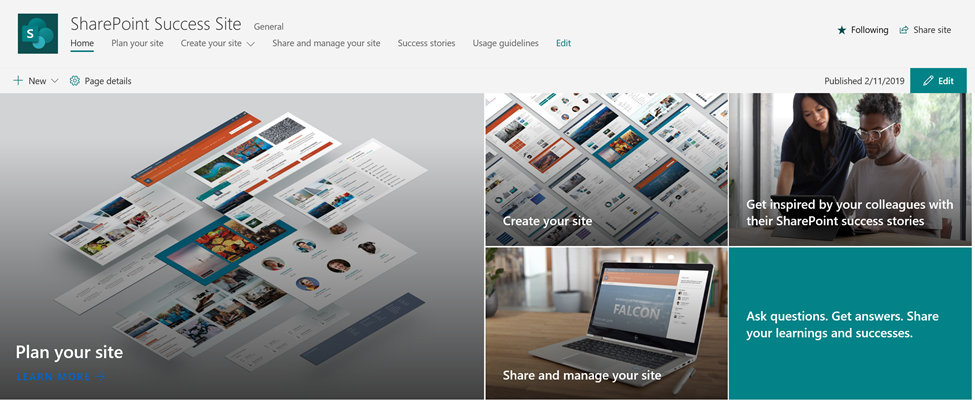

# Customizing a SharePoint Success Site
Introducing the SharePoint Success Site, a new solution from Microsoft designed to helps end users improve the quality and impact of the communication and team sites they build for internal audiences, while helping ensure they follow your organization’s governance site usage guidelines. With the SharePoint Success Site, you can:

- Tailor the SharePoint Success Site content for your environment
- Hide or show content to reflect the services or features supported in your organization
- Keep your content and users current with an up-to-date feed of SharePoint success learning content from Microsoft
- Build custom playlists and categories crafted specifically for your user's needs

## How does the SharePoint Success Site work? 

The SharePoint Success Site consists of three parts:
1. Live feed of content from a Microsoft online catalog
2. SharePoint communication site
3. SharePoint web part called Microsoft 365 learning pathways
<Matt to provide graphic in future based on M365LP>

## Requirements and Permissions

Before getting started with this guide, ensure that the SharePoint Success Site has been set up by your SharePoint Tenant Administrator. If you’re not sure if it's been set up, contact your SharePoint tenant administrator to verify that the SharePoint Success Site has been provisioned. Also be sure to get the URL of the SharePoint Success Site. If you are the Tenant Administrator and learning pathways has not been provisioned, see Provision SharePoint Success Site.

### Permissions to provision the SharePoint Success Site

- Tenant Administrator, also known as Office 365 Global Administrator
- SharePoint Site Collection Administrator with Owner permissions on the site

### Permissions to use SharePoint Success Site Administration features to be able to customize site

- Site Collection Administrator
- SharePoint Owner or Member permissions

### Permissions to use the SharePoint Success Site as a user
•	Office 365 user permissions/SharePoint Site Visitor permissions or higher

## Get started with customization

Once you've ensured you have the necessary permissions to customize the site and web part, it's time to get started with the customization process.

To get started, see Go to the SharePoint Success Site.

### Go to the SharePoint Success Site
The SharePoint Success Site is hosted in your Office 365 tenant, so you'll need to sign in to Office 365 to get to the site. If you haven’t already signed into Office 365, sign in now.

#### Sign in

1.	Open your Web browser and navigate to office.com or your organization’s sign-in location.
2.	Sign in with your username and password.
3.	Navigate to the location of the site using the URL supplied by your tenant administrator or select SharePoint from the Office 365 Home page, and then select the SharePoint Success Site.
4.	Review the Plan your site, Create your site, Share and manage your site sections to see the full suite of Microsoft curated and maintained training playlist available with the SharePoint Success Site.
5.	Kick the tires a bit. Click a few subcategories, and then click a few playlists to get a feel for how the SharePoint Success Site content is organized.

## Customize the site
The following sections of the SharePoint Success Site can be customized to meet your requirements, prior to rolling out to end users:
•	SharePoint site template
•	Site usage guidelines 
•	Success stories 
•	Intranet team 
•	Champions community

## SharePoint Site Template

There are several different ways you can make the SharePoint Success Site template your own: 
•	Branding 
•	Customizing the hero graphic
•	Adding web parts to your site
•	Change the logo 
•	Customize the navigation 
•	Customize the page layout

## Up-to-Date Content Feed
<to be update>
The Create your site playlist content may need to be adjusted to align with the site provisioning method you have chosen for your SharePoint implementation. The Create your site playlist content is based on the default self-service site provisioning experience where end users can create their own SharePoint site without IT intervention. If your organization prevents users from creating their own sites or includes any other modifications to the site provisioning experience (e.g., create a site form that must be completed by users), edit the Create your site playlist accordingly. 
To learn more about how to manage site creation in SharePoint Online refer to this article. 

 ## Custom Playlists
<to be update>

## Boilerplate SharePoint Usage Policies

<to be updated>

## Success Stories
The success stories section is a gallery for organizations to populate with internal SharePoint Online success stories that inspire others in the organization about what is possible with SharePoint.
<insert screen shot>
Add success stories to your portal
If available, add existing SharePoint success stories to your portal. If success stories are not currently available, consider working with interested departments in building high priority and easy to implement SharePoint sites and/or solutions. Delivering these “early wins” will help inspire others in the organization on the possibilities for using SharePoint themselves to achieve important business outcomes. See adoption section for more information.  
Create form to solicit success stories
The purpose of the “Success Stories” section is to enable peers to learn from one another on how they can use SharePoint to create sites that help them achieve their objectives. End users will be able to learn from the successes and lessons from peers who have implemented SharePoint solutions. 
To help solicit SharePoint success stories from your end users (for posting on the portal), build a success story submission form utilizing Microsoft Forms – http://forms.office.com. 
  
1.	Create a submission form at https://forms.office.com

  

  

To gather the right information about each SharePoint Online story, consider including the following questions: 

•	Name of solution
•	Project team members
•	Who is the sponsor of the project?
•	What Office 365 technologies (e.g., SharePoint, Yammer, Stream, Flow) were used as part of the solution?
•	What were the reasons for building the SharePoint site/solution?
•	Provide a description of the solution
•	What impact or results has the SharePoint site/solution generated?
•	What best practices for planning and implementing your solution would you recommend to other who are building their own SharePoint site/solution? 
See here for more information about how to use Microsoft Forms.
2.	Click share and copy the link to the form  
 

3.	Insert the link into your portal 

 

## Portal team
If your organization has a portal/Intranet team that will be supporting site owners, consider adding the team members on the SharePoint Success Site homepage using the people web part. If you will not have a dedicated team supporting site owners, remove the current people web part. 

## Champions Community
To help build, grow, and sustain your SharePoint Online adoption and support site owners, we recommend building a portal champions community on Yammer. Portal champions can answer SharePoint related questions posted in the Yammer group and encourage site owners to share their successes and best practices. 
See the champions program guide here for more information on how to build a successful champions program. 
To increase visibility and engagement within your portal champions community, integrate the Yammer group hosting your community into the SharePoint Success Site using the Yammer web part. 
  
To integrate a Yammer feed into the portal, see here for instructions.
