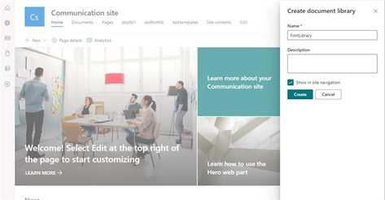

# Supporting Custom Organization Fonts in PowerPoint for web 
Custom fonts allow customers to create a brand for their organizations to encourage consistency in the documents and presentations. Earlier, organization users could see and use custom font installed locally on their desktop. Now, customers with an E3 or E5 license can take advantage of <b>Custom Font Support</b> on PowerPoint for displaying new web fonts. Upload your font as a SharePoint OAL and observe your font has rendered properly on PowerPoint for the web. Seamless support for the desktop experiences is coming soon. 

## How does this work? 
The following diagram outlines the key steps in making our solution work: 

   

1. Company admin uploads their fonts to their company’s SharePoint site using the <b>SharePoint Online Management Shell.</b>
2. SharePoint stores the assets in a [public Office 365 Content Delivery Network.](https://docs.microsoft.com/microsoft-365/enterprise/use-microsoft-365-cdn-with-spo?view=o365-worldwide) 
3. Users in the company will open a PowerPoint file on the web platform, PowerPoint for the web will fetch the appropriate fonts by accessing the CDN, when needed. 
4. PowerPoint for the web will render the fonts correctly on all web-based experiences. 

## Adding custom fonts to SharePoint as organization asset libraries 
1. [Create a new site](https://support.microsoft.com/office/create-a-site-in-sharepoint-4d1e11bf-8ddc-499d-b889-2b48d10b1ce8) or use your existing site for organization asset libraries and set permissions. 
2. Create a new document library for your custom font.
  
   
3.	Using the <b>SharePoint Online Management Shell,</b> run the following commands to choose  the library as font organization asset library. 

      ```Add-SPOOrgAssetsLibary -LibraryUrl <New Document Library SharePoint URL> -OrgAssetType OfficeFontLibary -CdnType Public```
 
     For example: 

      ```Add-SPOOrgAssetsLibary -LibraryUrl “https://constosofonts.sharepoint.com/FontLibrary” -OrgAssetType OfficeFontLibary -CdnType Public``` 
 
4.	Using the <b>SharePoint Online Management Shell,</b> run the following command to upload your custom font to the document library location you created. 

     ```Set-SPOCustomFontCatalog -FontFolder <Local Font Folder Location>  -LibraryUrl <Document Library SharePoint URL> ```
 
     For example: 

     ```Set-SPOCustomFontCatalog -FontFolder “C:\ProgramData\Fonts” -LibraryUrl “https://contosofonts.sharepoint.com/FontLibrary” ```

## Important notes on features and its release
- This feature/support will be available in PowerPoint for the web in the month of February 2022. Following endpoints are supporting this feature: 
  - Windows Desktop – March 2022 
  - Mac + mobile – June 2022 
- Updates to font organization asset libraries take 24 hours to update across your organization. 
- This feature supports only TTF and OTF font filetypes. 
- Don't use the <b>Document Library SharePoint Web UI</b> for making changes to your font libraries, these changes won't reflect. Use only the <b>SharePoint Online Management Shell</b> commands to make changes.
  - Only use the Remove-SPOOrgAssetsLibrary command to remove an Office Font Library. 
- Your custom fonts will only be available internally, and external users can't render or use your custom font.

## Public CDNs and licensing 
In general, custom fonts for <b>public</b> will be stored in a cloud location, and it won't be accessible for public. In this scenario, public means - access to asset is anonymous and unauthenticated. Whenever a user requests the custom font, we don't check for company specific authentication. However, to gain access for your fonts, users outside of your company need to maliciously reconstruct or guess the URL location of your font. Later, spoof the request through an approved list of hosts (PPT, SharePoint, and Teams). If users can guess the URL of your fonts, they're unable to plug the URL into their browsers to download the fonts. 


