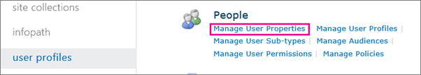
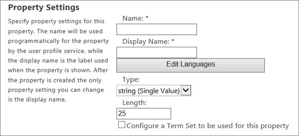

# Add and edit user profile properties in SharePoint

If your organization uses the cloud identity model, your Office 365 user accounts are stored in Azure AD and you can manage most user profile info in the Microsoft 365 admin center. For info, see [Edit or change a user in Office 365](/office365/admin/add-users/change-a-user-name-and-email-address). You can also manage user profiles (including adding user pictures and defining user managers) in the Azure AD admin center. For info, see [Add or change profile information for a user in Azure Active Directory](https://go.microsoft.com/fwlink/?linkid=864809). If you need to create custom user profile properties, such as languages spoken, emergency contact info, or sales account, you can use user properties in SharePoint. Note that these properties are NOT synced back to Azure AD.
  
## Add a property for a user profile

1. Sign in to https://admin.microsoft.com as a global or SharePoint admin to open the Microsoft 365 admin center. (If you see a message that you don't have permission to access the page, you don't have Office 365 administrator permissions in your organization.)
    
    > [!NOTE]
    > If you have Office 365 Germany, sign in at https://portal.office.de. If you have Office 365 operated by 21Vianet (China), sign in at https://login.partner.microsoftonline.cn/. Then select the **Admin** tile to open the admin center.  
    
2. In the left pane of the admin center, under **Admin centers**, select **SharePoint**. (You might need to select **Show all** to see the list of admin centers.).

3. If the classic SharePoint admin center appears, select **Open it now** at the top of the page to open the new SharePoint admin center. In the left pane of the new SharePoint admin center, select **Classic features**.
    
4. Under **User profiles** , select **Open**.
    
5. Under **People**, select **Manage User Properties**.
    
    
  
6. Select **New Property**.
    
7. In the **Name** box, enter a unique name for the property.
    
    
  
8. In the **Display Name** box, enter the profile property name that will be displayed to all users. (This name doesn't have to be unique.)
    
9. In the **Type** list, select the data type for the property.
    
    > [!NOTE]
    >  If you select **string (Multi Value)**, the property will be permanently set as a multi-valued property. You cannot change this setting after you select **OK**. You can only delete the property and add it again as a new single-value property.
  
10. If you selected binary, HTML, or string, use the **Length** box to enter the maximum number of characters allowed for property values.
    
11. If you selected string and want to associate the profile property with a [managed metadata term set](managed-metadata.md), select **Configure a Term Set to be used for this property**. Then select a term set from the list.
    
12. Make sure **Default User Profile Subtype** is selected so the default user profile subtype is associated with this user profile property.
    
13. In the **Description** box, enter the instructions or information that is displayed to users about this profile property.
    
14. In the **Policy Settings** section, select the policy setting and default privacy setting that you want for this property. Select the **User can override** box to enable users to override these settings.
    
15. If you want users to be able to change this profile information for themselves, select **Allow users to edit values for this property**.
    
16. In the **Display Settings** section, specify whether and how the property will be viewed by users.
    
17. In the **Search Settings** section, select **Alias** if the property is the equivalent of a user's name. For example, you might do this if you create a property for a "Stage name" and want searches for all documents by John Kane to return the same results as searches for the user's real name. Select the **Indexed** if you want searches to return all the user profiles matching that property. For example, if you have a property for "University," a search for that value would return all alumni from that university.
    
    > [!NOTE]
    >  The **Alias** check box is available only if you set the **Default Privacy Setting** \> **Everyone**.
  
18. Select **OK**.
    
## Edit or delete a property you added

1. In the left pane of the admin center, under **Admin centers**, select **SharePoint**. (You might need to select **Show all** to see the list of admin centers.)

2. If the classic SharePoint admin center appears, select **Open it now** at the top of the page to open the new SharePoint admin center. In the left pane of the new SharePoint admin center, select **Classic features**.
    
3. Select **User profiles**, and then select **Open**. Under **People**, choose **Manage User Properties**.
    
    
  
4. In the **Property Name** column, select the profile property that you want to change, and then select **Edit** or **Delete**.
    
5. Edit the elements you want to change.
    
    > [!NOTE]
    >  Some elements of profile properties, such as the **Type** element, are unavailable because they can't be edited. To define these elements, create a new property. The exception is the Source Data Connection property. It's predefined in SharePoint and can't be changed.
  
6. When you're done, select **OK**.
    
 ## Synchronize custom properties

Custom properties from Active Directory or Azure AD are not synchronized with SharePoint Online. For info about bulk updating custom user profile properties by using PowerShell, see [Call the import API from PowerShell](/sharepoint/dev/solution-guidance/bulk-user-profile-update-api-for-sharepoint-online#call-the-import-api-from-powershell).

## Need more help?

[!INCLUDE[discussionforums.md](includes/discussionforums.md)]
