# Add columns to a content type

Content types are a way of grouping information about list items or documents that you want to capture using columns. For example, if you have a purchase order content type, it could include account number, project number, date, and project manager. You can customize content types by adding columns of the types you need. You can add the appropriate content type to your list or library and get a group of columns, rather than creating or adding each column individually. You can have multiple content types in the same list or library, and create views to see different types of items and documents.

When you can create content types on a site level or a list or library level the advantage is that they are shared for all sites and subsites under the top site. This can help standardize columns, and minimize errors. The disadvantage is that they require administrator permissions to create, and have to be planned more carefully. List or library level content types are quick to create, but are unique to the library they're in.

## Add a column to a content type

To add a column to a content type, follow these steps:

> [!WARNING]
> If the content types that appear are not hyperlinks or cannot be selected, it means that the site inherits its content types from a different site. To add a column to the content type, you must change it on the other site.

### Add a column to a site content type

1. Go to the site where you want to change a site content type by adding a column.

2. Select **Settings** , and then select **Site Settings**.

3. Under **Web Designer Galleries**, select **Site content types**.

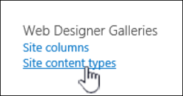

4. Select the name of the content type that you want to add a column to.

5. Under **Columns**, select **Add from existing site columns**.

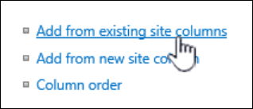

6. In the **Select Columns** section, under **Select columns from**, select the arrow to select the group from which you want to add a column.

7. Under **Available columns**, select the column that you want to add, and to move the column to the **Columns to add** list, select **Add**.

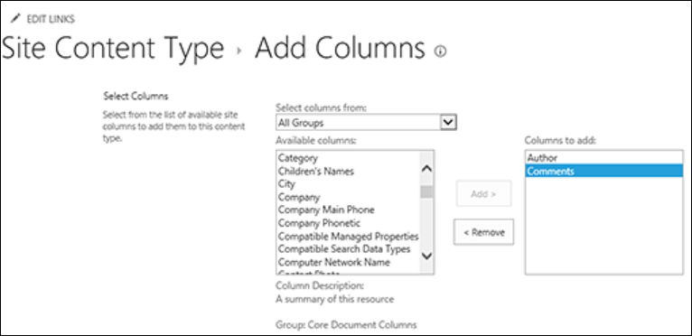

8. In the **Update List and Site Content Types** section, under **Update all content types inheriting from this type?**, if you want to update all content types that inherit from this site content type, select **Yes**. If you don't want to update the content types that inherit from this site, select **No**.

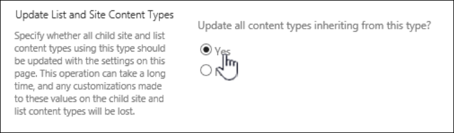

## Add a column to a list or library content type

1. Go to the list or library where you want to change the content type by adding a column.

2. Do one of the following:

    - If you're working in a list, select the **List** tab, and then select **List Settings**.
    
    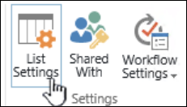

    - If you're working in a library, select the **Library** tab, and then select **Library Settings**.
    
    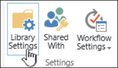

3. Under **Content Types**, select the name of the content type that you want to add a column to.

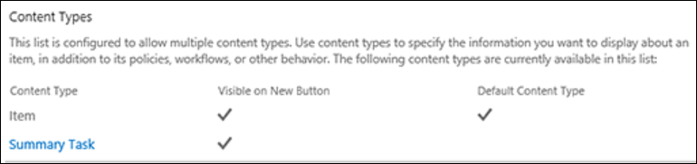

4. Under **Columns**, select **Add from existing site or list columns**.

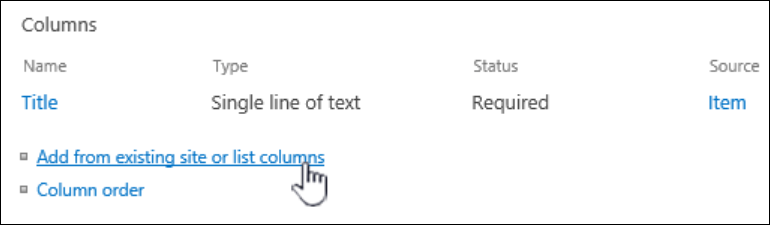

5. In the **Select Columns** section, under **Select columns from**, select the arrow to select the group from which you want to add a column.

6. Under **Available columns**, select the column that you want to add, and to move the column to the **Columns to add** list, select **Add**.

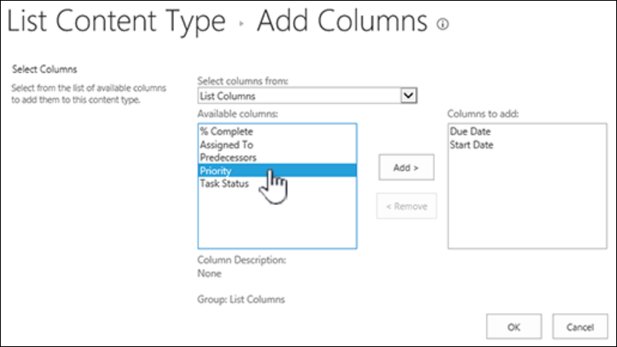

7. Select **OK**.

## Change column order

To change column order for a content type, follow these steps.

### Change column order on a site content type

1. Go to the site where you want to change the column order.

2. Select **Settings** , and then select **Site Settings**.

3. Under** Web Designer Galleries**, choose **Site content types**.

4. Under **Site Content Type**, select the name of the content type that you want to change column order.

5. Under **Columns**, select **Column order**.

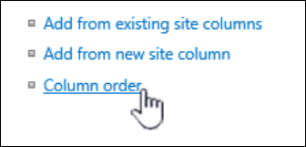

6. In the **Column Order** section, select the arrow next to the column that you want to reorder in the **Position from Top** column, and then select the order number that you want.

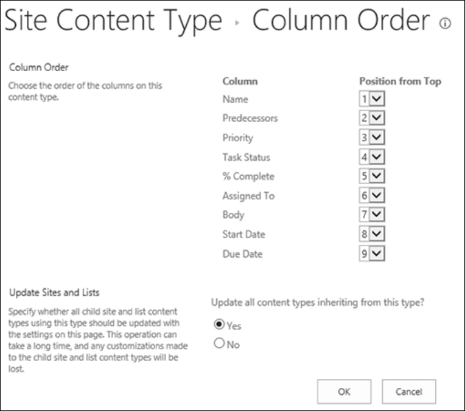

7. In the **Update List and Site Content Types** section, under **Update all content types inheriting from this type?**, if you want to update all content types that inherit from this site content type, select **Yes**. If you don't want to update the content types that inherit from this site, select **No**.

8. Select **OK**.

### Change column order on a list or library content type

1. Go to the list or library where you want to change the column order.

2. Do one of the following:

    - If you're working in a list, select the **List** tab, and then select **List Settings**.
    
    

    - If you're working in a library, select the **Library** tab, and then select **Library Settings**.
    
    

3. Under **Content Type**, select the name of the content type that you want to change.

4. Under **Columns**, select **Column order**.

5. In the **Column Order** section, select the arrow next to the column that you want to reorder in the **Position from Top** column, and then select the order number that you want.

6. In the **Update List and Site Content Types** section, under **Update all content types inheriting from this type?**, if you want to update all content types that inherit from this site content type, select **Yes**. If you don't want to update the content types that inherit from this site, select **No**.

7. Select **OK**.

## Make a column required, optional, or hidden

To make a column required, optional or hidden, follow these steps.

### For a site content type

1. Go to the site where you want to change a site content type by adding a column.

2. Select **Settings** , and then select **Site Settings**.

3. Under** Web Designer Galleries**, choose **Site content types**.

4. Under **Columns**, select the name of the column that you want to make required, optional, or hidden.

5. In the **Column Settings** section, do one of the following:

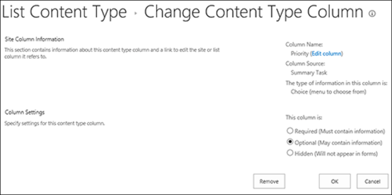

    - To require users to specify information for a column, select **Required**.
    
    - To make it optional for users to specify information for a column, select **Optional**.
    
    - To hide a column so that it does not appear in any forms for the content type, select **Hidden**.

6. Select **OK**.

### For a list or library content type

1. Go to the list or library where you want to change the content type by adding a column.

2. Do one of the following:

    - If you're working in a list, select the **List** tab, and then select **List Settings**.
    
    

    - If you're working in a library, select the **Library** tab, and then select **Library Settings**.
    
    

3. Under **Content Types**, select the name of the content type that you want to change. If **Content Types** doesn't appear, select **Advanced settings**, and under **Allow management of content types?**, select **Yes**, and then select **OK**.

4. Under **Columns**, select the name of the column that you want to make required, optional, or hidden.

5. In the **Column Settings** section, do one of the following:

    - To require users to specify information for a column, select **Required**.
    
    - To make it optional for users to specify information for a column, select **Optional**.
    
    - To hide a column so that it does not appear in any forms for the content type, select **Hidden**.

6. Select **OK**.

## Add and use a content type to a list or library

To add a content type to a list or library, see [Add a content type to a list or library](https://support.microsoft.com/office/add-a-content-type-to-a-list-or-library-917366ae-f7a2-47ad-87a5-9689a1884e60).

To see the columns in your content type, create a new view, or update the default view. For more info, see [Create, change, or delete a view of a list or library](https://support.microsoft.com/office/create-change-or-delete-a-view-of-a-list-or-library-27ae65b8-bc5b-4949-b29b-4ee87144a9c9).