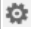
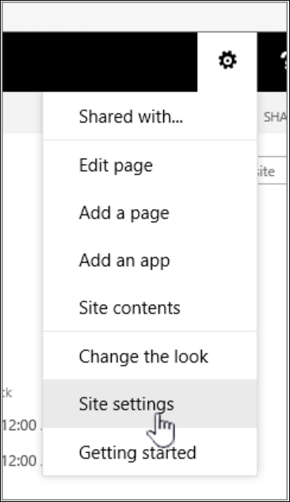

# Add columns to a content type

Content types are a way of grouping information about list items or documents that you want to capture using columns. For example, if you have a purchase order content type, it could include account number, project number, date, and project manager. You can customize content types by adding columns of the types you need. You can add the appropriate content type to your list or library and get a group of columns, rather than creating or adding each column individually. You can have multiple content types in the same list or library, and create views to see different types of items and documents.

When you can create content types on a site level or a list or library level the advantage is that they are shared for all sites and subsites under the top site. This can help standardize columns, and minimize errors. The disadvantage is that they require administrator permissions to create, and have to be planned more carefully. List or library level content types are quick to create, but are unique to the library they're in.

## Add a column to a content type

To add a column to a content type, follow these steps:

> [!WARNING]
> If the content types that appear are not hyperlinks or cannot be selected, it means that the site inherits its content types from a different site. To add a column to the content type, you must change it on the other site.

### Add a column to a site content type

1. Go to the site where you want to change a site content type by adding a column.

2. Select **Settings** , and then select **Site Settings**.

3. Under **Web Designer Galleries**, choose **Site content types**.
