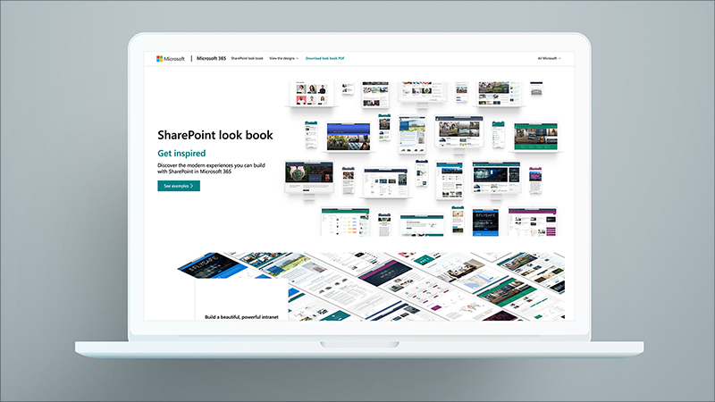
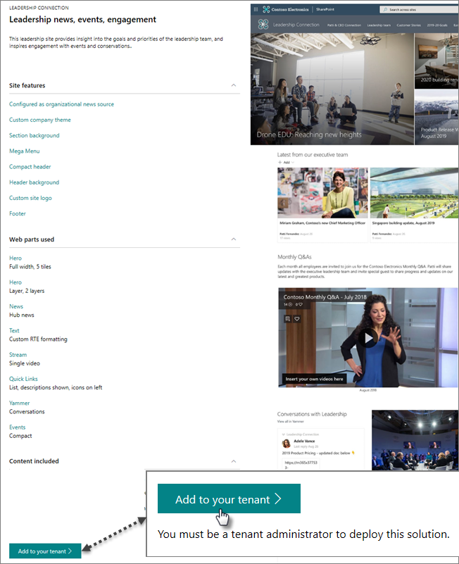
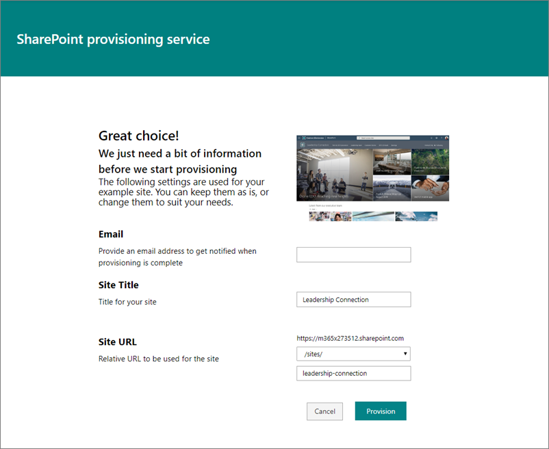
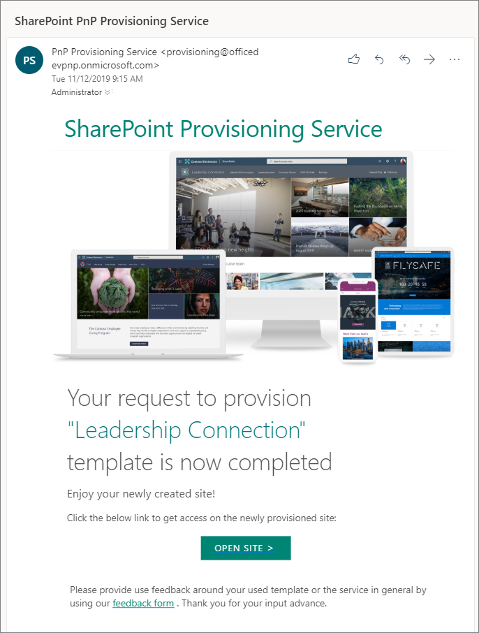
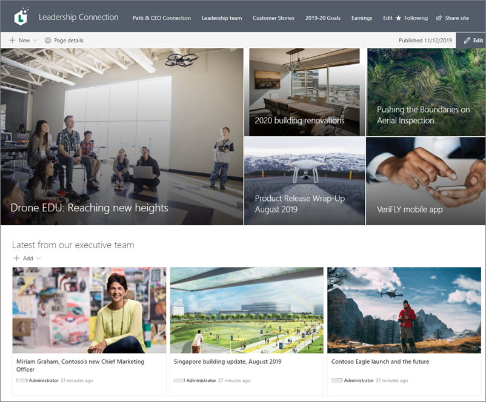

# Add a sample site to your tenant

Discover the modern experiences you can build with SharePoint. Use the SharePoint look book and integrated provisioning service to find inspiring samples of communication sites and team sites that look great on the web and on mobile devices. Then, add one or more sample sites to your tenant. You can customize the sample to use for your own site or use the site for learning or showing to your colleagues. You can do this all with the SharePoint look book and the integrated SharePoint provisioning service.

What's included in a sample? You'll get:
- A modern communication or team site, depending on the sample you choose
- A site home page with sample branding, web parts, content, and images
- sample news posts and pages
- sample navigation

## Get started

### Select a sample you like
Browse the samples in the online [SharePoint look book](https://lookbook.microsoft.com/). Select a sample to learn more about it. You’ll see the site features, web parts used, and content included. Each feature and web part in the list links to a help topic to show you how to use that feature.  

Once you've decided on an sample you want to use in your tenant, select the **Add to your tenant** button near the bottom of the page. Note that you'll need to be signed in as a tenant admin to use this service.

### Enter your information

After selecting the **Add to your tenant** button, enter your email address (for a notification of when your site is ready to use), the title you want to use for your site, and the site URL you want to use.

### Start provisioning

Select **Provision**, and in a short time your site will be ready for you to use. How will you know? You’ll get an email (to the email address you provided on the form above) like this:

### Open and explore your site

Select the **Open site** button, and you’ll see your sample site and content in your tenant!

From here, you can explore the site and edit the pages and content.

**Additional resources**:

[Create a communication site](https://support.office.com/article/7FB44B20-A72F-4D2C-9173-FC8F59BA50EB)

[Create a team site](https://support.office.com/article/ef10c1e7-15f3-42a3-98aa-b5972711777d)

[Using web parts](https://support.office.com/article/336e8e92-3e2d-4298-ae01-d404bbe751e0)

[Create and use modern pages](https://support.office.com/article/b3d46deb-27a6-4b1e-87b8-df851e503dec)

[SharePoint Design Guidance](https://spdesign.azurewebsites.net/)
