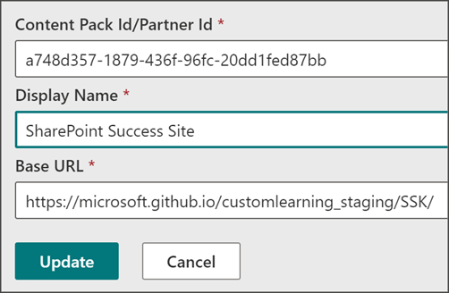
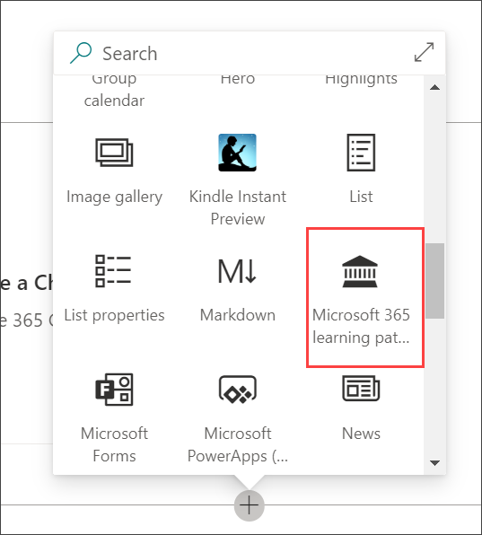
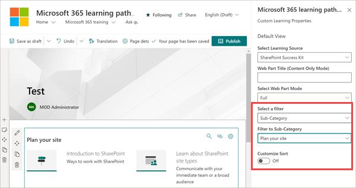

# Add the SharePoint Success Site playlist to your M365 Learning Pathways solution

If you already have [Microsoft 365 learning pathways](https://docs.microsoft.com/office365/customlearning/) solution provisioned, you can add the SharePoint Success Site Content Pack to M365 learning pathways without [provisioning the SharePoint Success Site template](https://docs.microsoft.com/sharepoint/provision-sss). In the learning pathways administration page, you can add a reference to the SharePoint Success Site CDN (Content Delivery Network), so the SharePoint Success Site content can be delivered through the Learning Pathways Web part. 

The SharePoint Success Site’s up-to-date CDN includes a range of content that helps new users and existing site owners plan, build, and manage SharePoint sites:

- **Plan your site:** Guidance on how to plan a site, including what type of SharePoint site to use, access rights, and permission strategy
- **Create your site:** Content that helps new site owners create their site, including how to brand and customize their site and how to add content
- **Share and manage your site:** Guidance to help launch, share, and manage the new site
- **Advanced site creation:** Content for site owners that want to learn beyond site creation basics

## Add the SharePoint Success Site CDN  

1. From the Learning Pathways SharePoint site, select **Home** and then **Learning pathways Administration**
2. Select the ellipsis (…) and then **Add Content Pack**

3. Select **Custom Content Pack**, and then add the details as shown below and then select **Update**

- **Content Pack Id/Partner Id:** a748d357-1879-436f-96fc-20dd1fed87bb
- **Display Name:** SharePoint Success Site
- **Base URL:** http://microsoft.github.io/customlearning_staging/SSK/

## Then, add and filter the learning pathways web part  

You can add the Learning Pathways Web part to a SharePoint page, and then filter the content to display the SharePoint Success Site content. 

1. From the a site, add a page by selecting **+ New** and then **Page** 

2. Select **Blank** and then **Create Page**

3. Select **+ Add a new web part** and then select **Microsoft 365 learning pathways**

## Finally, filter the web part to the SharePoint Success Site content 

1. In the left corner of the learning pathways web part, select **Edit web part**

2. Under Select Learning Source box, select **SharePoint Success Kit**

3. For the filter, select **Sub-category**

4. Under Filter to Sub-Category, select **Plan your site**

5. Select **Apply** when you are done

For more information about filtering content, see [Add and edit the Microsoft 365 learning pathways web part](https://docs.microsoft.com/office365/customlearning/custom_addwebpart). 

