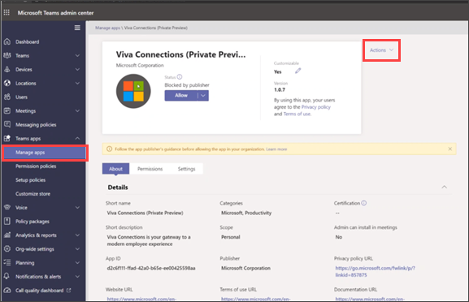
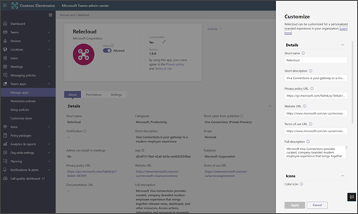
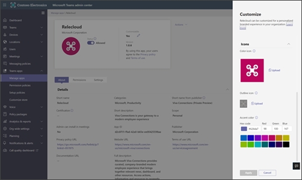
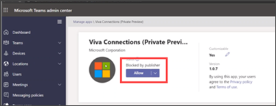

# Add the Viva Connections app in the Teams Admin Center (Preview)

After you have prepared your intranet for Viva Connections in SharePoint, you are ready to add the Viva Connections app in the Microsoft Teams Admin Center. Add the Viva Connections app, and then customize app settings to add your organization's logo, pre-install, and pre-pin the app for end users. 

> [!IMPORTANT]
> - Some Viva Connections features will become available sooner than others. This document reflects the most up to date guidance and will be updated over the next several weeks to include updates to features as they become available. 
> - Teams administrator (or higher) permissions are required to add the Viva Connections app to the Teams Admin Center.

## Start by adding the app in the Teams Admin Center

1.	Log in to the Microsoft Teams admin center
2.	Select **Teams Apps** and then **Manage Apps**
3.	Search for “Viva Connections”, and select the **Viva Connections app**

> [!NOTE]
> The Viva Connections app is blocked by default.

## Next, customize the app

1. Select **Actions** in the top-right area and then select **Customize**

2. From the **Customize** panel, update the attributes under details. 

- The **Short name** will be the display name of the Viva Connections app in your tenant.  In this example, it is “Relecloud”. 

3. Next, select **Icon** at the bottom of the **Customize** panel:

>- Upload a full color icon 192x192px
>- Also upload a transparent outline icon 32x32px
>- Optionally, select an accent color that will be applied on card elements in the app on Teams mobile
 
4. Select **Apply** when you are done.

## Then, customize the app settings

1. Optionally (but highly recommended) use Teams app setup policy to pre-install and pre-pin the app for users on the Teams app bar on desktop and mobile. [Learn more about Teams app set up policies](/MicrosoftTeams/teams-app-setup-policies).

2. Optionally (but highly recommended) set app permissions policies to determine which users have access to the app. [Learn more about Teams permission policies](/microsoftteams/teams-app-permission-policies).

## Finally, make the app available to end users

1. Return to the Teams admin center and select **Teams apps** then **Manage apps** and search for the Viva Connections app using the name you selected as the **Short name** when you first customized the Viva Connections app.

2. Change the app from the default **Blocked by Publisher** state to the **Allowed** state.

## Resources

[Overview of Viva Connections](/viva-connections-overview)
 

