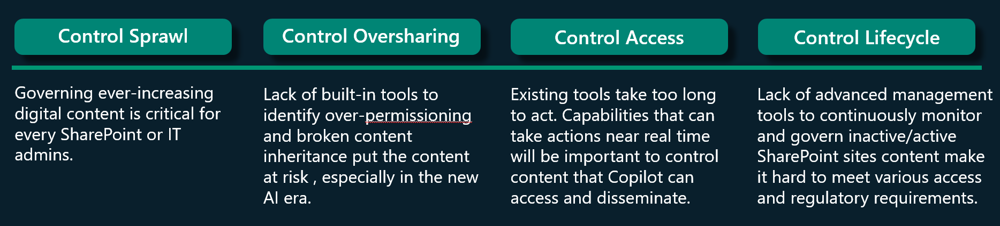

# Microsoft SharePoint Premium - SharePoint Advanced Management overview

Microsoft SharePoint Premium - SharePoint Advanced Management is an essential add-on for Microsoft 365 that equips IT administrators with a powerful suite of tools to bolster content governance throughout the Microsoft Copilot deployment journey.

Whether preparing for [Copilot deployment](/copilot/microsoft-365/microsoft-365-copilot-setup) or managing content post-implementation, this solution offers capabilities to:

- prevent content sprawl,
- streamline access management for SharePoint and OneDrive sites, and
- analyze usage patterns through comprehensive reporting.

We recommend utilizing SharePoint Advanced Management features along with our [best practices for Copilot for Microsoft 365](/sharepoint/sharepoint-copilot-best-practices) to reduce the risk of oversharing, control content sprawl, and manage content lifecycle.

SharePoint Advanced Management features are managed by [IT administrators](/microsoft-365/admin/add-users/about-admin-roles) with access to the [SharePoint admin center](https://go.microsoft.com/fwlink/?linkid=2185219). Some features can be used by site owners.

SharePoint Advanced Management helps you identify, manage, and resolve common content governance issues such as:

## Manage content sprawl

**What is content sprawl?** Content sprawl occurs when digital content accumulates without proper management across various storage locations in an organization. This leads to difficulties in accessing information, higher storage expenses, security vulnerabilities, and compliance complexities. You can tackle content sprawl by implementing governance strategies and utilizing tools that centralize control, optimize storage efficiency, and uphold secure data management practices.

### Inactive SharePoint sites policy

You can run automated, rule-based policies to manage and reduce inactive sites with the [**Inactive SharePoint sites policy**](site-lifecycle-management.md) feature from SharePoint Advanced Management.

The inactive sites policy combats content sprawl by automatically identifying and managing inactive SharePoint sites. It operates by defining inactivity criteria, such as lack of updates or user activity over a set period. Once identified, site owners receive email notifications to confirm the active/inactive state of the site.

## Manage oversharing

Copilot leverages the data stored in SharePoint and OneDrive sites to provide insights and automate tasks across your organization. Confidential data from content in SharePoint and OneDrive sites can populate in Copilot's generated insights, posing security and privacy risks.

SharePoint Advanced Management ensures this data is securely handled and accessed only by authorized users and/or security groups, maintaining the integrity and security of the insights generated by Copilot​.

By preventing oversharing and managing access effectively, you can ensure that Copilot's collaboration features are optimized. This leads to more efficient and secure use of Copilot across your organization.

### Restricted access control for OneDrive

You can limit access to shared content of a user's OneDrive to only people in a security group with the **[Restricted access control for OneDrive](onedrive-site-access-restriction.md)** policy. Once the policy is enabled, anyone who is not in the designated security group won't be able to access content in that OneDrive even if it was previously shared with them. To block users from accessing OneDrive as a service, you can enable the [Restrict OneDrive service access](limit-access.md) feature.

### Restricted access control for SharePoint

### Recent SharePoint admin actions

 The **[Recent SharePoint admin actions](recent-actions-panel.md)** policy lets you review and monitor the last 30 changes you've made to a SharePoint site's properties within the last 30 days in the SharePoint admin center. This feature only shows changes made by you and not other administrators.

### Change history - Site changes

The **[Change history - Site changes](change-history-report.md)** feature lets you create change history reports in the SharePoint admin center to review SharePoint site property changes made within the last 180 days. Create up to five reports for a given date range and filter by sites and users. You can download the report as a .csv file to view the site property changes.

### Data access governance insights

**[Data access governance insights](data-access-governance-reports.md)**These reports help you discover sites that contain potentially overshared or sensitive content. You can use these reports to assess and apply appropriate security and compliance policies.

### Conditional access policy for SharePoint and OneDrive sites

**[Conditional access policy for SharePoint and OneDrive sites](authentication-context-example.md)**|With Microsoft Entra authentication context, you can enforce more stringent access conditions when users access SharePoint sites. Authentication contexts can be directly applied to sites or used with sensitivity labels to connect Microsoft Entra Conditional Access policies to labeled sites.

### Block download policy for SharePoint and OneDrive sites

**[Block download policy for SharePoint and OneDrive sites](block-download-from-sites.md)** You can block download of files from SharePoint sites or OneDrive without needing to use Microsoft Entra Conditional Access policies. Users have browser-only access with no ability to download, print, or sync files. They also won't be able to access content through apps, including the Microsoft Office desktop apps.

## Content permissions and access

You can utilize SharePoint Advanced Management to analyze insights from reports on usage patterns.

## Manage content lifecycle

(utilize advanced management tools to monitor recent changes to site or tenant settings, rename tenants, block file download)

- **Copilot access to content management** (set policies to restrict access to sites and manage content discoverability via Copilot and tenant-wide search)
  - **[Restricted access control for SharePoint sites (restricted-access-control.md)** - You can restrict the access of a SharePoint site and its content only to the members of Microsoft 365 group (for group-connected sites) or a security group (for non-group connected sites). Users who aren't in the specified groups won't have access to site content even if they previously had site access permissions or a file sharing link.

## Licensing

SharePoint Advanced Management is a per-user license. To use SharePoint Advanced Management, you must have a license for each user in your organization. (It's not required for guests.) Users must also be licensed for SharePoint K, P1, or P2 via standalone or a Microsoft 365 suite.

You can purchase the *SharePoint Advanced Management Plan 1* add-on in the Microsoft 365 admin center, through a Cloud Solution Provider (CSP), or through volume licensing enrollment. Contact your Microsoft account manager for further information.

SharePoint Advanced Management is available for Commercial, WW Commercial Public Sector, Education, Charity, and US GCC, GCC-High, and DoD customers.

SharePoint Advanced Management is $3 per user per month for commercial customers.

Licensing details for each feature listed above are included in those articles.

## Related topics

[Microsoft Syntex documentation](/microsoft-365/syntex)

[Microsoft 365 Government - how to buy](/office365/servicedescriptions/office-365-platform-service-description/office-365-us-government/microsoft-365-government-how-to-buy)

[Get started with Microsoft Copilot for Microsoft 365](/copilot/microsoft-365/microsoft-365-copilot-setup)
