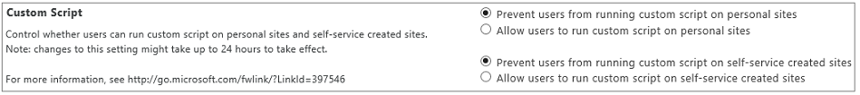
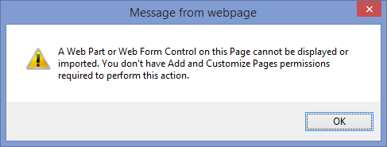

# Allow or prevent custom script

As a global or SharePoint admin in Microsoft 365, you can allow custom script as a way of letting users change the look, feel, and behavior of sites and pages to meet organizational objectives or individual needs. If you allow custom script, all users who have "Add and Customize Pages" permission to a site or page can add any script they want. (By default, users who create sites are site owners and therefore have this permission. For more info about SharePoint permission levels, see [Understanding permission levels in SharePoint](/sharepoint/understanding-permission-levels).) 
  
> [!NOTE]
> For simple ways to change the look and feel of a site, see [Change the look of your SharePoint site](https://support.office.com/article/06bbadc3-6b04-4a60-9d14-894f6a170818). 
  
By default, script is allowed on sites that admins create. It is not allowed on OneDrive, on sites users create themselves, and on the root site for your organization. You'll probably want to limit the amount of script you allow for security reasons. For more info about the security implications of custom script, see [Security considerations of allowing custom script](security-considerations-of-allowing-custom-script.md).
  
> [!IMPORTANT]
> If SharePoint was set up for your organization before 2015, your custom script settings might still be set to "Not Configured" even though in the SharePoint admin center they appear to be set to prevent users from running custom script. In this case, users won't be able to copy items between SharePoint sites and between OneDrive and SharePoint. On the settings page of the SharePoint admin center, select **OK** to accept the custom script settings as they appear and enable cross-site copying. For more info about copying items between OneDrive and SharePoint, see [Copy files and folders between OneDrive for Business and SharePoint sites](https://support.office.com/article/67a6323e-7fd4-4254-99a8-35613492a82f). 
  
## To allow custom script on OneDrive or user-created sites
<a name="__top"> </a>

In the SharePoint admin center, you can choose to allow users to run custom script on OneDrive (referred to as "personal sites") or on all classic team sites they create. For info about letting users create their own sites, see [Manage site creation in SharePoint](manage-site-creation.md).
  
> [!CAUTION]
> Before you allow custom script on sites in your organization, make sure you understand the [security implications](security-considerations-of-allowing-custom-script.md). 
  
1. Go to the [Settings page of the new SharePoint admin center](https://admin.microsoft.com/sharepoint?page=migrationCenter&modern=true) and sign in with an account that has [admin permissions](/sharepoint/sharepoint-admin-role) for your organization.

>[!NOTE]
>If you have Office 365 Germany, [sign in to the Microsoft 365 admin center](https://go.microsoft.com/fwlink/p/?linkid=848041), then browse to the SharePoint admin center and open the Settings page. <br>If you have Office 365 operated by 21Vianet (China), [sign in to the Microsoft 365 admin center](https://go.microsoft.com/fwlink/p/?linkid=850627), then browse to the SharePoint admin center and open the Settings page.

2. At the bottom of the page, select **classic settings page**.

3. Under **Custom Script** choose:

  - **Allow users to run custom script on personal sites**.

  - **Allow users to run custom script on self-service created sites**.

    
  
    > [!NOTE]
    > Because self-service site creation points to your organization's root site by default, changing the Custom Script setting allows custom script on your organization's root site. For info about changing where sites are created, see [Manage site creation in SharePoint](manage-site-creation.md). 
  
4. Select **OK**. It can take up to 24 hours for the change to take effect.

## To allow custom script on other SharePoint sites
<a name="__top"> </a>

> [!CAUTION]
> Before you allow custom script on sites in your organization, make sure you understand the [security implications](security-considerations-of-allowing-custom-script.md). 
  
To allow custom script on a particular site (previously called "site collection") immediately, follow these steps:

1. [Download the latest SharePoint Online Management Shell](https://go.microsoft.com/fwlink/p/?LinkId=255251).
    
2. Connect to SharePoint Online as a [global admin or SharePoint admin](/sharepoint/sharepoint-admin-role) in Microsoft 365. To learn how, see [Getting started with SharePoint Online Management Shell](/powershell/sharepoint/sharepoint-online/connect-sharepoint-online).

3. Run the following command.
 ```PowerShell
 Set-SPOsite <SiteURL> -DenyAddAndCustomizePages 0
 ``` 
If you change this setting for a user's OneDrive or a classic team site, it will be overridden by the Custom Script setting in the admin center within 24 hours.
  
## Features affected when custom script is blocked
<a name="__top"> </a>

When users are prevented from running custom script on OneDrive or the classic team sites they create, site admins and owners won't be able to create new items such as templates, solutions, themes, and help file collections. If you allowed custom script in the past, items that were already created will still work.
  
The following site settings are unavailable when users are prevented from running custom script:
  
|**Site feature**|**Behavior**|**Notes**|
|:-----|:-----|:-----|
|Save Site as Template  <br/> |No longer available in Site Settings  <br/> |Users can still build sites from templates created before custom script was blocked.  <br/> |
|Save document library as template  <br/> |No longer available in Library Settings  <br/> |Users can still build document libraries from templates created before custom script was blocked.  <br/> |
|Solution Gallery  <br/> |No longer available in Site Settings  <br/> |Users can still use solutions created before custom script was blocked.  <br/> |
|Theme Gallery  <br/> |No longer available in Site Settings  <br/> |Users can still use themes created before custom script was blocked.  <br/> |
|Help Settings  <br/> |No longer available in Site Settings  <br/> |Users can still access help file collections available before custom script was blocked.  <br/> |
|HTML Field Security  <br/> |Still available in Site Settings, but changes made will not take effect  <br/> |Users can still use HTML field security that they set up before custom script was blocked.  <br/> |
|Sandbox solutions  <br/> |Solution Gallery is no longer available in Site Settings  <br/> |Users can't add, manage, or upgrade sandbox solutions. They can still run sandbox solutions that were deployed before custom script was blocked.  <br/> |
|SharePoint Designer  <br/> |Pages that are not HTML can no longer be updated.  <br/> Handling List: **Create Form** and **Custom Action** will no longer work.  <br/> Subsites: **New Subsite** and **Delete Site** redirect to the **Site Settings** page in the browser.  <br/> Data Sources: **Properties** button is no longer available.  <br/> |Users can still open some data sources. To open a site that does not allow custom script in SharePoint Designer, you must first open a site that does allow custom script.  <br/> |
|Uploading files that potentially include script  <br/> |The following file types can no longer be uploaded to a library  <br/> .asmx  <br/> .ascx  <br/> .aspx  <br/> .htc  <br/> .jar  <br/> .master  <br/> .swf  <br/> .xap  <br/> .xsf  <br/> |Existing files in the library are not impacted.  <br/> |
|Uploading Documents to Content Types <br/>|Access denied message when attempting to attach a document template to a Content Type. <br/>|We recommend using Document Library document templates. |
|Publishing of SharePoint 2010 Workflows <br/>|Access denied message when attempting to publish a SharePoint 2010 Workflow. <br/>| |
   
The following web parts and features are unavailable to site admins and owners when you prevent them from running custom script.
  
|**Web part category**|**Web part**|
|:-----|:-----|
|Business Data  <br/> |Business Data Actions  <br/> Business Data Item  <br/> Business Data Item Builder  <br/> Business Data List  <br/> Business Data Related List  <br/> Excel Web Access  <br/> Indicator Details  <br/> Status List  <br/> Visio Web Access  <br/> |
|Community  <br/> |About This Community  <br/> Join  <br/> My Membership  <br/> Tools  <br/> What's Happening  <br/> |
|Content Rollup  <br/> |Categories  <br/> Project Summary  <br/> Relevant Documents  <br/> RSS Viewer  <br/> Site Aggregator  <br/> Sites in Category  <br/> Term Property  <br/> Timeline  <br/> WSRP Viewer  <br/> XML Viewer  <br/> |
|Document Sets  <br/> |Document Set Contents  <br/> Document Set Properties  <br/> |
|Forms  <br/> |HTML Form Web Part  <br/> |
|Media and Content  <br/> |Content Editor  <br/> Script Editor  <br/> Silverlight Web Part  <br/> |
|Search  <br/> |Refinement  <br/> Search Box  <br/> Search Navigation  <br/> Search Results  <br/> |
|Search-Driven Content  <br/> |Catalog-Item Reuse  <br/> |
|Social Collaboration  <br/> |Contact Details  <br/> Note Board  <br/> Organization Browser  <br/> Site Feed  <br/> Tag Cloud  <br/> User Tasks  <br/> |
|Master Page Gallery  <br/> |Can't create or edit master pages  <br/> |
|Publishing Sites  <br/> |Can't create or edit master pages and page layouts  <br/> |
   
## Best practice for communicating script setting changes to users
<a name="__top"> </a>

Before you prevent custom script on sites where you previously allowed it, we recommend communicating the change well in advance so users can understand the impact of it. Otherwise, users who are accustomed to changing themes or adding web parts on their sites will suddenly not be able to and will see the following error message.
  

  
Communicating the change in advance can reduce user frustration and support calls.
