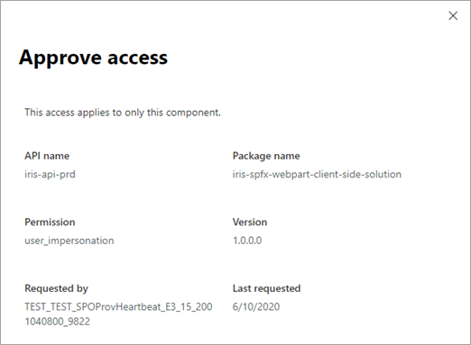

# Manage access to Microsoft Entra ID-secured APIs

When developers build SharePoint Framework solutions, they might need to connect to an API that's secured through Microsoft Entra ID. Developers can specify which Microsoft Entra applications and permissions their solution requires, and an administrator can manage the permission request from <a href="https://go.microsoft.com/fwlink/?linkid=2185223" target="_blank">**API access** in the SharePoint admin center</a>.

[Learn more about building SharePoint Framework solutions that connect to Azure-AD secured APIs](/sharepoint/dev/spfx/use-aadhttpclient#manage-permission-requests).

   

The API access page shows pending and approved requests. It also shows which requests apply to any SharePoint Framework component or custom script in your organization (organization-wide) and which requests apply to only the specific component (isolated).

   > [!NOTE]
   > The admin role that's required to approve permissions depends on the API. To approve permissions to any of the third-party APIs registered in the tenant, the [application administrator](/azure/active-directory/roles/permissions-reference#application-administrator) role is sufficient. To approve permissions for Microsoft Graph or any other Microsoft API, the Global Administrator role is required. The API access page is not available for people signed in with the global reader role.

## Approve a pending request

1. Select the request, and then select **Approve** to see details about the request.
2. In the **Approve access** panel, select **Approve**.

    

    After you approve a request, it moves to the Approved requests list.

    > [!NOTE]
    > Permissions of type delegated are added to the _SharePoint Online Client Extensibility Web Application Principal_ in Microsoft Entra ID.
    >
    > If you try to approve a permission request for a resource that already has some permissions granted (for example, granting additional permissions to the Microsoft Graph), the requested scopes are added to the previously granted permissions.

## Reject a pending request

1. Select the request, and select **Reject**.
2. Select **Reject** again to confirm.

   Rejecting access doesn't remove the app from the Apps site. If the app is used on any sites, it might not work as expected. After you reject the request, it's removed from the page and the developer will need to issue a new request with the same resource and scope.

## Remove access to a previously approved request

1. Select the request, and then select **Remove access**.
2. Select **Remove** again to confirm.

   When you remove access, solutions and custom scripts that rely on the permission might not work as expected. After you remove access, the request is removed from the page and the developer will need to issue a new request with the same resource and scope.

## Manage access by using Microsoft PowerShell

You can also use PowerShell to manage permission requests.

- To view pending requests, use the cmdlet [Get-SPOTenantServicePrincipalPermissionRequests](/powershell/module/sharepoint-online/get-spotenantserviceprincipalpermissionrequests?view=sharepoint-ps&preserve-view=true).
- To approve a request, use the cmdlet [Approve-SPOTenantServicePrincipalPermissionRequest](/powershell/module/sharepoint-online/Approve-SPOTenantServicePrincipalPermissionRequest?view=sharepoint-ps&preserve-view=true).
- To reject a request, use the cmdlet [Deny-SPOTenantServicePrincipalPermissionRequest](/powershell/module/sharepoint-online/deny-spotenantserviceprincipalpermissionrequest?view=sharepoint-ps&preserve-view=true).
- To remove access to a previously approved request, use the cmdlet [Revoke-SPOTenantServicePrincipalPermission](/powershell/module/sharepoint-online/revoke-spotenantserviceprincipalpermission?view=sharepoint-ps&preserve-view=true).
