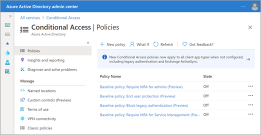
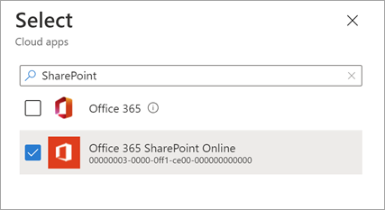

# Use app-enforced restrictions

These steps in the Azure AD admin center tell Azure to use the SharePoint site-level access settings you specify.
  
1. On the [Conditional Access | Policies page](https://aad.portal.azure.com/#blade/Microsoft_AAD_IAM/ConditionalAccessBlade/Policies) of the Azure AD admin center, select **New policy**.

    

2. Enter a suitable name for the policy you are creating.

3. Select **Users and groups**, and then select whether you want the policy to apply to all users or only select users or groups.

4. Select **Cloud apps or actions**, select **Select apps**, search for **SharePoint**, select **Office 365 SharePoint Online**, and then select **Select**.

    

5. Select **Conditions**, select **Client apps**, switch **Configure** to **Yes**, keep all the clients selected, and then select **Done**.

6. Select **Session**, select **Use app enforced restrictions**, and then select **Select**. 

    

7. Enable the policy and select **Create**.
