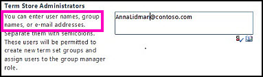
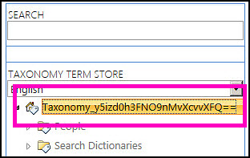

# Assign roles and permissions to manage term sets

To be able to create or change a term in the Term Store management tool, you must have one of three specific roles: Term Store Administrator, Group Manager, or Contributor. 
  

  
A Term Store Administrator can do these tasks:
  
- Create or delete term set groups
    
- Add or remove Group Managers or Contributors
    
- Change the working languages for the term store
    
- Any task that a Group Manager or Contributor can do
    
> [!IMPORTANT]
>  You must be a Term Store Administrator to designate additional Term Store Administrators. 
  
To add a Term Store Administrator:
  
1. [Open the Term Store Management Tool](assign-roles-and-permissions-to-manage-term-sets.md#__open_the_term).
    
2. In the tree view pane on the left, select the taxonomy.
    

  
1. In the **General** tab of the properties pane, in the **Term Store Administrators** box, type the names of the people who you want to add. You can also click the **Browse** button to find and add users. 
    
2. When you finish adding the names of people who you want to be Term Store Administrators, click **Save**.
    
## Add Group Managers

A Group Manager can do these tasks:
  
- Add or remove Contributors.
    
- Any task that a Contributor can do
    
> [!IMPORTANT]
>  You must be a Term Store Administrator to add new Group Managers. 
  
To add a Group Manager:
  
1. Go to the site where you want to add a Group Manager.
    
2. [Open the Term Store Management Tool](assign-roles-and-permissions-to-manage-term-sets.md#__open_the_term).
    
3. In the tree view pane on the left, select the Group for which you want to add a Group Manager. 
    
4. In the **General** tab of the properties pane, in the **Group Managers** box, type the names of the people who you want to add. You can also click the **Browse** button to find and add users. 
    
5. When you finish adding the names of people who you want to be Group Managers, click **Save**.
    
## Add Contributors

A Contributor can create or change a term set.
  
You must be either a Term Store Administrator or a Group Manager of a specific group to add Contributors to that group.
  
> [!NOTE]
>  The Contributor role in managed metadata differs from a Contributor on a site. 
  
1. Go to the site where you want to add a Contributor.
    
2. [Open the Term Store Management Tool](assign-roles-and-permissions-to-manage-term-sets.md#__open_the_term).
    
3. In the tree view pane on the left, select the Group to which you want to add a Contributor. 
    
4. In the **General** tab of the properties pane, in the **Contributors** box, type the names of the people who you want to add. You can also click the **Browse** button to find and add users. 
    
5. When you finish adding the names of people who you want to be Contributors, click **Save**.
    
## In this article

> [Managed metadata roles](assign-roles-and-permissions-to-manage-term-sets.md#__toc332890713)
    
> [Metadata tasks that other site users can perform](assign-roles-and-permissions-to-manage-term-sets.md#__toc332890714)
    
> [Add a Term Store Administrator](assign-roles-and-permissions-to-manage-term-sets.md#bm_add_term_store_admin)
    
> [Add Group Managers](assign-roles-and-permissions-to-manage-term-sets.md#__toc332890716)
    
> [Add Contributors](assign-roles-and-permissions-to-manage-term-sets.md#__toc332890717)
    
> [Open the Term Store Management Tool](assign-roles-and-permissions-to-manage-term-sets.md#__open_the_term)
    
## Managed metadata roles

The tasks that you can do in the Term Store management tool are determined by the specific role that you're assigned. 
  
> [!NOTE]
>  When you set up a term set, you can designate a group or a person as an Owner, Contact, or Stakeholders for the term set. These labels do not grant any specific permission to work with the term set. Instead, they provide a useful way to track the business owners or stakeholders for a term set. 
  
[Top of Page](assign-roles-and-permissions-to-manage-term-sets.md#__top)
  
## Metadata tasks that other site users can perform

Site users who do not have an assigned role in the Term Store management tool can use terms and terms sets in other ways. 
  
Site users who have at least Contribute permissions on the site can do the following tasks with managed metadata: 
  
- Update values in Managed Metadata columns (if terms sets associated with the columns are open and if the column lets fill-in choices)
    
- Add new terms to a term set when they update the value for a Managed Metadata column
    
- Create new Enterprise Keywords when they update the Enterprise Keywords column for a list or library
    
- Use metadata navigation in lists or libraries to filter the display of items
    
- Use managed terms or Enterprise Keywords in search queries, and then refine search results based on these terms
    
In addition, site users who have appropriate permissions (such as Site Owners) can create new Managed Metadata columns for lists, libraries, or content types. When they create these columns, they can create new term sets that are local to the Site Collection, and they can manage the terms within these term sets. 
  
[Top of Page](assign-roles-and-permissions-to-manage-term-sets.md#__top)
  
## Open the Term Store Management Tool

To open the Term store management tool, select the SharePoint environment that you use, and then follow the steps.
  
In SharePoint Online
  
1. Go to the **SharePoint Online Administration Center**.
    
2. Click **Term Store**.
    
    In SharePoint Server
    
3. From the site collection Home page, click **Site Contents**
    
4. On the **Site Contents** page, click **Settings**.
    
5. On the **Site Settings** page, in the **Site Administration** group, click **Term store management**.
    
After you open the Term Store management tool, you can assign roles.
  
[Top of Page](assign-roles-and-permissions-to-manage-term-sets.md#__top)
  

