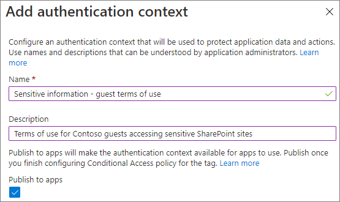
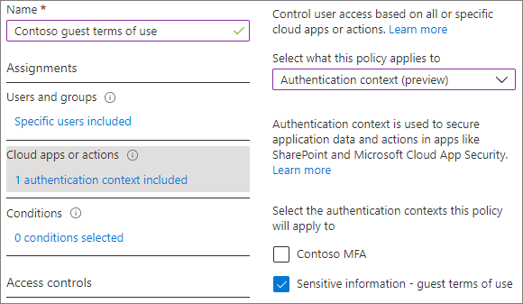
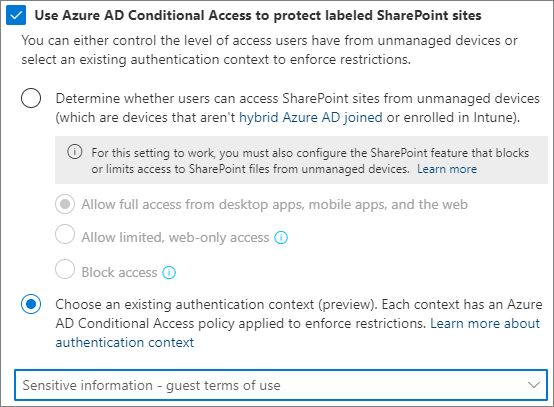

# Manage site access based on sensitivity label

With [Azure Active Directory authentication context (preview)](/azure/active-directory/conditional-access/concept-conditional-access-cloud-apps#configure-authentication-contexts), you can enforce more stringent access conditions when users access SharePoint sites that have a sensitivity label applied. 

Authentication contexts are used with sensitivity labels to connect [Azure AD conditional access policies](/azure/active-directory/conditional-access/overview) to labeled sites.

> [!NOTE]
> If you don't use sensitivity labels with SharePoint sites, you can directly apply an authentication context to a SharePoint site by using the [Set-SPOSite](/powershell/module/sharepoint-online/set-sposite) PowerShell cmdlet.

Setting up an authentication context for labeled sites requires these basic steps:

1. Add an authentication context in Azure Active Directory.

2. Create a conditional access policy that applies to that authentication context and has the conditions and access controls that you want to use.

3. Set a sensitivity label to apply the authentication context to labeled sites.

In this article, we'll look at the example of requiring guests to agree to a [terms of use](/azure/active-directory/conditional-access/terms-of-use) before gaining access to a sensitive SharePoint site. You can also use any of the other conditional access conditions and access controls that you might need for your organization.

## Add an authentication context

First, add an authentication context in Azure Active Directory.

To add an authentication context
1. In [Azure Active Directory Conditional Access](https://aad.portal.azure.com/#blade/Microsoft_AAD_IAM/ConditionalAccessBlade), under **Manage**, click **Authentication context (Preview)**.

2. Click **New authentication context**.

3. Type a name and description and select the **Publish to apps** check box.

    

4. Click **Save**.

## Create a conditional access policy

Next, create a conditional access policy that applies to that authentication context and that requires guests to agree to a terms of use as a condition of access.

To create a conditional access policy
1. In [Azure Active Directory Conditional Access](https://aad.portal.azure.com/#blade/Microsoft_AAD_IAM/ConditionalAccessBlade), click **New policy**.

2. Type a name for the policy.

3. On the **Users and groups** tab, choose the **Select users and groups** option, and then select the **All guest and external users** check box.

4. On the **Cloud apps or actions** tab, under **Select what this policy applies to**, choose **Authentication context (Preview)**, and select the check box for the authentication context that you created.

    

5. On the **Grant** tab, select the check box for the terms of use that you want to use, and then click **Select**.

6. Choose if you want to enable the policy, and then click **Create**.

## Update a sensitivity label

Next, update a sensitivity label (or create a new one) to use the authentication context.

To update a sensitivity label
1. In the [Microsoft 365 compliance center](https://compliance.microsoft.com/informationprotection), on the **Information protection** tab, click the label that you want to update and then click **Edit label**.

2. Click **Next** until you are on the **Define protection settings for groups and sites** page.

3. Ensure that the **External sharing and Conditional Access settings** check box is selected, and then click **Next**.

4. On the **Define external sharing and device access settings page**, select the **Use Azure AD Conditional Access to protect labeled SharePoint sites** check box.

5. Select the **Choose an existing authentication context (preview)** option.

6. In the dropdown list, choose the authentication context that you want to use.

    

7. Click **Next** until you are on the **Review your settings and finish** page, and then click **Save label**.

Once the label has been updated, guests accessing a SharePoint site (or the **Files** tab in a team) with that label will be required to agree to the terms of use before gaining access to that site.

## See also

[Use sensitivity labels to protect content in Microsoft Teams, Microsoft 365 groups, and SharePoint sites](/microsoft-365/compliance/sensitivity-labels-teams-groups-sites)

[Conditional Access: Cloud apps, actions, and authentication context](/azure/active-directory/conditional-access/concept-conditional-access-cloud-apps)