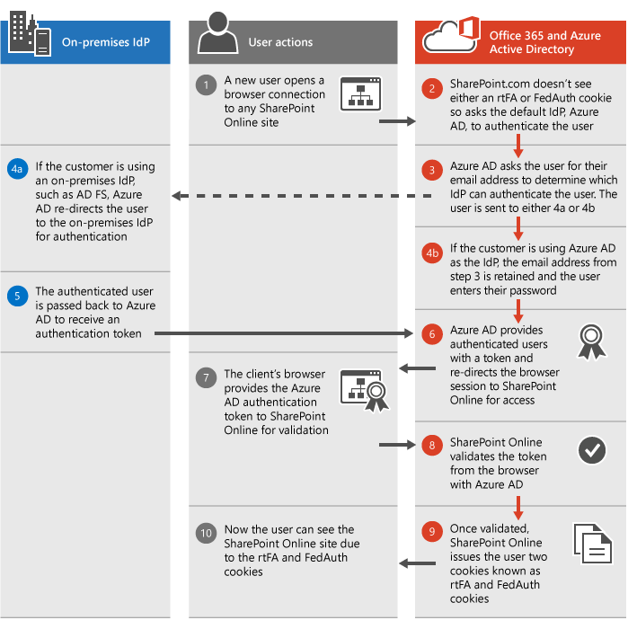

# SharePoint authentication

Microsoft 365 and SharePoint serve a broad customer base with a variety of usability and security needs. Some customers don't mind lots of authentication prompts if it means their data will be more secure and other customers despise the sight of a logon prompt, especially in situations where it seems as though SharePoint should already know who the user is. Luckily, customers don't have to choose usability or security as these work together in a lot of great ways today. We'll continue to add more ways these work together so come back occasionally to learn more.
  
The following diagram outlines the SharePoint authentication process as it works today. It walks through how the scenario works using either your own Identity Provider (IdP) or the default Azure Active Directory (Azure AD) IdP.
  
The Federation Authentication (FedAuth) cookie is for each top level site in SharePoint such as the root site, the MySite, and the Admin site. The root Federation Authentication (rtFA) cookie is used across all of SharePoint. When a user visits a new top level site or another company's page, the rtFA cookie is used to authenticate them silently without a prompt. When a user signs out of SharePoint, the rtFA cookie is deleted.
  

  
## Session and persistent cookies

By default, all SharePoint cookies are **session** cookies. These cookies are not saved to the browser's cookie cache and instead are deleted whenever the browser is closed. Azure AD provides a **Keep Me Signed In** button during login that passes a signal to Microsoft 365 to enable **persistent** cookies. These cookies are saved to the browser's cache and will persist even if the browser is closed or the computer is restarted. 
  
Persistent cookies have a huge impact on the sign-in experience by reducing the number of authentication prompts users see. Persistent cookies are also required for some SharePoint features, such as **Open with Explorer** and **Mapped Drives**. 
  
For more information about session timeouts see our article reviewing [Session timeouts for Microsoft 365](/office365/enterprise/session-timeouts).
  

