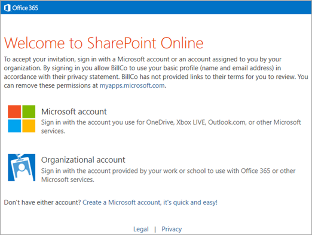
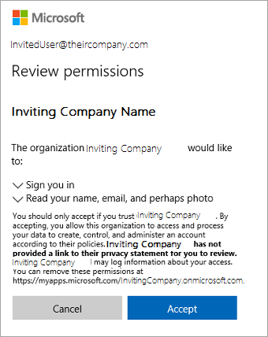

# B2B Sync

The OneDrive sync app now lets users sync libraries or folders in Microsoft SharePoint or Microsoft OneDrive that have been shared from other organizations. This scenario is often referred to as Business-to-Business (B2B) Collaboration. We're calling this new feature in the OneDrive sync app "B2B Sync".

Azure Active Directory (Azure AD) guest accounts play a key role in making B2B Collaboration possible. A guest account at one organization links to a member account at another organization. Once created, a guest account allows Microsoft 365 services like OneDrive and SharePoint to grant a guest permission to sites and folders the same way a member within the organization is granted permission. Since the accounts at two organizations are linked, the user only needs to remember the username and password for the account at their organization. As a result, a single sign-in to their account enables access to content from their own organization and from any other organizations that have created guest accounts for them.

> [!IMPORTANT]
> We recommend that you enable [SharePoint and OneDrive integration with Azure AD B2B](/sharepoint/sharepoint-azureb2b-integration) to help ensure that the required Azure AD guest account for the share recipient is created in your organization's directory.

## B2B Sync requirements

For people outside your organization to sync shared libraries and folders:

- External sharing must be enabled for your organization.
- External sharing must be enabled for the site or OneDrive.
- The content must be shared with people outside the organization at the site or folder level. If a folder is shared, it must be through a link that requires sign-in.
- Sharing recipients must have a Microsoft 365 work or school account (in Azure AD).
- Any Azure AD conditional access policies must be compatible with guests ([more below](#ensure-any-azure-ad-conditional-access-ca-policies-are-compatible-with-external-access)).
- ADAL must not be enabled if using builds before 19.086.*.

This article gives an overview of the B2B Sync experience and describes these requirements in more detail.

## Known issues with this release

- On the Mac, Files On-Demand thumbnails will not display from external organization's sites. Thumbnails will display correctly for files from the user's own organization.
- On the Mac, if the guest account was created with a different email address format than the form they are using with the sync app, the external site's content cannot be synced. For example, first.last@fabrikam.com vs alias@fabrikam.com.
- On the Mac, the external content may be placed on the local computer in the user's own organization's folder instead of one with the external organization's name.
- Interactive authentication UI for guest accounts from an external organization is not supported by the sync client.

## Overview of the B2B Sync experience

Here's an example of what happens after someone at "Contoso" shares a site or folder with someone at "Fabrikam":

1. The Fabrikam recipient receives an email like the following.

    

2. When the recipient clicks the link in the email to go to the shared item, they need to click "Organizational account" to sign in with their Fabrikam account. Behind the scenes, this creates the Contoso guest account in Azure AD.

    

3. The recipient may need to enter their Fabrikam username or password, and then they can view the shared item. If they don't want to sync everything that was shared, they can browse to the library or folder they want to sync. To set up syncing, they need to click the Sync button.

    

4. The guest's browser will display up a message asking if they want to open "Microsoft OneDrive," and they will need to allow this.

5. If this is the first time the guest has used the sync app with their Fabrikam account, they'll need to sign in. The email address will be automatically set to the Fabrikam account used in the previous steps. The guest needs to select "Sign in."

6. The guest might be able to sign in to the sync app without entering their Fabrikam password if they're signed in to Windows with the same account. Otherwise they'll need to enter their password.

7. The guest will confirm where they want to sync the shared item on their computer.

    > [!NOTE]
    > The content is placed in a folder whose name includes the name of the organization ("SharePoint - Contoso" in this example). If the user is syncing SharePoint content from Fabrikam as well, they'll also have a "SharePoint - Fabrikam" folder.

8. The guest will continue through OneDrive sync app setup.

9. After the guest completes setup, the site will begin syncing. The user can click the blue cloud icon in the notification area to open the OneDrive sync activity center and see the files syncing, open the local folder with the files, or open the SharePoint site in a web browser.

## Enable external sharing for your organization

In order for users at your organization to be able to share with their partners at other organizations, external sharing must be enabled at the organization level. To do this, you must be a global or SharePoint admin in Microsoft 365. After you enable external sharing at the organization level, you can restrict it site by site. A site's settings can be the same as the organization setting, or more restrictive, but not more permissive.

You can change your organization-level sharing settings in two different places (both control the same thing):

- On the Sharing page in the new SharePoint admin center. For more info, see [Change the organization-level external sharing setting](/sharepoint/turn-external-sharing-on-or-off#change-the-organization-level-external-sharing-setting)
- In the Microsoft 365 admin center, on the Org settings page > SharePoint.

> [!IMPORTANT]
> If you allow Anyone links (sometimes referred to as "anonymous access" links), these links do not create guest accounts and therefore the external share recipient will not be able to leverage B2B Sync when receiving that link type.

For more info, see [External sharing overview](/sharepoint/external-sharing-overview).

### Control external sharing

When you allow users to share content from your organization externally, you can use several features in Microsoft 365 to manage who has access to the content. Admins and site owners can review permissions and audit access to sites. For info, see [Searching for site content shared with people outside your organization](/microsoft-365/compliance/keyword-queries-and-search-conditions#searching-for-site-content-shared-with-external-users) and [Turn on external sharing notifications](turn-on-external-sharing-notifications.md). You can enable external sharing with only specific internet domains, or you can block specific domains. For info, see [Restricted domains sharing](/sharepoint/restricted-domains-sharing). You can also allow only members of specific security groups to share externally. For info, see [Turn external sharing on or off](/sharepoint/turn-external-sharing-on-or-off).

We recommend creating separate sites (site collections, not subsites) for each unit of work that you want to share externally. This way, you can clearly annotate the sites to indicate that people outside the organization have access, and avoid unintentional disclosure of information. For individual users sharing content from their OneDrive, we recommend creating separate folders for different projects or collaboration groups.

You can remove a guest's permission to a site or folder, or you can delete the guest account to remove their permission from all of your organization's content.

> [!IMPORTANT]
> Any synced content will remain on the user's computer after permissions have been removed.

## Enable external sharing for a site

To view or change the sharing setting for any site, use the new SharePoint admin center.

1. Go to <a href="https://go.microsoft.com/fwlink/?linkid=2185220" target="_blank">Active sites in the SharePoint admin center</a>, and sign in with an account that has [admin permissions](/sharepoint/sharepoint-admin-role) for your organization.

    >[!Note]
    >If you have Office 365 operated by 21Vianet (China), [sign in to the Microsoft 365 admin center](https://go.microsoft.com/fwlink/p/?linkid=850627), then browse to the SharePoint admin center and open the Active sites page.

2. Customize the view as necessary to see the External sharing column.

3. If you need to, [change the external sharing setting for a site](/sharepoint/manage-sites-in-new-admin-center#change-the-external-sharing-setting-for-a-site).

## Ensure any Azure AD Conditional Access (CA) policies are compatible with external access

The tenant admin can enable several kinds of conditional access policies at their tenant. When a guest is going to access a tenant's content, those policies may need to be adjusted for the guests so they can gain access.

- Currently the sync client does not support interactive authentication UI when syncing external content. Any policy that would require a sign-in UI such as MFA (multi-factor authentication) or TOU (terms of use) prompt, will prevent the syncing of the external content from that tenant. If a tenant admin deploys such a policy before a guest starts syncing from that tenant, the user will be unable to establish the sync relationship. If the policy is deployed after a guest is syncing content from the tenant, that guest will receive an error and be unable to continue to sync from the tenant.

- Tenants may update their Terms of Use (TOU) from time to time. A policy can trigger the user to view and accept the updated TOU via an interactive authentication prompt. Since sync doesn't support external tenant sign-in UI, sync will indicate it is unable to sync the external site's content.

- Device Compliance requires user machines to be managed by the tenant and then to be up to date with requirements. For guests, their machines are likely to be managed by their own organization and thus are incompatible with requiring their machines to be managed by the content sharing tenant.

- Location-based conditional access policies are typically used to enforce additional requirements like MFA when the user is not connecting from a trusted location (such as the tenant's office network). Typically in a guest scenario the client machine won't be located at the trusted locations, and since sync doesn't support MFA, you likely do not want this policy to apply to your guests.

For more information see [Authentication and Conditional Access for External Identities](/azure/active-directory/external-identities/authentication-conditional-access).

## Methods of sharing

Sites and folders can be shared in different ways in SharePoint and OneDrive:

- If users are syncing a folder, they can right-click it in File Explorer to share it.
- Users can go to the SharePoint site or folder on the web and click the Share button to share it.
- Users can share sites and folders in the SharePoint and OneDrive mobile apps.
- Admins can create guest accounts and use the admin center or PowerShell to add them to sites.

> [!NOTE]
> For more info about these methods, see [Learn how to share a site](https://support.office.com/article/958771a8-d041-4eb8-b51c-afea2eae3658) and [Learn how to share a folder](https://support.office.com/article/1fe37332-0f9a-4719-970e-d2578da4941c).

B2B Sync works with all these methods of sharing. It has only the following requirements:

- For guests to sync shared content, the content must be shared at the site or folder level. Guests can't sync files that are shared individually (for example, from the Office apps).
- B2B sync works only when guest accounts are created in the organization, and when the recipient has an Azure AD account. It doesn't work when users share by creating an Anyone link (also known as "anonymous access" link), or when they share with people who have a Microsoft account or other personal account.

### Add guests to SharePoint sites

As an admin in Microsoft 365, you can share with people outside the organization by [creating guests individually in the Azure AD admin center](/azure/active-directory/b2b/b2b-quickstart-add-guest-users-portal), and then adding them to a SharePoint team site individually or by adding them to a security group that already has permissions to the site you want to share. If you grant permissions by using the advanced permissions page (instead of by using the Share site button), you'll need to inform the guest that you've given them permission to the site. They won't receive an invitation email.

> [!IMPORTANT]
> If you use the advanced permissions page, we recommend granting permissions at the site level, not at the document library or folder level.

### Use PowerShell to bulk create guest accounts and add them to a SharePoint group

If you need to create and grant permissions to many guest accounts, you can use the following PowerShell script, which creates guest accounts and grants them permissions to a site. The script takes a CSV (comma-separated value) file as input, which contains a list of user display names and email addresses. For each name and email address, a guest account is created and that account is added to a security group to grant it permission. The script is designed so that you can feed the resulting output CSV as input to the script on a subsequent run. This lets you add more users to your CSV file or retry creating any failed account.

As users are added to the Azure AD Group, they should receive an email welcoming them to the group. After running the script, you'll need to email the users with a direct link to the SharePoint site you gave them permissions to. When they click the link, they'll be presented with the below UI to accept the terms of the invitation. Once they accept, they will be taken to the site you shared with them. At that point they can click the Sync button to begin syncing the sites files to their PC or Mac.



```PowerShell
# first line of InviteGuests.ps1 PowerShell script
# requires latest AzureADPreview
# Get-Module -ListAvailable AzureAD*
# Uninstall-Module AzureAD
# Uninstall-Module AzureADPreview
# Install-Module AzureADPreview


# customizable properties for this script

$csvDir = ''
$csvInput = $csvDir + 'BulkInvite.csv'
$csvOutput = $csvDir + 'BulkInviteResults.csv'

$domain = 'YourTenantOrganization.onmicrosoft.com'
$admin = "admin@$domain"
$redirectUrl = 'https://YourTenantOrganization.sharepoint.com/sites/SiteName/'
$groupName = 'SiteName'


# CSV file expected format (with the header row):
# Name,Email
# Jane Doe,jane@contoso.com

$csv = import-csv $csvInput

# will prompt for credentials for the tenantorganization admin account
# (who has permissions to send invites and add to groups)
Connect-AzureAD -TenantDomain $domain -AccountId $admin

$group = (Get-AzureADGroup -SearchString $groupName)

foreach ($row in $csv)
{
    Try
    {
        if ((Get-Member -inputobject $row -name 'error') -and `
            ($row.error -eq 'success'))
        {
            $out = $row  #nothing to do, user already invited and added to group
        }
        else
        {
            echo ("name='$($row.Name)' email='$($row.Email)'")

            $inv = (New-AzureADMSInvitation -InvitedUserEmailAddress $row.Email -InvitedUserDisplayName $row.Name `
                        -InviteRedirectUrl $redirectUrl -SendInvitationMessage $false)

            $out = $row
            $out|Add-Member -MemberType ScriptProperty -force -name 'time' -Value {$(Get-Date -Format u)}
            $out|Add-Member -MemberType ScriptProperty -force -name 'status' -Value {$inv.Status}
            $out|Add-Member -MemberType ScriptProperty -force -name 'userId' -Value {$inv.InvitedUser.Id}
            $out|Add-Member -MemberType ScriptProperty -force -name 'redeemUrl' -Value {$inv.inviteRedeemUrl}
            $out|Add-Member -MemberType ScriptProperty -force -name 'inviteId' -Value {$inv.Id}

            # this will send a welcome to the group email
            Add-AzureADGroupMember -ObjectId $group.ObjectId -RefObjectId $inv.InvitedUser.Id

            $out|Add-Member -MemberType ScriptProperty -force -name 'error' -Value {'success'}
        }
    }
    Catch
    {
        $err = $PSItem.Exception.Message
        $out|Add-Member -MemberType ScriptProperty -force -name 'error' -Value {$err}
    }
    Finally
    {
        $out | export-csv -Path $csvOutput -Append
    }
}

# for more information please see
# https://learn.microsoft.com/azure/active-directory/b2b/b2b-tutorial-bulk-invite
# end of InviteGuests.ps1 powershell script
```

For more info, see:

- [Redemption experience](/azure/active-directory/b2b/redemption-experience)
- [Add user without invite](/azure/active-directory/b2b/add-user-without-invite)

## When a guest loses access to shared content

If a person's guest account is deleted or their permission to shared content is removed, the sync app will display an error.

- A notification will appear indicating that the library can't be synced.

    

- The OneDrive icon in the notification area will show an error.

    

    When the guest clicks the icon, they will see an error banner in the activity center.

    
    

## Policy Setting to Prevent B2B Sync

The B2B Sync feature of the OneDrive sync app allows users at an organization to sync content shared with them from another organization. If you wish to prevent users at your organization from being able to use B2B Sync, you may set a policy value on your users' Windows PC or Mac to block external sync.

You only need to take these actions if you wish to prevent users at your organization from using the B2B Sync feature (to prevent syncing libraries and folders shared from other organizations).

The new BlockExternalSync setting is described in the adm\OneDrive.admx and OneDrive.adml files installed as part of the OneDrive sync product build 19.086.* or higher.  If you use ADM to manage your sync app policies, import the new files as you normally would to see the new setting.

If you are using other management systems to deploy policies to your users' Windows PCs, use the equivalent of the following command to prevent B2B Sync:

```console
reg add "HKLM\SOFTWARE\Policies\Microsoft\OneDrive" /v BlockExternalSync /t REG_DWORD /d 1
```

On a Mac with the Apple Store version of OneDrive, use the equivalent of the following command to prevent B2B Sync:

```console
defaults write com.microsoft.OneDrive-mac BlockExternalSync -bool YES
```

On a Mac with the Standalone version of OneDrive, use the equivalent of the following command to prevent B2B Sync:

```console
defaults write com.microsoft.OneDrive BlockExternalSync -bool YES
```
