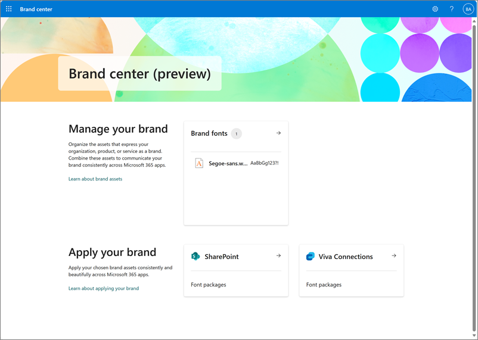
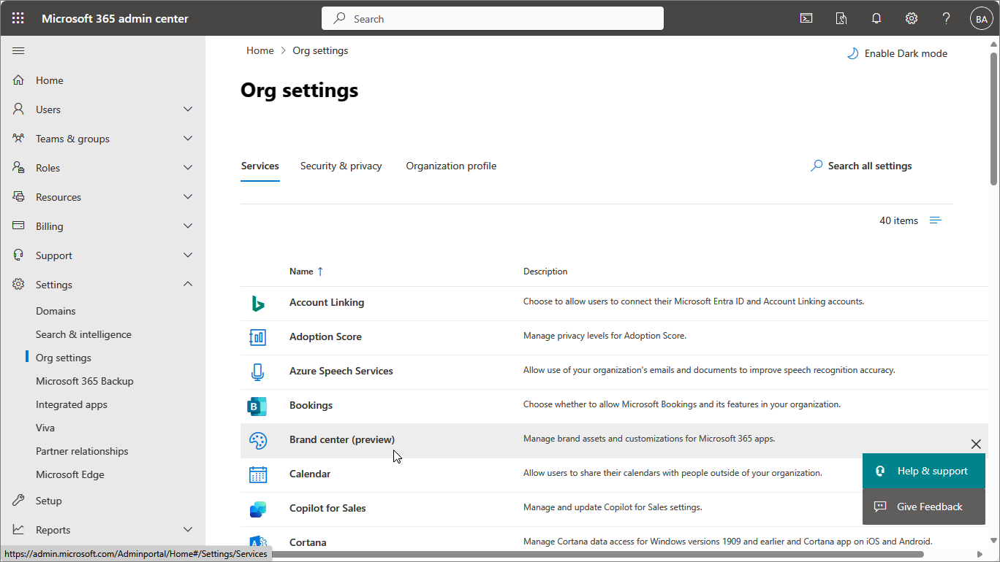
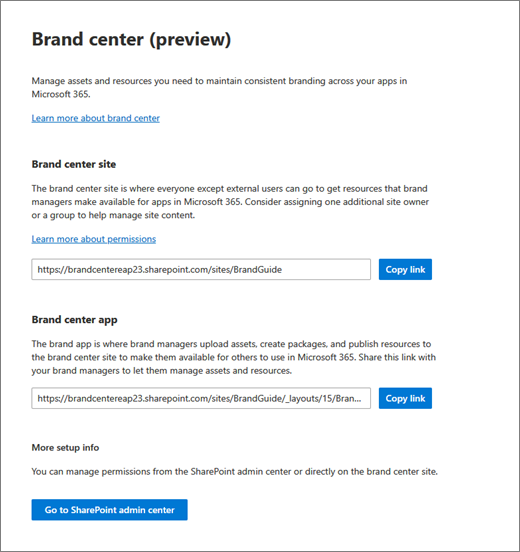

# SharePoint brand center

The SharePoint brand center offers a centralized branding management application that empowers your brand managers or designated brand owners to help your organization to customize the look and feel of their experiences.

With this new brand asset management system, you can handle your colors, fonts, and images, and other assets all in one place.

## What is the brand center?

The brand center uses the SharePoint Organization Asset Library (OAL) to store and manage assets in the background. The brand center app is located in a designated site within your tenant.

> [!NOTE]
> The SharePoint brand center currently only allows one brand center for your organization, and the Global Administrator sets it up.

The brand center app lets you access and manage your organization's brand assets from one central place. By using the brand center app, you can make sure that your organization's brand identity is coherent and professional in all your communication channels. You can also save time and resources by avoiding duplication and confusion of brand assets, and by empowering your employees to create high-quality branded content.

## Setting up the brand center

To enable the new brand center the global administrator needs to perform a set of simple steps in the Microsoft 365 admin center to create/activate the Brand center app. The brand center app requires the use of Public CDN.

The brand center administrative experience finds the site that has your organization’s existing organization asset libraries if you're using them and base your brand center on this site. If you aren't using the organization asset library feature, we'll prompt you to make a new site to be your brand center.

When you turn on the SharePoint brand center for your organization, this lets you use the custom fonts feature in SharePoint and Viva Connections. You can find more details in the Message Center post for Custom Fonts.

To enable the SharePoint brand center, the global administrator needs to perform a few simple steps in the Microsoft 365 admin center to create/activate the Brand center app.

The steps required depend on your current tenant configuration. The following describes steps you need to do for each of the three scenarios:

- Scenario 1: Your tenant doesn't currently utilize the SharePoint Organization Assets feature.

- Scenario 2: Your tenant uses the SharePoint Organization Assets feature with Private CDN.

- Scenario 3: Your tenant uses the SharePoint Organization Assets feature with Public CDN.

**Scenario 1:** Your tenant doesn't currently utilize the SharePoint Organization Assets feature.

For this scenario, the global administrator performs the following steps to create the Brand center app.

1. In the admin center, go to **Settings \> Org settings**.

1. Select **Brand center (preview)**.

1. Choose site name for the Brand Center site – Suggested “Brand Guide”.

1. Read and give consent to the use of Public CDN in your tenant for the Brand center.

1. Create the site and configure Public CDN in your tenant.

1. Add site owners to the Brand center site you created and share the link to the site to those owners to unlock the Brand center app.

**Scenario 2:** Your tenant uses the SharePoint Organization Assets feature with Private CDN.

For this scenario, the global administrator performs the following steps to create the Brand center app.

1. In the admin center, go to **Settings \>** **Org settings**.

1. Select **Brand center (preview)**.

1. The Brand center recognizes your existing organization assets site location and will utilize this as the location for the Brand center app.

1. Read and give consent to the use of Public CDN in your tenant for the Brand center.

1. Activate Public CDN in your tenant.

1. Copy and share the link to the Brand center site/app to your site owners to unlock the Brand center app.

**Scenario 3:** Your tenant uses the SharePoint Organization Assets feature with Public CDN.

For this scenario, the global administrator needs to perform the following steps to create the Brand center app.

1. In the admin center, go to **Settings \> Org settings**.

1. Select **Brand center (preview)**.

1. The Brand center recognizes your existing organization assets site location and will utilize this as the location for the Brand center app.

1. Activate the Brand center app for your organization.

1. Copy and share the link to the Brand center site/app to your site owners to unlock the Brand center app.

After you finish setting up your SharePoint brand center, you can control who can access the brand center app by customizing the site permissions of the brand center site. Site owners of the brand center site will be able to use the brand center app.

## Managing the brand center

The SharePoint brand center includes two levels of management: the Microsoft 365 Admin Center and the Brand Center associated SharePoint site. Within the Microsoft 365 Admin Center, the global administrator has control over the enablement of the Brand Center and easy access to the associated site with management in the SharePoint Admin Center.

From the Brand center associated site, [SharePoint site owners](/sharepoint/site-permissions#site-owners) and [above](/sharepoint/site-permissions) can update the site permissions in the SharePoint Admin Center such as adding more brand managers to the experience. You can do this by adding members to the site owners’ group. Within the app itself, the brand managers are able to upload and manage their organization’s brand assets.

|Who?|Where?|What?|
|----|------|-----|
|Global administrator|Microsoft 365 Admin Center|- Enablement of the brand center   -Access to the SharePoint Admin Center of the brand center site|
|- Global administrator - Site administrator - Site owner|SharePoint Admin Center|Update permissions|

> [!NOTE]
> The brand center app is limited to brand font management while in Preview.

## Managing brands in Multi-geo organizations

One of the challenges of managing brand assets across geographies is ensuring consistency and compliance with local regulations and cultural preferences. Brand managers need to be able to adapt their brand assets to different markets and languages, while still maintaining a unified and recognizable brand identity.

The SharePoint brand center currently only creates a single brand center app in the primary geo of a tenant. We haven’t changed anything about how this impacts the current multi-geo operations for Organization Asset Image or Template Libraries. However, for custom fonts to work across geographies, the following requirements must be met:

Each additional geography where custom fonts are wanted must have an organization asset library set up in a site that uses the Public CDN. Once these requirements are met, custom fonts show up in the **Change the Look** panel and will work in that geography.

> [!NOTE]
> This does not impact Organization Asset Image Libraries and Template Libraries.

## Brand Assets

Every organization has a set of brand assets that are important for expressing its brand identity. Brand assets are the things that give your brand its distinctive look, sound, and feel. They include your logo, colors, fonts, images, voice, and guidelines. You use your brand assets to show your brand personality and style in all the places where you communicate with your customers, such as websites, social media, marketing materials, presentations, and products. When you use your brand assets well, you make your brand more memorable, trustworthy, and unique.

One of the challenges of managing brand assets is to ensure consistency and quality across different platforms and devices. You want your brand to look sharp and professional everywhere, without spending too much time and effort on resizing, formatting, or providing appropriate access to your users.

The SharePoint brand center makes the management of brand assets simple across the Microsoft 365 product ecosystem. This centralized management system enables both asset management along with customization for how the assets are utilized within each product.

### Brand Images

SharePoint offers a feature called the organization asset library (OAL), which allows you to store and access your brand images from a central location. You can upload and manage your organization's logos, icons, backgrounds, and other images in a centralized library that can be accessed by all your users. This way, you can ensure that your team members have access to the latest and most relevant images that reflect your brand identity and message. You can also use organization assets to create templates and themes that incorporate your images and fonts, making it easy to create professional and consistent slides and documents.

Learn more about [image asset management](/sharepoint/organization-assets-library).

### Brand Fonts

A font isn't just a way of writing. It's a visual feature that connects your content to your brand and expresses your tone and character. A font can give your content a professional, creative, friendly, or authoritative appearance, depending on the typeface, size, color, and spacing you use.

For SharePoint and Viva Connections experiences, an organization uses the SharePoint brand center to control your organization’s fonts. This helps you make sure that your font selections are coherent and match your brand identity and guidelines.

Learn more about [brand fonts in the SharePoint brand center](/sharepoint/brand-fonts). 

Organization font support for PowerPoint for the web is also available utilizing the organization assets infrastructure. Customers with E3 or E5 licenses can take advantage of Organization Font Support in PowerPoint for the web to edit and display their fonts.

Learn more about [brand organization fonts for PowerPoint for the web](/sharepoint/support-for-organization-fonts-in-powerpoint-for-the-web).
