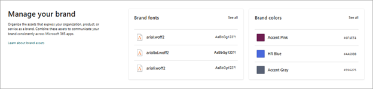
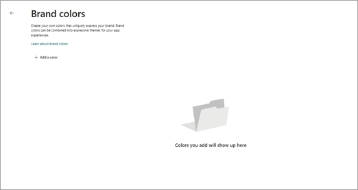
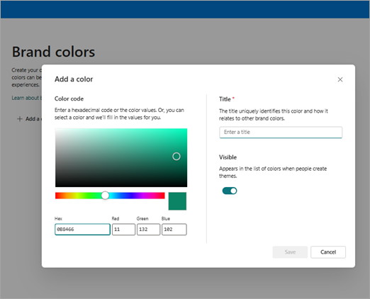

# Brand Colors

By strategically incorporating brand colors throughout your content, you can create a cohesive visual identity that resonates with your audience. These colors are more than mere aesthetic choices; they are powerful tools that evoke emotions, convey messages, and build recognition. Whether it's through a striking website, engaging social media graphics, or compelling marketing materials, the thoughtful use of color can transform ordinary content into an extraordinary experience that authentically expresses your organization's values and essence.

Brand colors are your organization’s colors that are uploaded and managed within the SharePoint brand center.  In this article, we talk about how to manage your brand colors so you can use them in Microsoft 365.

## Adding brand colors to the brand center

Once the brand center is enabled, brand managers can create, update, and manage their organization’s brand colors easily through the app.  

In the brand color library, you can add a new color to create a full list of available standard colors to be used in various experiences.  

> [!NOTE]
> Brand colors are currently supported for use in the SharePoint and Viva Connections theme experiences>

**Step 1**: Select Brand color from the SharePoint brand center app.  

**Step 2**: Create your brand color by selecting and customizing your color.  

You can create a new color using multiple methods:

Use the color pickers to move around and select a color

Enter a Hexadecimal code value into the Hex box

Enter Red, Green, Blue values into the text boxes

**Step 3**: Name your brand color. Determine the visible setting for your brand color.

> [!NOTE]
> This name will appear in picker experiences where you would like to select colors to use and should provide the appropriate information to guide users when selecting.>

## Manage your brand colors

To manage your brand colors, you’ll need to navigate to the Brand colors library in the Brand center app.  

1. Select your color from the library.  

1. Edit the Name, Color, or Visible property for your color.  

> [!NOTE]
> Deletion of brand colors is not allowed from the Brand center app at this time.

See also:  

[How to choose the perfect colors for your brand](https://create.microsoft.com/learn/articles/how-to-choose-colors-for-brand)

[Fundamentals of color: What is color theory?](https://create.microsoft.com/learn/articles/what-is-color-theory)
