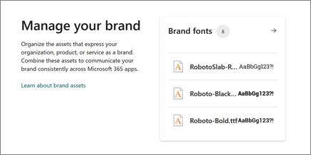

# Brand Fonts

The choice of font can have a significant impact on the look and feel of your content. A font can convey your brand personality, tone, and style, as well as enhance the readability and aesthetics of your text. Whether you want to create a professional, elegant, playful, or creative impression, using a font that matches your brand identity can help you stand out from the crowd and connect with your audience.

Brand fonts are your organization’s fonts that are uploaded and managed within the SharePoint brand center. In this article, we talk about how to manage your brand fonts so you can use them in Microsoft 365.

There are different types of font format types and font file types. The way a font is used, digital, or printed, can change the font file type needed.

### Web-safe fonts

Web-safe fonts are a set of fonts that are widely used and available on most devices by default. They're designed to be compatible with different browsers and operating systems, and to reduce the risk of font substitution or distortion.

## Adding brand fonts to the brand center

SharePoint and Viva Connections include a set of font options that are available for use within Microsoft web products.

However, sometimes you may want to use a custom font that you’ve created, purchased, or downloaded from somewhere else. These custom fonts might be more accurate to how you would like to represent your brand within Microsoft 365 applications like SharePoint and Viva Connections.

### Locate custom fonts on the Web

You can also get and use fonts that are installed with other applications, or download fonts from the Internet. Some fonts on the Internet are sold commercially, some are shareware, and some are free. The [Microsoft Typography site](https://www.microsoft.com/en-us/Typography/default.aspx) site provides links to other font foundries (the people or businesses outside of Microsoft who make and offer fonts) where you can find more fonts.

## Install a custom brand font

After choosing your custom brand font, you'll need to upload it into the SharePoint brand center so that it can be part of your font packages. You'll go to the Brand Fonts library from the Brand center app.

1.  Download or locate your custom brand font files. These often come in .zip folders.

1.  If the font files are zipped, unzip them by right-clicking the .zip folder and then clicking **Extract**.

1.  Navigate to the Brand fonts library in the SharePoint brand center app. Using the upload button

After the brand font files are uploaded our system extracts the needed metadata from the font files for use in the Brand center.

> [!NOTE]
> There's a slight delay in the time from upload until this metadata is populated into the library and the font is available for use.

### Supported font file types: 

| Font file type       | File extension |
|----------------------|----------------|
| True Type fonts      | .ttf           |
| Open Type fonts      | .otf           |
| Web Open Format Font | .woff          |
| Web Open Format Font | .woff2         |

The Web Open Format file is a web-only font format that compresses the fonts to make them load faster on websites. This format can't be used for other purposes, such as installing the fonts on your computer. WOFF 2.0 is the ideal format for web fonts being used on SharePoint and Viva Connections. These fonts work well on the web but not in graphics software.

Font file Size Limit: 10 MB

## Manage your custom brand fonts

To manage your custom brand fonts, you'll need to navigate to the Brand Fonts library in the Brand center app.

1. Select your custom font file from the library.

1. Edit the Visible property on your font file to control the availability of the font for experiences.  

> [!NOTE] 
> Deletion of custom brand fonts is not allowed from the Brand center app at this time.
