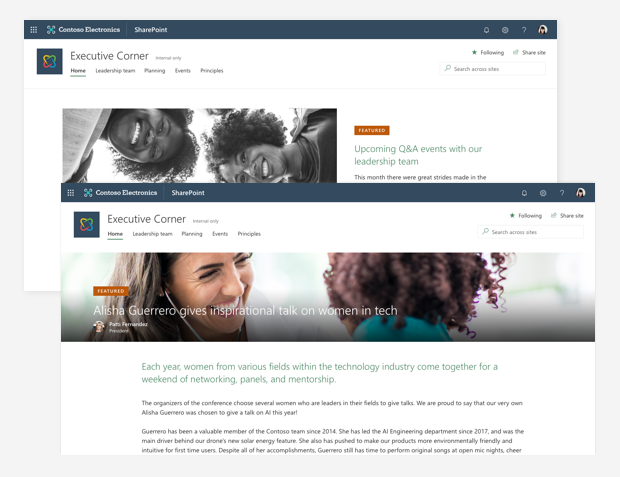

# Branding your SharePoint Online site

In the modern SharePoint Online experience, you can easily [change the look](https://support.office.com/article/06bbadc3-6b04-4a60-9d14-894f6a170818) and feel of your site to match your company or organizational brand. You can customize the logo, colors, and navigation – often without writing a single line of code. Branding can be applied at the site level, to a group of sites, or to all sites within your organization.

> [!NOTE]
> Branding your SharePoint Online site will not change the overall look of your Office 365 service For more information about branding Office 365, see [Customize the Office 365 theme for your organization](/office365/admin/setup/customize-your-organization-theme).

## Site branding in the classic experience

In the classic SharePoint experience, there are a set of default themes that can require a considerable amount of customization to get them to match your organization’s brand. Also, they aren’t very responsive, making the experience on different devices inconsistent. Most site branding requires the use of custom master pages or alternate CSS configurations. Master pages provide a great deal of flexibility, but they can be problematic. For example, anytime updates are made to SharePoint Online, any customizations made to the master page may no longer work or may not work the way you expect them to. SharePoint Online [ignores these customizations](/sharepoint/dev/transform/modernize-branding) unless you’re running in classic experience mode because they’re incompatible with the modern user interface. To avoid this, use only the recommended modern approaches to brand your SharePoint Online sites.

## Modern site branding

SharePoint Online includes an updated set of default site themes that are responsive and look great on any device. With site themes, you can customize your site’s logo and colors to match your brand. Site designs provide specific layouts and other functionality for your site. Additional branding can be achieved using custom themes or site designs without worrying about something breaking when SharePoint Online is updated. [Custom themes](/sharepoint/dev/declarative-customization/site-theming/sharepoint-site-theming-overview) let you create additional color schemes beyond the defaults. [Custom site designs](/sharepoint/dev/declarative-customization/site-design-overview) let you control the site theme and other customizations like the site navigation, default applications, and other settings. Custom themes or designs can be applied to a new site when it’s created or applied to an existing site or group of sites.

### Branding hub sites

When you brand a [SharePoint Online hub site](https://support.office.com/article/what-is-a-sharepoint-hub-site-fe26ae84-14b7-45b6-a6d1-948b3966427f), you can set it so the site branding is applied to any sites that [associate with it](https://support.office.com/article/associate-a-sharepoint-site-with-a-hub-site-ae0009fd-af04-4d3d-917d-88edb43efc05). This includes any site theme or site design used by the hub site. This allows you to apply common navigation and branding across a set of sites and use accent colors to emphasize elements that need to stand out.

## Classic experience vs. SharePoint Online

Below is a summary of the differences between branding a site in the classic experience vs. branding in the modern SharePoint Online experience.

|**Classic experience**|**Modern experience**|
|:-----|:-----|
|Unresponsive, OOB themes that you can customize|Responsive themes that look great on any device and can be customized to match your brand|
|Use custom master pages and CSS that are ignored in the modern experience|Use the [SharePoint Framework](/sharepoint/dev/spfx/sharepoint-framework-overview) to add header and footer, customize theme colors, etc.|

## Before you begin

Some things to consider before branding your classic experience sites in SharePoint Online are:

-   Do you need a consistent brand across all sites or will different divisions, departments, or groups in your organization have their own?

-   You should compile a list of all current sites, what site templates they use, any customizations that have been made to the master pages or CSS, and decide which of these customizations you need to keep. You can run the [SharePoint “Modern” user interface experience scanner](https://github.com/SharePoint/PnP-Tools/tree/master/Solutions/SharePoint.UIExperience.Scanner) which will do a deep analysis of all the sites in your organization and create reports that give you details about sites that have incompatible master pages or alternate CSS settings. [SharePoint Online handles branding differently](/sharepoint/dev/transform/modernize-branding) for classic site templates such as the publishing site. You’ll want to [troubleshoot any custom theme issues](/sharepoint/dev/declarative-customization/site-theming/sharepoint-site-theming-overview#troubleshoot-custom-theme-issues) you run into.

-   What areas do you want to customize (logo, colors, fonts, header/footer, navigation)?

-   Who in your organization can brand a site? You will need to make sure that they have site designer permissions or above to make these changes.

## Ready to brand your classic SharePoint site using the modern experience?

Check out the below resources that provide more details about how to use the modern SharePoint experience to brand your site.

[Branding SharePoint: The New Normal](https://bob1german.com/2018/09/04/branding-sharepoint-the-new-normal/)

[Change the look of your SharePoint Online site](https://support.office.com/article/06bbadc3-6b04-4a60-9d14-894f6a170818)

[SharePoint site theming](/sharepoint/dev/declarative-customization/site-theming/sharepoint-site-theming-overview)

[Modernize site branding](/sharepoint/dev/transform/modernize-branding)

[Modernize your classic SharePoint sites](/sharepoint/dev/transform/modernize-classic-sites)

[JSON schema](/sharepoint/dev/declarative-customization/site-theming/sharepoint-site-theming-json-schema)

[Theme generator](http://aka.ms/spthemebuilder)
