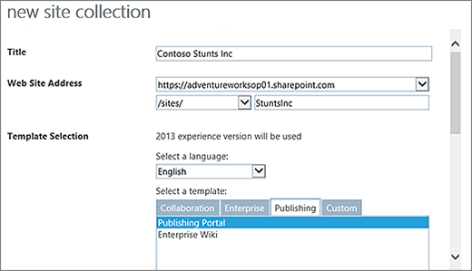
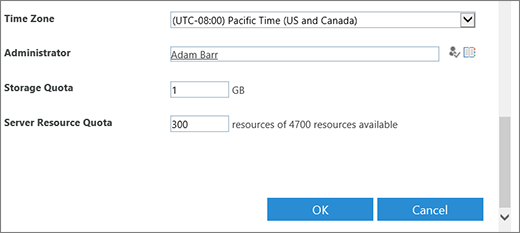
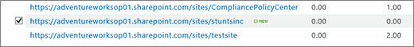
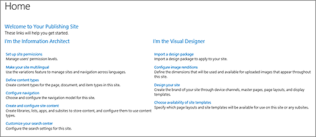
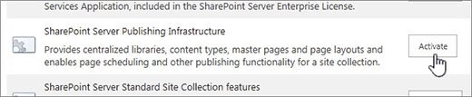

# Build a SharePoint publishing site

A SharePoint publishing site is a site that's built using a publishing site template. It's a site where authoring and publishing are more structured and where content management processes are enforced. Publishing sites are typically used to create enterprise intranets, communication portals, and public websites.
  
Publishing sites have unique features that streamline the authoring, approving, and publishing processes. These features are enabled automatically when you create a publishing site and include page layouts, column types, web parts, lists, and libraries. 
  
> [!NOTE]
>  The Enterprise Wiki is also a publishing site but is less structured and is intended for easy authoring when formal content management processes are not required. 
  
This article explains how to create a publishing site collection and publishing sub-sites, including the publishing site with workflow.
  
## Create a publishing portal

The publishing portal is the top level of the site collection. You must enable publishing here before you can create publishing sub-sites or activate publishing on existing sites.
  
To set up a publishing portal
  
1. [Sign in to Office 365](e9eb7d51-5430-4929-91ab-6157c5a050b4) with your work or school account. 
    
2. Go to the [ Office 365 admin center ](about-the-admin-center).
    
3. Choose **Resources** > **Sites**. Then choose **Add a site**.
    
4. Choose **Add a site**.
    
    > [!NOTE]
    > Alternatively, you can choose **Admin centers** > **SharePoint** then **New**. 
  
5. In the New Site Collection dialog box, enter the following information:
    
  - In the **Title** box, type a title for the site collection. 
    
  - For Web Site Address, select a domain name and a URL path (for example, /sites/) from the list, and then type a URL name for your publishing portal site collection. 
    
  - In Template Selection, in the **Select a language** dropdown, choose a language for the site collection. It is important to select the appropriate language for the site collection because once it's chosen, it cannot be changed. You can enable the SharePoint multiple language interface on your sites, but the primary language for the site collection will remain the same. 
    
  - In Template Selection, in the **Select a template** section, choose **Publishing** > **Publishing Portal**, or **Enterprise** > **Publishing Portal** depending on your version of SharePoint. 
    
     
  
  - In Time Zone, select the standard time zone appropriate for the location of the site collection.
    
  - In Administrator, type the user name of your site collection administrator. You can also use the **Check names** or **Browse** buttons to find a user to make site collection administrator. 
    
     
  
  - In Storage Quota, type the number of MB to allocate to this site collection. Check the MB available value to make sure you don't exceed the MB available.
    
  - In Server Resource Quota, type the usage quota to allocate to the site collection. 
    
    > [!NOTE]
    >  The resource usage quota is a site collection metric automatically compiled by SharePoint Online. Resource usage generally includes performance data (such as processor time and unhandled exceptions) that pertain to code in sandboxed solutions. When the level exceeds the daily quota, the sandbox is turned off for the site collection. The main purpose of resource quotas is to limit the risk that custom code will negatively impact the site collection. 
  
6. Click **OK**. It might take a few minutes before your new publishing portal site collection appears in the URL list. 
    
Once your portal has been created, you'll see a list of getting started links. These links correspond to tasks for fleshing out your new site collection. There is no particular order to these tasks and none of them are mandatory. The tasks you undertake and the order in which you do them depends on what makes sense for your organization.
  

  
To get started, click the site collection link you just created, and in the site collection properties dialog, click the Web Site Address. This takes you to the Home page of your new site. 
  

  
## Create a publishing sub-site

A publishing sub-site is a site that sits below the publishing site collection (or below a site collection with publishing features enabled) in a hierarchy. When a sub-site is created beneath a publishing site collection, publishing features are enabled automatically. 
  
1. From your publishing-enabled site collection, click **Settings**> **Site contents**.
    
2. Click **new subsite**.
    
3. In the **Title** box, type a title for the site collection. 
    
4. In **Description**, type a brief description of the site's purpose.
    
5. In Web Site Address, append the existing URL with a descriptive name for your new subsite.
    
6. In Template Selection, in the **Select a language** dropdown, choose a language for the site. It is important to select the appropriate language because once it's chosen, it cannot be changed. Your site language can differ from your site collection language. 
    
7. In Template Selection, in the **Select a template** section, choose **Enterprise** > **Publishing Site**.
    
8. Under **User Permissions**, choose one of the following:
    
  - **Use same permissions as parent site** if you want to share one set of permissions between this new site and its parent. Choosing this option means you can't later change the permissions on this site unless you're an administrator on the parent. 
    
  - **Use unique permissions** if want users of this site to have different permissions than on the parent site or if you have users who don't have access to the parent site. 
    
9. In Navigation Inheritance, choose **Yes** if you want to use the same top link bar that's present on the parent site. Otherwise, choose **No**.
    
10. Click **Create**.
    
## Create a publishing sub-site with approval workflow

A publishing approval workflow automates the routing of content to subject matter experts and stakeholders for review and approval. What makes the publishing approval workflow unique is that it's designed specifically for publishing sites where the publishing of new and updated web pages is tightly controlled. In these kinds of sites, no new content can be published until it has been approved by every approver in the workflow. For more info see [Work with a publishing approval workflow](https://support.office.com/article/e99aad65-e453-4bdb-9c2f-f27c6733ddae).
  
> [!NOTE]
>  The publishing approval workflow is not available for publishing site collections. 
  
To set up a publishing site with workflow
  
1. From your publishing-enabled site collection, click **Settings**> **Site contents**.
    
2. Click **new subsite**.
    
3. In the **Title** box, type a title for the site collection. 
    
4. In **Description**, type a brief description of the site's purpose.
    
5. In Web Site Address, append the existing URL with a descriptive name for your new subsite.
    
6. In Template Selection, in the **Select a language** dropdown, choose a language for the site. It is important to select the appropriate language because once it's chosen, it cannot be changed. Your site language can differ from your site collection language. 
    
7. In Template Selection, in the **Select a template** section, choose **Enterprise** > **Publishing Site with Workflow**.
    
8. Under **User Permissions**, choose one of the following:
    
  - **Use same permissions as parent site** if you want to share one set of permissions between this new site and its parent. Choosing this option means you can't later change the permissions on this site unless you're an administrator on the parent. 
    
  - **Use unique permissions** if want users of this site to have different permissions than on the parent site or if you have users who don't have access to the parent site. 
    
9. In Navigation Inheritance, choose **Yes** if you want to use the same top link bar that's present on the parent site. Otherwise, choose **No**.
    
10. Click **Create**.
    
## Activate publishing features

If you want to add publishing features to an existing site, follow these steps. You must have enabled publishing on the parent site collection before activating the features at the site level. For more info, see [Features enabled in a SharePoint Online publishing site](https://support.office.com/article/3ab3810c-3c2c-4361-9d0e-0cbe666ea0b0).
  
1. From the root of your site collection, click **Settings**> **Site settings**.
    
2. On the Site Settings page, under **Site Collection Administration**, click **Site collection features**.
    
3. On the Site Collection Features page, next to **SharePoint Server Publishing Infrastructure**, click **Activate**.
    
     
  
### Additional resources

- [Features enabled in a SharePoint Online publishing site](https://support.office.com/article/3ab3810c-3c2c-4361-9d0e-0cbe666ea0b0)
    
- [Work with a publishing approval workflow](https://support.office.com/article/e99aad65-e453-4bdb-9c2f-f27c6733ddae)
    
- [About publishing-enabled site templates](https://support.office.com/article/b4fa3dcd-f4cc-4820-aa73-fed106965725)
    
- [Create and manage pages in a publishing site](https://support.office.com/article/b8dd89a0-68d6-4076-80f9-cfb539156165)
    
- [Create a multi-language website](https://support.office.com/article/da0b5614-8cf5-4905-a44c-90c2b3f8fbb6)
    

