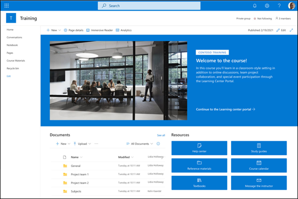
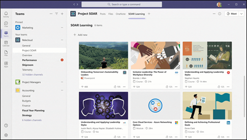
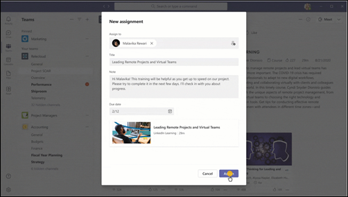
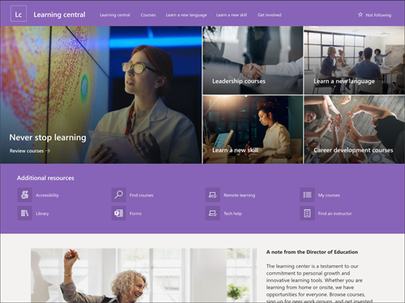

# Build learning and training experiences for employees
 

Learn how to build a training and learning experience that will keep employees and team members up to date with important skills and proficiencies required for professional success.

This article will  show you how to create a training solution that includes a durable training site, online learning, virtual training events, promotion, and tracking insights and feedback to improve your experience overtime.

**Create a learning and training experience by:**

- Taking inventory of all organizational needs, learning objectives and goals, and identifying important timelines
- Choosing the best tools that fit your organization's learning and training goals and objectives
- Keeping employees up to date about important learning and training due dates and opportunities
- Launching an accessible and scalable experience by ensuring employees know how to access modules, courses, and resources and asking for feedback to make improvements along the way

## Overview of creating a training and learning experience for employees

|Plan|Build|Launch|
|:---:|:---:|:---:|
||||
|- Understand your organizational needs     - List all learning objectives    - Personalize the experience based on role and career stage   - Identify timelines   - Define goals and outcomes|- Choose the best tools for your training and learning experience   -  Ensure tools and resources can be accessed by everyone    - Create a place where employees with similar learning objectives can connect|- Set realistic dealines     - Notify employees of upcoming training and learning opportunities and initiatives    - Gather insights from each platform used to measure overall effectiveness of training and learning experience|

## Plan a training and learning experience

**Planning considerations:**

- For some professions and disciplines, federal or state mandates may be in place requiring specific learning and training. Be sure to keep up with these dates to inform your organization's practice.

- Employees have varying and busy schedules. Be sure to notify employees more than one time about upcoming required learning before the due date to make sure it's top of mind.

- Depending on the organization, employees may be working across multiple regions and time zones. For live learning events, choose times that accommodate most employees.

||||
|:---:|:---:|:---:|:---:|
|Step 1: Understand your organizational needs|Step 2: List and categorize all learning objectives|Step 3: Define goals and outcomes|Step 4: Review Microsoft 365 Learning and Training tools|

### Step 1: Understand your organizational needs

Take inventory of all organizational departments, teams, and disciplines. Are there any legally required continued learning mandates for any employee groups in your organization? How many? Is there a broad range of disciplines and areas of expertise across your organization? Is there a certain budget that needs to be set and adhered to for learning and training resources? Set aside time to list all factors out to get a full scope of what is needed.

### Step 2: List and categorize all learning objectives

Now that you have listed out your organizational needs, identify the learning objectives for each employee group. Separate the required learning from suggested or recommended learning. Identify timelines for completion based on organizational needs. Establish starting points and finish lines for each module or experience.

### Step 3: Define goals and outcomes

Every organization has its own variation of technical and soft skills that need to be upheld and maintained over time. These skills can range from learning how to use job-related tools and in-house resources to learning about the intricacies of the company's culture and policies. Define what needs to be prioritized as learning goals and outcomes from the employees in your organization, prioritize these goals and begin curating modules and learning materials that best meet these desired goals and outcomes.

### Step 4: Review Microsoft 365 Learning and Training tools

- **Use Viva Learning to curate learning experiences.** Use [Viva Learning to curate learning modules](/viva/learning) for each employee that helps orient them on organizational needs, team needs, and the tools that they will be working with daily.

- **Create a learning and development landing page using SharePoint.** Create a SharePoint communication site using the [Learning Central SharePoint Communication site template](https://support.microsoft.com/office/use-the-sharepoint-learning-central-site-template-8a38c30a-746c-4081-8781-3679d6a3c0f6). Use the site to direct employees to events, news, and information about required learning and extra-curricular resources.

- **Use Microsoft Teams to hold live learning events.** Meetings in Teams include audio, video, and screen sharing, and are great for communicating with groups of fewer than 300 individuals. Teams can be used for meetings that happen in person, remotely, or a combination of the two. Additionally, the meeting can be recorded and shared with new employees who were unable to attend the meeting.

- **Provide an opportunity for employees to learn from each other in Yammer.** [Create a Yammer channel](https://support.microsoft.com/office/join-and-create-a-community-in-yammer-56aaf591-1fbc-4160-ba26-0c4723c23fd6) just for new employees. Choose to create one NEO channel for the entire organization or region or create channels for each new group of new employees. Then, use the [Yammer web part](https://support.microsoft.com/office/use-a-yammer-web-part-in-sharepoint-online-a53cfa0c-3d09-42c8-a286-1038a81c59da) on the SharePoint NEO site to integrate the conversation with other resources and contacts.

## Build the learning and training experience

Build out the learning and training experience one platform at a time. The tools listed here can be connected to each other, providing a thorough and connected learning and training journey for all employees.

## Review learning and training tools

### Use Viva Learning to curate learning experiences

[Viva Learning is an application for Microsoft Teams.](/viva/learning/overview-viva-learning) that allows users to discover, recommend, and access learning modules from different platforms to help users gain knowledge in any specific focus area. Viva Learning pulls content from LinkedIn Learning, Microsoft Learn, Microsoft 365 Training, and other partners. Use Viva Learning to curate learning modules for each employee that helps orient them on organizational needs, team needs, and the tools that they will be working with daily.

In Viva Learning, managers of an organization or team can assign learning and track the learning progress of each module. The Viva Learning home view aggregates a variety of information, including assigned content from learning management systems, recommended learnings, trending content, and learning provider content libraries. Learn more about [Viva Learning](https://www.microsoft.com/en-us/microsoft-viva/learning/?ef_id=21e9ec552f93177bad868d00eec92fd8:G:s&OCID=AID2200888_SEM_21e9ec552f93177bad868d00eec92fd8:G:s&msclkid=21e9ec552f93177bad868d00eec92fd8)

### Create a learning and development landing page using SharePoint

Create an internal communication site that acts as a home for the learning and training experience. This site should lay out resources, deliverables, and learning objectives in and organized way. This site should also contain the most up-to-date information to ensure the employee has everything needed to be successful. Try organizing action items on this site in a way that signals priority. List the things that need to be finished first at the top. This will help employees organize their learning and training to the best of their ability.

Microsoft offers a new customizable [Learning Central SharePoint communication site template](https://support.microsoft.com/office/use-the-sharepoint-learning-central-site-template-8a38c30a-746c-4081-8781-3679d6a3c0f6) that can help get you started. Get started with [SharePoint site templates](https://support.microsoft.com/office/apply-and-customize-sharepoint-site-templates-39382463-0e45-4d1b-be27-0e96aeec8398#ID0EDBH=Communication_site_templates).

### Use Teams to hold live learning events

Many learning experiences require hands-on training. Some experiences are better held in live environments where employees can ask questions and get guidance in real time. With the emergence of virtual work, having face time with other people in the organization is still important in making sure employees can communicate with learning instructors and other peers and ask top-of-mind questions. Use Microsoft Teams to administer live learning and training experiences.

Make this live event fun and engaging by giving employees an opportunity to communicate with each other in the Teams chat box or allow employees to ask questions on camera or through the moderated Q&A in Teams live events.

Record each session so employees can review the learning material later, or so future employees can experience the session as well. Make this recording available through the SharePoint Learning and Training site or through the Viva Learning platform. Learn more about [Teams live events.](/microsoftteams/teams-live-events/what-are-teams-live-events).

### Provide an opportunity for employees to learn from each other in communities on Yammer

Give employees that have similar learning objectives the opportunity to connect with each other and build a supportive virtual community in Yammer. Yammer is a platform that connects leaders, communicators, and employees to build communities, share knowledge, and engage across the organization. Yammer allows you to set up a community specifically for employees within the same or similar disciplines.

Naturally, employees come across information at different times in their learning and training process. Creating a space where new employees can build a community for themselves gives them the opportunity to share information as they come across it. In this virtual space, new employees can share resources, share ideas, and get to know each other. It also helps them build internal bonds that can last over the course of their career. Learn more about building communities in [Yammer](/yammer/get-started-with-yammer/newyammer-faq).

### Make sure all tools and experiences are accessible

Ensure each learning and training experience is accessible by [incorporating accessibility best practices across all relevant Microsoft 365 tools](https://www.microsoft.com/microsoft-365/business/accessibility-tools). Make sure everything in your learning and training experience is visible and labeled properly. Use alternative text for images and graphics. Incorporate [transcripts](https://support.microsoft.com/office/view-live-transcription-in-a-teams-meeting-dc1a8f23-2e20-4684-885e-2152e06a4a8b) in videos and training material.

Share this experience with the right people. Make sure employees know how to access all the tools needed in the learning experience. Use all sharing options including email, Teams messages, Yammer posts, SharePoint web parts, Viva Learning, and [Viva Connections](/sharepoint/viva-connections-overview) to build awareness and increase accessibility.

Ensure every employee and instructor has access to all tools and resources. Consider the unique needs of everyone involved in making sure the learning and training experience is successful. Stay informed about the specific time zones of every stakeholder to make sure all timelines and deliverables are feasible for everyone involved.

Lastly, make the starting point and ending point for each training opportunity. Review your experience to ensure employees know exactly where to start and when the experience has been completed successfully. This can be done within the experience, or by planning to generate an email through [Outlook](https://support.microsoft.com/outlook) that lets them know when they have finished each learning objective and if anything else is required of them.

## Launch a training and learning experience

After the learning and training experience has been planned and the tools have been selected, it's time to launch your experience.

### Notify employees of upcoming training

Build awareness of upcoming training by sending an email in Outlook or by adding a [SharePoint news posts](https://support.microsoft.com/office/create-and-share-news-on-your-sharepoint-sites-495f8f1a-3bef-4045-b33a-55e5abe7aed7) to spread the word across various platforms.  Let employees know if the training is required or suggested. List important details about the training like the due date and the learning objectives. Ensure all employees know how to access the learning module or experience.

### Gather insights to determine success

Gather insights from each platform along the way. Use these insights to inform managers, team leads, and other stakeholders. Look for insights such as live event attendance, audience reach, site traffic, module completion, and more.

Maintain your experience by updating things frequently, providing the most up-to-date and relevant information across all platforms. Learn more about [maintaining your SharePoint communication sites](https://support.microsoft.com/office/manage-your-sharepoint-communication-site-21761aac-f7f7-4499-b0ca-cf283477c32f) and keeping [SharePoint news posts updated](https://support.microsoft.com/office/create-and-share-news-on-your-sharepoint-sites-495f8f1a-3bef-4045-b33a-55e5abe7aed7).

Ask for feedback on the learning and training experience often using [Microsoft Forms](https://support.microsoft.com/forms). Use this feedback to determine what needs to be improved or altered for the next learning and training experience.

## More Resources

[Corporate communications overview](corporate-communications-overview.md)

[Overview of Viva Learning](/viva/learning/overview-viva-learning)

[Use the SharePoint Learning central site template](https://support.microsoft.com/office/use-the-sharepoint-learning-central-site-template-8a38c30a-746c-4081-8781-3679d6a3c0f6)
