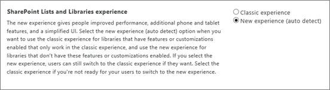

# Change the default list and library experience

As a global administrator or SharePoint administrator in Office 365, you may want some or all sites to continue using the classic list and library experience by default for a while. Keep in mind that users can switch to the new experience in specific libraries or sites if they choose. When users change the list or library settings, it overrides changes at the site, site collection, and organization level.
  
> [!NOTE]
> If you're not an admin, see [Switch the default experience for lists or document libraries from new or classic](https://support.office.com/article/66dac24b-4177-4775-bf50-3d267318caa9). 
  
## Change the default experience for all lists and document libraries

1. Sign in to Office 365 as a global admin or SharePoint admin.
    
2. Select the app launcher icon  in the upper-left and choose **Admin** to open the Office 365 admin center. (If you don't see the Admin tile, you don't have Office 365 administrator permissions in your organization.) 
    
3. In the left pane, choose **Admin centers** \> **SharePoint**.
    
4. Choose **settings**.
    
5. Next to **SharePoint Lists and Libraries experience**, select either **Classic experience** or **New experience (auto-detect)**.
    
    
  
## Change the default experience for sites and site collections by using Microsoft PowerShell

 **Check for customizations that affect lists or library pages**
  
One reason you may want to change the default experience at the site and site collection level is because you have customizations that affect list or library pages and represent business-critical functionality. If you want to check for these kinds of customizations to help you determine which sites and site collections you want to change the default for, you must use a Windows PowerShell script with a CSOM (Client-side object model) wrapper. The following script detects custom actions that deploy custom scripts.
  
1. [Download the latest SharePoint Online Management Shell](https://go.microsoft.com/fwlink/p/?LinkId=255251).
    
2. Connect to SharePoint Online as a global admin or SharePoint admin in Office 365. To learn how, see [Getting started with SharePoint Online Management Shell](https://go.microsoft.com/fwlink/?linkid=869066).
    
3. [Download the SharePoint and Project Client Object Model libraries](https://go.microsoft.com/fwlink/?linkid=872342).
    
4. Copy the following code and paste it into a text editor, such as Notepad. For this article, we will name the script file, CustomActions.ps1.
    
    > [!NOTE]
    > This script needs to be run separately for each website you want to check CustomActions for. The placeholder names indicated in \< \> need to be change to meet your organizational requirements. <br>> There are commented lines, denoted by the pound sign (#), in the sections of script for site collection level and site levels. To run the appropriate script, remove the pound sign (#) in front of the lines in the section that you want to change the experience for. 
  
  ```
  # This file uses CSOM. Replace the paths below with the path to CSOM on this computer.
  # If CSOM is in the user's downloads folder, you only have to replace the <username> placeholder.
  Add-Type -Path "C:\Users\<username>\downloads\Microsoft.SharePointOnline.CSOM.16.1.5026.1200\lib\net45\Microsoft.SharePoint.Client.dll"
  Add-Type -Path "C:\Users\<username>\downloads\Microsoft.SharePointOnline.CSOM.16.1.5026.1200\lib\net45\Microsoft.SharePoint.Client.Runtime.dll"
  # All strings in braces < >are placeholders that you must replace with the appropriate strings.
  $webUrl = 'https://<domain>.sharepoint.com/<relative-path-to-website>'
  $username = '<username>@<domain>.onmicrosoft.com'
  $password = Read-Host -Prompt "Password for $username" -AsSecureString
  [Microsoft.SharePoint.Client.ClientContext]$clientContext = New-Object Microsoft.SharePoint.Client.ClientContext($webUrl)    
  $clientContext.Credentials = New-Object Microsoft.SharePoint.Client.SharePointOnlineCredentials($username, $password)
  $site = $clientContext.Site;
  $customActions = $site.UserCustomActions
  $clientContext.Load($customActions)
  $clientContext.ExecuteQuery()
  $first = $true
  foreach($customAction in $customActions)
  {
      if($customAction.Location -eq "scriptlink" -and -Not ([string]::IsNullOrEmpty($customAction.ScriptBlock)))
      {
          if ($first)
          {
              Echo " "
                  Echo ($webUrl + " has the following inline JavaScript custom actions")
          $first = $false
          }
          Echo $customAction.Title
      }
  }
  
  ```

5. Save the file, naming it  `CustomActions.ps1`.
    
    > [!NOTE]
    > You can use a different file name, but you must save the file as an ANSI-encoded text file whose extension is  `.ps1`
  
6. Change to the directory where you saved the file.
    
7. At the PowerShell command prompt, type the following command:
    
     `./CustomActions.ps1`
    
    > [!NOTE]
    > If you get an error message about being unable to run scripts, you might need to change your execution policies. For info, see [About Execution Policies](https://go.microsoft.com/fwlink/?linkid=869255). 
  
 **Change the default experience for sites and site collections**
  
To change the default experience for document libraries on a site collection or site level, you must use a Windows PowerShell script with a CSOM (Client-side object model) wrapper, as follows.
  
1. [Download the latest SharePoint Online Management Shell](https://go.microsoft.com/fwlink/p/?LinkId=255251).
    
2. Connect to SharePoint Online as a global admin or SharePoint admin in Office 365. To learn how, see [Getting started with SharePoint Online Management Shell](https://go.microsoft.com/fwlink/?linkid=869066).
    
3. [Download the SharePoint and Project Client Object Model libraries](https://go.microsoft.com/fwlink/?linkid=872342).
    
4. Copy the following code and paste it into a text editor, such as Notepad. For this article, we will name the script file, DocLib.ps1.
    
    > [!NOTE]
    > There are commented lines, denoted by the pound sign (#), in the sections of script for site collection level and site levels. To run the appropriate script, remove the pound sign (#) in front of the lines in the section that you want to change the experience for. 
  
  ```
  ##The first two lines of the script load the CSOM model:
  Add-Type -Path "C:\Users\{username}\downloads\Microsoft.SharePointOnline.CSOM.16.1.5026.1200\lib\net45\Microsoft.SharePoint.Client.dll"
  Add-Type -Path "C:\Users\{username}\downloads\Microsoft.SharePointOnline.CSOM.16.1.5026.1200\lib\net45\Microsoft.SharePoint.Client.Runtime.dll"
  $webUrl = 'https://{domain}.sharepoint.com/[optional path to subweb]'
  $username = Read-Host -Prompt "Enter or paste the site collection administrator's full O365 email, for example, name@domain.onmicrosoft.com" 
  $password = Read-Host -Prompt "Password for $username" -AsSecureString
  [Microsoft.SharePoint.Client.ClientContext]$clientContext = New-Object Microsoft.SharePoint.Client.ClientContext($webUrl)
  $clientContext.Credentials = New-Object Microsoft.SharePoint.Client.SharePointOnlineCredentials($username, $password)
  # To apply the script to the site collection level, uncomment the next two lines.
  #$site = $clientContext.Site; 
  #$featureguid = new-object System.Guid "E3540C7D-6BEA-403C-A224-1A12EAFEE4C4"
  # To apply the script to the website level, uncomment the next two lines, and comment the preceding two lines.
  #$site = $clientContext.Web;
  #$featureguid = new-object System.Guid "52E14B6F-B1BB-4969-B89B-C4FAA56745EF" 
  # To turn off the new UI by default in the new site, uncomment the next line.
  #$site.Features.Add($featureguid, $true, [Microsoft.SharePoint.Client.FeatureDefinitionScope]::None);
  # To re-enable the option to use the new UI after having first disabled it, uncomment the next line.
  # and comment the preceding line.
  #$site.Features.Remove($featureguid, $true);
  $clientContext.ExecuteQuery();
  
  ```

5. Save the file, naming it  `DocLib.ps1`.
    
    > [!NOTE]
    > You can use a different file name, but you must save the file as an ANSI-encoded text file whose extension is  `.ps1`
  
6. Change to the directory where you saved the file.
    
7. At the PowerShell command prompt, type the following command:
    
     `./DocLib.ps1`
    
    > [!NOTE]
    > If you get an error message about being unable to run scripts, you might need to change your execution policies. For info, see [About Execution Policies](https://go.microsoft.com/fwlink/?linkid=869255). 
  

