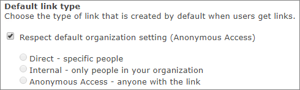
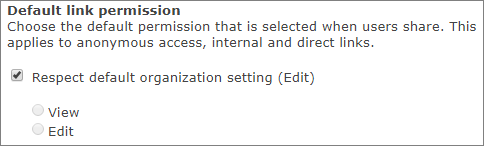

# Change the default link type for a site

Users can share files and folders in SharePoint and OneDrive by sending a link. They should select a link type based on the people to whom they want to give permission. The following link types are available: 

- Anyone with the link (previously called "anonymous access" or "shareable")
- People in your organization with the link 
- People with existing access
- Specific people 

As a global or SharePoint admin, you may want to enable users to send "Anyone" links, but you may not want this to the be the default type of link when users select to share files and folders. You can set the default type of link to something more restrictive, while still allowing users to select other types of links as needed. You can change this setting at the organization level and at the site (previously called "site collection") level. 
  
> [!NOTE]
> It isn't possible to set the default sharing link to "People with existing access."  The default sharing link setting applies only to libraries that use the new experience. This setting does not affect Outlook Web App, Outlook 2016, or Office clients prior to Office 2016. 

For info about the changing this setting at the organization level, see [File and folder links](turn-external-sharing-on-or-off.md#file-and-folder-links).

  
## Change the default link type for a classic site (site-level setting)

1. Sign in to https://admin.microsoft.com as a global or SharePoint admin to open the Microsoft 365 admin center. (If you see a message that you don't have permission to access the page, you don't have Office 365 administrator permissions in your organization.)
    
    > [!NOTE]
    > If you have Office 365 Germany, sign in at https://portal.office.de. If you have Office 365 operated by 21Vianet (China), sign in at https://login.partner.microsoftonline.cn/. Then select the **Admin** tile to open the admin center.  
    
2. In the left pane of the admin center, under **Admin centers**, select **SharePoint**. (You might need to select **Show all** to see the list of admin centers.).
 
3. If the classic SharePoint admin center appears, select **Open it now** at the top of the page to open the new SharePoint admin center. In the left pane of the new SharePoint admin center, select **Classic features**.

4. Select **More classic features**, and then under **Classic site collections page**, select **Open**.
    
5. Select the site that you want to change, and then select **Sharing**.
    
6. Under **Default link type**, clear the **Respect default organization setting** check box, and then choose the option you want to show by default when a user gets a link. 
    
    
  
7. Under **Default link permission**, clear the **Respect default organization setting** check box, and then choose whether you want the default permission to be view or edit. 
    
    
  
8. Select **Save**.
    

