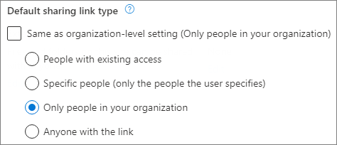
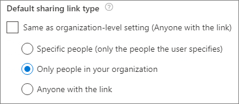

# Change the default link type for a site

Users can share files and folders in SharePoint and OneDrive by sending a link. They should select a link type based on the people to whom they want to give permission. The following link types are available: 

- Anyone with the link (previously called "anonymous access" or "shareable")
- People in your organization with the link 
- People with existing access
- Specific people 

As a global or SharePoint admin, you may want to enable users to send "Anyone" links, but you may not want this to the be the default type of link when users select to share files and folders. You can set the default type of link to something more restrictive, while still allowing users to select other types of links as needed. You can change this setting at the organization level and at the site (previously called "site collection") level. 
  
> [!NOTE]
> The default sharing link setting applies only to libraries that use the new experience. This setting does not affect Outlook Web App, Outlook 2016, or Office clients prior to Office 2016. 

For info about the changing this setting at the organization level, see [File and folder links](turn-external-sharing-on-or-off.md#file-and-folder-links).

  
## Change the default link type for a site

1. Go to the [Active sites page of the new SharePoint admin center](https://admin.microsoft.com/sharepoint?page=siteManagement&modern=true) and sign in with an account that has [admin permissions](/sharepoint/sharepoint-admin-role)
 for your organization.

    > [!NOTE]
    > If you have Office 365 Germany, [sign in to the Microsoft 365 admin center](https://go.microsoft.com/fwlink/p/?linkid=848041), then browse to the SharePoint admin center and open the Active sites page.  If you have Office 365 operated by 21Vianet (China), [sign in to the Microsoft 365 admin center](https://go.microsoft.com/fwlink/p/?linkid=850627), then browse to the SharePoint admin center and open the Active sites page.
    
2. In the left column, click to select a site.

3. Select **Sharing**.

4. Under **Default sharing link type**, clear the **Same as organization-level setting** check box.

    

5. Choose the default sharing link setting that you want to use for this site, and then click **Save**.

> [!NOTE]
> You can set the default link type to *People with existing access* by running [Set-SPOSite](https://docs.microsoft.com/powershell/module/sharepoint-online/set-sposite) with the `-DefaultLinkToExistingAccess` parameter.

## See also

[Turn external sharing on or off for a site](change-external-sharing-site.md)
